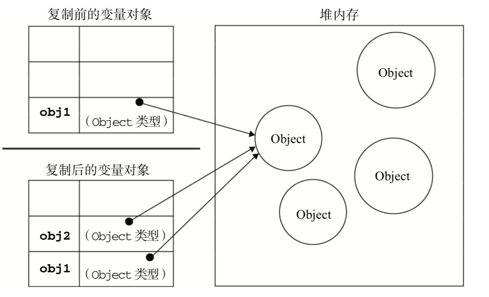

- [基本类型和引用类型](#基本类型和引用类型)
    - [动态属性](#动态属性)
    - [复制变量值](#复制变量值)
    - [传递参数](#传递参数)


### 基本类型和引用类型
基本数据类型: Undefined, Null, Boolean, Number, String, 这5中基本数据类型是按值访问的, 因此可以操作保存在变量中的实际的值。

引用类型: Object， 是保存在内存中的对象。 与其他语言不同，JavaScript不允许直接访问内存中的位置， 也就是说不能直接操作对象的内存空间。当复制保存着对象的某个变量时，操作的是对象的引用。但在为对象添加属性时，操作的是实际的对象

#### 动态属性
我们不能给基本类型的值添加属性， 尽管这样做不会导致任何错误。如
```js
var name = 'Nicholas';
name.age = 27;
alert(name.age);    //undefined
```
只能给引用类型值动态添加属性，基本类型无效。

#### 复制变量值
对于基本类型，如果从一个变量向另一个变量复制基本类型的值，会在变量对象上创建一个新值，然后把该值复制到为新变量分配的位置上。
```js
var num1 = 5;
var num2 = num1;  //基本变量复制，时完全独立的， num2时num1的一个副本，两个变量不会互相影响
```

当从一个变量向另一个变量复制引用类型的值时，同样也会将存储在变量对象中的值复制一份放到 为新变量分配的空间中。不同的是，这个值的副本实际上是一个指针，而这个指针指向存储在堆中的一个对象。复制操作结束后，两个变量实际上将引用同一个对象。因此，改变其中一个变量，就会影响另一个变量。
```js
var obj1 = new Object();
var obj2 = obj1;
obj1.name = "Nicholas";
alert(obj2.name);  //"Nicholas"
```


#### 传递参数
ECMAScript 中**所有函数的参数都是按值传递的**。也就是说，把函数外部的值复制给函数内部的参 数，就和把值从一个变量复制到另一个变量一样。基本类型值的传递如同基本类型变量的复制一样，而 引用类型值的传递，则如同引用类型变量的复制一样。

在向参数传递基本类型的值时，被传递的值会被复制给一个局部变量(即命名参数，或者用 ECMAScript 的概念来说，就是 arguments 对象中的一个元素)。

在向参数传递引用类型的值时，会把这个值在内存中的地址复制给一个局部变量，因此这个局部变量的变化会反映在函数的外部。

基本类型参数
```js
function addTen(num) {  
    num += 10;      //函数的num是个局部变量
    return num; 
}
var num = 20;
var result = addTen(num);   //num参数是全局变量
alert(num); //20，没有变化 
alert(result); //30
```
就好像值传递，参数赋给局部变量`num(局部)=num（全局）`， 值传递的特性，互不干扰的副本。

引用类型参数
```js
function setName(obj) {
    obj.name = "Nicholas";
}
var person = new Object();
setName(person);
alert(person.name);    //"Nicholas"
```
同理，局部变量`obj=person`，这是一个引用传值，所以obj和person都代表指针，指向堆内存中的同一个对象。 所以即使时局部变量，在函数中直接修改就是直接操作堆内存中的对象了。 当然如果在函数内部对局部参数重新定义，那么局部参数就改变了指针指向了，即使修改也不影响person指向的对象了。
```js
function setName(obj) { 
    obj.name = "Nicholas"; 
    obj = new Object();         //对局部变量重新定义，修改了。 函数结束立即销魂
    obj.name = "Greg";
}
var person = new Object();
setName(person);
alert(person.name);    //"Nicholas"

//引用类型的修改是直接修改堆内存中的对象， 而重新定义赋值则是重新在堆内存中开辟了一个新对象。 所以即使之前是相互的指针， 重新定义后也会没有关联
let o = {
    a: 1
}
let b = o;      //引用传值
b.b = 2;        //直接修改堆内存对象
console.log(a, b)  //{a: 1, b: 2}  {a: 1, b: 2}
b = {c: 3};     //重新定义
console.log(a, b)   //{a: 1, b: 2}  {c: 3}
```
