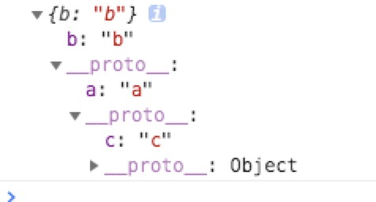

### Object.is()

ES5 比较两个值是否相等，只有两个运算符：相等运算符（`==`）和严格相等运算符（`===`）。它们都有缺点。

ES6 提出（同值相等）算法，用来解决这个问题。在所有环境中，只要两个值是一样的，它们就应该相等。

`Object.is`就是部署这个算法的新方法。它用来比较两个值是否严格相等，与严格比较运算符（===）的行为基本一致。

```javascript
Object.is('foo', 'foo')
// true
Object.is({}, {})
// false
```

不同之处只有两个：一是`+0`不等于`-0`，二是`NaN`等于自身。

```javascript
+0 === -0 //true
NaN === NaN // false

Object.is(+0, -0) // false
Object.is(NaN, NaN) // true
```


### Object.assign()

`Object.assign`方法用于对象的合并，将源对象（source）的所有可枚举属性，复制到目标对象（target）。

**`Object.assign`拷贝的属性是有限制的，只拷贝源对象的自身属性（不拷贝继承属性），也不拷贝不可枚举的属性（`enumerable: false`）,还无法正确拷贝`get`、`set`属性，get属性会被直接计算返回值，并且属性名为`get`函数上的名字**。

**属性名为 `Symbol` 值的属性，也会被`Object.assign`拷贝**。

`Object.assign()`和对象扩字符(`...`)很像。

`Object.assign`方法的第一个参数是目标对象，后面的参数都是源对象。

```javascript
Object.assign(target, source1, source2);
```

> 注意，如果目标对象与源对象有同名属性，或多个源对象有同名属性，则后面的属性会覆盖前面的属性。

如果只有一个参数，`Object.assign`会直接返回该参数。不存在复制拷贝问题，相当于直接将对象付给了新变量，所以都指向同一个地址。

```javascript
const aa = {a: 1};
const bb = Object.assign(aa) === aa; // true     不是浅拷贝，相互改变直接影响对方
aa.a = 2;
console.log(aa, bb);	//{a: 2}  {a: 2}

//进行浅拷贝
const cc = Object.assign({}, aa);
aa.a = 2;
console.log(aa, cc);	//{a: 2} {a: 1}
```

不会拷贝继承属性和特性为`enumerable:false`的属性

```js
const aa = {
    a: 1, 
    b: 2，
};
const bb = {name: 'zhangsan'}
Object.defineProperty(aa, 'b', {
    enumerable: false
})
Object.setPrototypeOf(aa, bb);			//aa继承bb
console.log(Object.assign({}, aa));  	//{a: 1}  因为b属性不可枚举，bb是aa的原型，所以都不被拷贝
```

get、set属性也不会被复制，但get属性会直接被计算，函数名作为属性，返回的值为属性值被复制

```js
var person = {
    _name: "chen", 
    age: 21,
    get name() {
        return 1111;
    },
    set name(name) {
        this._name = 22232
    }
}
//访问器set属性、get不会被拷贝，  get属性被直接计算了，name作为属性名，1111为属性值被复制
console.log(Object.assign({}, person))	//{_name: 'chen', age: 21, name: 111}
```

如果该参数不是对象，则会先转成对象，然后返回。

```javascript
typeof Object.assign(2) // "object"
```

#### 注意点

1. 浅拷贝
2. 同名属性的替换
3. 数组的处理

`Object.assign`可以用来处理数组，但是会把数组视为对象。

```javascript
Object.assign([1, 2, 3], [4, 5])
// [4, 5, 3]
```

上面代码中，`Object.assign`把数组视为属性名为 0、1、2 的对象，因此源数组的 0 号属性`4`覆盖了目标数组的 0 号属性`1`。

4. 取值函数的处理

`Object.assign`只能进行值的复制，如果要复制的值是一个取值函数，那么将求值后再复制。

```javascript
const source = {
  get foo() { return 1 }
};
const target = {};
Object.assign(target, source)
// { foo: 1 }
```

#### 常见用途

1. 为对象添加属性
2. 为对象添加方法
3. 克隆对象(浅拷贝)，只能克隆原始对象自身的值，不能克隆它继承的值。如果想要保持继承链，可以采用下面的代码。

```js
function clone(origin) {
  let originProto = Object.getPrototypeOf(origin);
  return Object.assign(Object.create(originProto), origin);
}
```

4. 合并多个对象
5. 为属性指定默认值


### Object.getOwnPropertyDescriptors()

ES5 的`Object.getOwnPropertyDescriptor()`方法会返回某个对象属性的描述对象。

ES2017 引入了`Object.getOwnPropertyDescriptors()`方法，返回指定对象所有自身属性（非继承属性）的描述对象。

```javascript
const obj = {
  foo: 123,
  get bar() { return 'abc' }
};

Object.getOwnPropertyDescriptors(obj)
// { foo:
//    {
//		value: 123,
//      writable: true,
//      enumerable: true,
//      configurable: true 
//    },
//   bar:
//    {
//		get: [Function: get bar],
//      set: undefined,
//      enumerable: true,
//      configurable: true 
//    } 
//	}
```

该方法的引入目的，主要是为了解决`Object.assign()`无法正确拷贝`get`属性和`set`属性的问题。我测试两个属性不被复制，但是`get`属性会直接被计算，然后返回该函数名字的属性。

```javascript
//使用这种方式复制
const source = {
  set foo(value) {
    console.log(value);
  }
};

const target2 = {};
Object.defineProperties(target2, Object.getOwnPropertyDescriptors(source));
Object.getOwnPropertyDescriptor(target2, 'foo')
// { get: undefined,
//   set: [Function: set foo],
//   enumerable: true,
//   configurable: true }
```

### 克隆对象(浅拷贝)，包括原型对象

`Object.getOwnPropertyDescriptors()`方法的另一个用处，是配合`Object.create()`方法，将对象属性克隆到一个新对象。这属于浅拷贝。

```javascript
const clone = Object.create(Object.getPrototypeOf(obj), Object.getOwnPropertyDescriptors(obj));  //第二个参数为添加到该对象上的属性描述符

// 或者

const shallowClone = (obj) => Object.create(
  Object.getPrototypeOf(obj),
  Object.getOwnPropertyDescriptors(obj)
);
```

#### 对于继承

以前，继承另一个对象，常常写成下面这样。

```javascript
const obj = {
  __proto__: prot,
  foo: 123,
};
```

ES6 规定`__proto__`只有浏览器要部署，其他环境不用部署。如果去除`__proto__`，上面代码就要改成下面这样。

```javascript
const obj = Object.create(prot);
obj.foo = 123;

// 或者

const obj = Object.assign(
  Object.create(prot),
  {
    foo: 123,
  }
);
```

有了`Object.getOwnPropertyDescriptors()`，我们就有了另一种写法。

```javascript
const obj = Object.create(
  prot,
  Object.getOwnPropertyDescriptors({
    foo: 123,
  })
);
```

`Object.getOwnPropertyDescriptors()`也可以用来实现 Mixin（混入）模式。

```javascript
let mix = (object) => ({
  with: (...mixins) => mixins.reduce(
    (c, mixin) => Object.create(
      c, Object.getOwnPropertyDescriptors(mixin)
    ), object)
});

// multiple mixins example
let a = {a: 'a'};
let b = {b: 'b'};
let c = {c: 'c'};
let d = mix(c).with(a, b);
console.log(d);
```




### `__proto__`属性，`Object.setPrototypeOf()`，`Object.getPrototypeOf()`

`__proto__`属性用来读取或设置当前对象的`prototype`对象。目前，所有浏览器（包括 IE11）都部署了这个属性。

```javascript
// es5 的写法
const obj = {
  method: function() { ... }
};
obj.__proto__ = someOtherObj;

// es6 的写法
var obj = Object.create(someOtherObj);
obj.method = function() { ... };
```

无论从语义的角度，还是从兼容性的角度，还是不要使用`__proto__`这个属性。

而是使用下面的`Object.setPrototypeOf()`（写操作）、`Object.getPrototypeOf()`（读操作）、`Object.create()`（生成操作）代替。

如果一个对象本身部署了`__proto__`属性，该属性的值就是对象的原型。

```javascript
Object.getPrototypeOf({ __proto__: null })
// null
```

#### Object.setPrototypeOf()

`Object.setPrototypeOf`方法的作用与`__proto__`相同，用来设置一个对象的`prototype`对象，返回参数对象本身。它是 ES6 正式推荐的设置原型对象的方法。

```javascript
Object.setPrototypeOf(object, prototype)
//该方法等同于下面的函数。
function setPrototypeOf(obj, proto) {
  obj.__proto__ = proto;
  return obj;
}
```

由于`undefined`和`null`无法转为对象，所以如果第一个参数是`undefined`或`null`，就会报错。

```javascript
Object.setPrototypeOf(undefined, {})
// TypeError: Object.setPrototypeOf called on null or undefined
Object.setPrototypeOf(null, {})
// TypeError: Object.setPrototypeOf called on null or undefined
```

#### Object.getPrototypeOf()

用于读取一个对象的原型对象。

```javascript
Object.getPrototypeOf(obj);
```

```javascript
function Rectangle() {
  // ...
}
const rec = new Rectangle();

Object.getPrototypeOf(rec) === Rectangle.prototype
// true

Object.setPrototypeOf(rec, Object.prototype);	//重新设置了原型对象
Object.getPrototypeOf(rec) === Rectangle.prototype
// false
```

如果参数不是对象，会被自动转为对象。

```javascript
// 等同于 Object.getPrototypeOf(Number(1))
Object.getPrototypeOf(1)
// Number {[[PrimitiveValue]]: 0}

Object.getPrototypeOf(1) === Number.prototype // true
Object.getPrototypeOf('foo') === String.prototype // true
Object.getPrototypeOf(true) === Boolean.prototype // true
```

如果参数是`undefined`或`null`，它们无法转为对象，所以会报错。


#### Object.keys()，Object.values()，Object.entries()

以上三个方法供`for...of`循环使用。**都是返回数组**

>  以上三个方法都返回一个数组，不像数组实例中的`Array.prototype.keys()`等方法，返回的是一个迭代对象(Iterator)

```js
let arr = [1, 2, 3];
let o = {a: 1, b: 2};
console.log(arr.values())	//Array Iterator{} [1, 2, 3]
cosole.log(Object.values(o))	//数组	[1, 2]
console.log(Object.values(arr))	//[1, 2, 3]
```

- `Object.keys()`：返回一个数组，成员是参数对象自身的（不含继承的，不含Symbol 值的属性）所有可遍历（enumerable）属性的键名
- `Object.values()`：返回一个数组，成员是参数对象自身的（不含继承的，不含Symbol 值的属性）所有可遍历（enumerable）属性的键值。

```javascript
const obj = Object.create({}, {p: {value: 42}});  //enumerable没设置默认为false
Object.values(obj) // []
//改为
const obj = Object.create({}, {p:
  {
    value: 42,
    enumerable: true
  }
});
Object.values(obj) // [42]
```

`Object.values`会过滤属性名为 Symbol 值的属性。

```javascript
Object.values({ [Symbol()]: 123, foo: 'abc' });
// ['abc']
```

如果`Object.values`方法的参数是一个字符串，会返回各个字符组成的一个数组。

```javascript
Object.values('foo')	// ['f', 'o', 'o']
```

- `Object.entries()`：返回一个数组，成员是参数对象自身的（不含继承的，不含Symbol 值的属性）所有可遍历（enumerable）属性的键值对数组。

```javascript
const obj = { foo: 'bar', baz: 42 };
Object.entries(obj)
// [ ["foo", "bar"], ["baz", 42] ]
```

如果原对象的属性名是一个 Symbol 值，该属性会被忽略。

`Object.entries`的基本用途是遍历对象的属性。

`Object.entries`方法的另一个用处是，将对象转为真正的`Map`结构。

```javascript
const obj = { foo: 'bar', baz: 42 };
const map = new Map(Object.entries(obj));
map // Map { foo: "bar", baz: 42 }
```


### Object.fromEntries()

`Object.fromEntries()`方法是`Object.entries()`的逆操作，用于将一个键值对数组转为对象。

```javascript
Object.fromEntries([
  ['foo', 'bar'],
  ['baz', 42]
])
// { foo: "bar", baz: 42 }
```

该方法的主要目的，是将键值对的数据结构还原为对象，因此特别适合将 Map 结构转为对象。

```javascript
// 例一
const entries = new Map([
  ['foo', 'bar'],
  ['baz', 42]
]);

Object.fromEntries(entries)
// { foo: "bar", baz: 42 }

// 例二
const map = new Map().set('foo', true).set('bar', false);
Object.fromEntries(map)
// { foo: true, bar: false }
```

该方法的一个用处是配合`URLSearchParams`对象，将查询字符串转为对象。

```javascript
Object.fromEntries(new URLSearchParams('foo=bar&baz=qux'))
// { foo: "bar", baz: "qux" }
```

> 注意：兼容存在问题，基本浏览器都还不能使用。