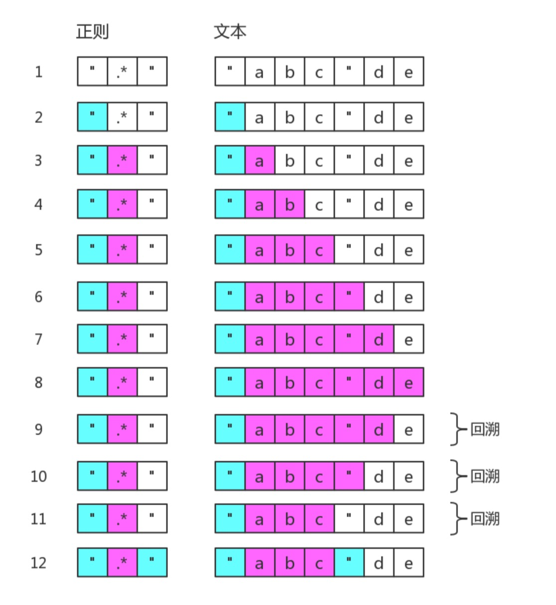

### 1. 第一章 正则表达式字符匹配攻略

**正则表达式是匹配模式，要么匹配字符，要么匹配位置**。

#### 1.1 两种模糊匹配

- 横向模糊匹配

其实现的方式是使用量词。譬如 `{m,n}`，表示连续出现最少 m 次，最多 n 次。比如正则 `/ab{2,5}c/`

- 纵向模糊匹配

其实现的方式是使用字符组。譬如 `[abc]`，

#### 1.2 字符组

例如 `[abc]`

- 范围表示法：`[1-6a-fG-M]`
- 排除字符组：`[^abc]`

- 常见的简写形式

| 字符组 | 具体含义                                                     |
| ------ | ------------------------------------------------------------ |
| `\d`   | `[0-9]`                                                      |
| `\D`   | `[^0-9]`                                                     |
| `\w`   | `[0-9a-zA-Z_]`                                               |
| `\W`   | `[^0-9a-zA-Z_]`                                              |
| `\s`   | `[ \t\v\n\r\f]`。表示空白符，包括空格、水平制表符、垂直制表符、换行符、回车符、换页符。 |
| `\S`   | `[^\t\v\n\r\f]`                                              |
| `.`    | `[^\n\r\u2028\u2029]`。通配符，表示几乎任意字符。换行符、回车符、行分隔符和段分隔符除外。 |

如果要匹配任意字符怎么办?可以使用 `[\d\D]`、`[\w\W]`、`[\s\S]` 和` [^] `中任何的一个。

#### 1.3 量词

| 量词   | 具体含义          |
| ------ | ----------------- |
| `{m,}` | 表示至少出现 m 次 |
| `{m}`  | 出现 m 次         |
| `?`    | {0,1}             |
| `+`    | {1,}              |
| `*`    | {0,}              |

##### 贪婪匹配与惰性匹配

正则它会尽可能多的匹配，是贪婪的。`/\d{2,5}/g`这里会尽量匹配多，如有5个会匹配5个。	

**通过在量词后面加个问号就能实现惰性匹配**。例如：`/\d{2,5}?/g`  这里只会匹配2个，尽可能少的匹配。

#### 1.4 多选分支

一个模式可以实现横向和纵向模糊匹配。而多选分支可以支持多个子模式任选其一。

具体形式如下:`(p1|p2|p3)`，其中 p1、p2 和 p3 是子模式，用 `|(管道符)`分隔，表示其中任何之一。


例如要匹配字符串 "good" 和 "nice" 可以使用 /good|nice/。

```js
var regex = /goodbye|good/g;
var string = "goodbye";
console.log( string.match(regex) );
// => ["goodbye"]
```

分支结构也是惰性的，即当前面的匹配上了，后面的就不再尝试了


### 2. 第二章 正则表达式位置匹配攻略

#### 2.1 什么是位置呢？

位置(锚)是相邻字符之间的位置。比如，下图中箭头所指的地方:


#### 2.2 如何匹配位置呢？

ES5中，共有6个锚：`^`、`$`、`\b`、`\B`、`(?=p)`、`(?!p)`。

注意：像上面的位置匹配符是匹配字符串中的位置，并不是字符串中的值。

```js
//匹配值
let str = 'abc';
str.repalce(/^a/g, '#');		//#bc
//匹配位置
str.repalce(/(?=b)/g, '#');		//a#bc
```


##### 2.2.1 ^和$

`^` ：匹配开头，在多行匹配中匹配行开头。

`$`：匹配结尾，在多行匹配中匹配行结尾。

```js
var result = "hello".replace(/^|$/g, '#');
console.log(result);
// => "#hello#"
```

多行匹配模式(即有修饰符`m`)时，二者是行的概念

```js
var result = "I\nlove\njavascript".replace(/^|$/gm, '#');
console.log(result);
/*
#I#
#love#
#javascript#
*/
```

##### 2.2.2 \b和\B

`\b`是单词边界，具体就是`\w`与`\W`之间的位置，也包括`\w`与`^`之间的位置，和`\w`与`$`之间的位置。

```js
var result = "[JS] Lesson_01.mp4".replace(/\b/g, '#');
console.log(result);
// => "[#JS#] #Lesson_01#.#mp4#"
```

##### 2.2.3 (?=p)和(?!p)

`(?=p)`，其中 p 是一个子模式，即 p 前面的**位置**，或者说，该**位置**后面的字符要匹配 p。

比如 (?=l)，表示 "l" 字符前面的位置，例如:

```js
var result = "hello".replace(/(?=l)/g, '#');
console.log(result);
// => "he#l#lo"
```

而 `(?!p)` 就是 `(?=p)` 的反面意思，就是不是p前面的位置，也可以说，该位置后面的字符不匹配p

```js
var result = "hello".replace(/(?!l)/g, '#');
console.log(result);
// => "#h#ell#o#"
```

#### 2.4 例子

数字的千位分隔符表示法，比如把 "12345678"，变成 "12,345,678"。可见是需要把相应的位置替换成 ","。

使用 `(?=\d{3}$)` 就可以做到:

```js
var result = "12345678".replace(/(?=\d{3}$)/g, ',')
console.log(result);
// => "12345,678"
```

改进

```js
var result = "12345678".replace(/(?=(\d{3})+$)/g, ',')
console.log(result);
// => "12,345,678"
```

写完正则后，要多验证几个案例，此时我们会发现问题:

```js
var result = "123456789".replace(/(?=(\d{3})+$)/g, ',')
console.log(result);
// => ",123,456,789"
```

怎么解决呢?我们要求匹配的到这个位置不能是开头。我们知道匹配开头可以使用` ^`，但要求这个位置不是开头怎么办? `(?!^)`

```js
var regex = /(?!^)(?=(\d{3})+$)/g;
var result = "12345678".replace(regex, ',')
console.log(result);
// => "12,345,678"
result = "123456789".replace(regex, ',');
console.log(result);
// => "123,456,789"
```


1. 验证密码问题：密码长度 6-12 位，由数字、小写字符和大写字母组成，但必须至少包括 2 种字符。

初始不考虑“但必须至少包括 2 种字符”这一条件。我们可以容易写出:

```js
var regex = /^[0-9A-Za-z]{6,12}$/;
```

2. 判断是否包含有某一种字符

假设，要求的必须包含数字，怎么办?此时我们可以使用 `(?=.*[0-9])` 来做。

```js
var regex = /(?=.*[0-9])^[0-9A-Za-z]{6,12}$/;
```

3. 最后，同时包含具体两种字符

比如同时包含数字和小写字母，可以用 `(?=.[0-9])(?=.[a-z])` 来做

```js
var regex = /(?=.*[0-9])(?=.*[a-z])^[0-9A-Za-z]{6,12}$/;
```

**像  `(?=p)和(?!p)` 这些匹配位置要写在前面，可以匹配整个字符串。**

对于这个正则，我们只需要弄明白 `(?=.*[0-9])^` 即可。分开来看就是 `(?=.*[0-9])` 和` ^`。表示开头前面还有个位置(当然也是开头，即同一个位置，所以写在前面没什么影响，还可以匹配整个字符串)。

翻译成大白话，就是接下来的字符，必须包含个数字。


### 3. 第三章 正则表达式括号的作用

#### 3.1 分组和分支结构

- `/(ab)+/`
- `(p1|p2)`

##### 3.1.1 分组

我们知道 /a+/ 匹配连续出现的 "a"，而要匹配连续出现的 "ab" 时，需要使用 /(ab)+/。

##### 3.1.2 分支结构

`(p1|p2)`，即p1或p2

```js
var regex = /^I love (JavaScript|Regular Expression)$/;
console.log( regex.test("I love JavaScript") );
console.log( regex.test("I love Regular Expression") );
// => true
// => true 
```

#### 3.2 分组引用

括号的作用就是对匹配的数据进行分组，我们也可以进行数据提取，以及更强大的替换操作。

##### 3.2.1 提取数据

```js
var regex = /(\d{4})-(\d{2})-(\d{2})/;
var string = "2017-06-12";
console.log( string.match(regex) );
// => ["2017-06-12", "2017", "06", "12", index: 0, input: "2017-06-12"]

let reg = /(\d{4})-(\d{2})-(\d{2})/g;
console.log( string.match(regex) );
//["2017-06-12"]
```

> match 返回的一个数组，第一个元素是整体匹配结果，然后是各个分组(括号里)匹配的内容，然后是匹配下标，最后是输入的文本。另外，正则表达式是否有修饰符 g，match 返回的数组格式是不一样的。 

另外也可以使用正则实例对象的 `exec` 方法

```js
var regex = /(\d{4})-(\d{2})-(\d{2})/;
var string = "2017-06-12";
console.log( regex.exec(string) );
// => ["2017-06-12", "2017", "06", "12", index: 0, input: "2017-06-12"]
```

同时，也可以使用构造函数的全局属性 `$1` 至 `$9` 来获取:

```js
var regex = /(\d{4})-(\d{2})-(\d{2})/;
var string = "2017-06-12";
regex.test(string); // 正则操作即可，例如 
//regex.exec(string); 
//string.match(regex);

console.log(RegExp.$1); // "2017"
console.log(RegExp.$2); // "06"
console.log(RegExp.$3); // "12"
```

##### 3.2.2 替换

yyyy-mm-dd 格式，替换成 mm/dd/yyyy

```js
var regex = /(\d{4})-(\d{2})-(\d{2})/;
var string = "2017-06-12";
var result = string.replace(regex, "$2/$3/$1");
console.log(result);
// => "06/12/2017"
```

等价于如下的形式：

```js
var regex = /(\d{4})-(\d{2})-(\d{2})/;
var string = "2017-06-12";
var result = string.replace(regex, function () {
    return RegExp.$2 + "/" + RegExp.$3 + "/" + RegExp.$1;
});
console.log(result);
// => "06/12/2017"
```

也等价于:

```js
var regex = /(\d{4})-(\d{2})-(\d{2})/;
var string = "2017-06-12";
var result = string.replace(regex, function (match, year, month, day) {
    return month + "/" + day + "/" + year;
});
console.log(result);
// => "06/12/2017"
```

#### 3.3 反向引用

```js
//这里的\1表示之前第一个分组的值
var regex = /\d{4}(-|\/|\.)\d{2}\1\d{2}/;
var string1 = "2017-06-12";
var string2 = "2017/06/12";
var string3 = "2017.06.12";
var string4 = "2016-06/12";
console.log( regex.test(string1) ); // true
console.log( regex.test(string2) ); // true
console.log( regex.test(string3) ); // true
console.log( regex.test(string4) ); // false
```


注意里面的 `\1`，表示的引用之前的那个分组` (-|\/|\.)`。不管它匹配到什么(比如 `-`)，`\1` 都匹配那个同样的具体某个字符。 

我们知道了 `\1` 的含义后，那么 `\2` 和 `\3` 的概念也就理解了，即分别指代第二个和第三个分组。 

看到这里，此时，恐怕你会有几个问题。

##### 3.3.1 括号嵌套怎么办？

```js
var regex = /^((\d)(\d(\d)))\1\2\3\4$/;
var string = "1231231233";
console.log( regex.test(string) ); // true
console.log( RegExp.$1 ); // 123
console.log( RegExp.$2 ); // 1
console.log( RegExp.$3 ); // 23
console.log( RegExp.$4 ); // 3
/*所以
\1是分组1，找到第一个开括号，123
\2是分组2，找到第二个开括号，1
\3是分组3，找到第三个开括号，23
\4是分组4，找到第四个开括号，3
*/
```


##### 3.3.2 \10表示什么呢？

另外一个疑问可能是，即 `\10` 是表示第 10 个分组，还是 `\1` 和 `0` 呢? 答案是前者，虽然一个正则里出现 `\10` 比较罕见。

##### 3.3.3 引用不存在的分组会怎样?

因为反向引用，是引用前面的分组，但我们在正则里引用了不存在的分组时，此时正则不会报错，只是匹配
反向引用的字符本身。例如` \2`，就匹配 `"\2"`。注意 `"\2"` 表示对 `"2"` 进行了转义。

##### 3.3.4 分组后面有量词会怎样?

分组后面有量词的话，分组最终捕获到的数据是最后一次的匹配。

```js
var regex = /(\d)+/;
var string = "12345";
console.log( string.match(regex) );
// => ["12345", "5", index: 0, input: "12345"]
```

从上面看出，分组 `(\d) `捕获的数据是` "5"`。

同理对于反向引用，也是这样的。测试如下:

```js
var regex = /(\d)+ \1/;
console.log( regex.test("12345 1") );
// => false
console.log( regex.test("12345 5") );js
// => true
```

#### 3.4 非捕获括号

如果只想要括号最原始的功能，但不会引用它，即，既不在 API 里引用，也不在正则里反向引用。

此时可以使用非捕获括号`(?:p)` 和 `(?:p1|p2|p3)`。

```js
var regex = /(?:ab)+/g;
var string = "ababa abbb ababab";
console.log( string.match(regex) );
// => ["abab", "ab", "ababab"]
```

```js
var regex = /^I love (?:JavaScript|Regular Expression)$/;
console.log( regex.test("I love JavaScript") );
console.log( regex.test("I love Regular Expression") );
// => true
// => true
```

#### 3.5 例子

##### 3.5.1 字符串trim方法模拟

去掉开头和结尾的空白。

第一种

```js
function trim(str) {
    return str.replace(/^\s+|\s+$/g, '')
}
console.log( trim("  foobar   ") );
// => "foobar"
```

第二种

```js
function trim (str) {
    return str.replace(/^\s*(.*?)\s*$/g, "$1");
}
console.log( trim("  foobar   ") );
// => "foobar"
```

这里使用了惰性匹配`*?`，不然也会匹配最后一个空格之前的所有空格的。

##### 3.5.2 将每个单词的首字母转为大写

```js
function titleize (str) {
    								//单词开头或者空白+单词
    return str.toLowerCase().replace(/(?:^|\s)\w/g, function (c) {
        return c.toUpperCase();
    });
}
console.log( titleize('my name is epeli') );
// => "My Name Is Epeli"
```

##### 3.5.3 驼峰化

```js
function camelize (str) {
    return str.replace(/[-_\s]+(.)?/g, function (match, c) {
        return c ? c.toUpperCase() : '';
    });
}
console.log( camelize('-moz-transform') );
// => "MozTransform"
```

正则后面 的 ? 的目的，是为了应对 str 尾部的字符可能不是单词字符，比如 str 是 '-moz-transform ' 

### 4. 第四章 正则表达式回溯法原理

学习正则表达式，是需要懂点儿匹配原理的。而研究匹配原理时，有两个字出现的频率比较高:“回溯”。

#### 4.1 没有回溯的匹配

假设我们的正则是 /ab{1,3}c/，而当目标字符串是 "abbbc" 时，就没有所谓的“回溯”。其匹配过程是:


#### 4.2 有回溯的匹配

1. 例子1

RegExp： `/ab{1,3}c/`

目标字符串：`"abbc"`

中间就有回溯。


图中第 5 步有红颜色，表示匹配不成功。此时 b{1,3} 已经匹配到了 2 个字符 "b"，准备尝试第三个时， 结果发现接下来的字符是 "c"。那么就认为 b{1,3} 就已经匹配完毕。然后状态又回到之前的状态(即 第 6 步与第 4 步一样)，最后再用子表达式 c，去匹配字符 "c"。当然，此时整个表达式匹配成功了。 图中的第 6 步，就是“回溯”。 

2. 例子2

RegExp：`/ab{1,3}bbc/`

目标字符串：`"abbbc"`

匹配的过程是：


3. 例子3

RegExp：`/".*"/`

目标字符串：`"abc"de`



可以看出 `.*` 是非常影响效率的，为了减少一些不必要的回溯，可以把正则修改为 `/"[^"]*"/`。

#### 4.3 常见的回溯形式

正则表达式匹配字符串的这种方式，有个学名，叫回溯法。

> 回溯法也称试探法，它的基本思想是:从问题的某一种状态(初始状态)出发，搜索从这种状态出发
> 所能达到的所有“状态”，当一条路走到“尽头”的时候(不能再前进)，再后退一步或若干步，从
> 另一种可能“状态”出发，继续搜索，直到所有的“路径”(状态)都试探过。这种不断“前进”、
> 不断“回溯”寻找解的方法，就称作“回溯法”。------百度百科

本质上就是深度优先搜索算法。

##### 4.3.1 贪婪量词

之前的例子都是贪婪量词相关的。比如 b{1,3}，因为其是贪婪的，尝试可能的顺序是从多往少的方向去尝
试。首先会尝试 "bbb"，然后再看整个正则是否能匹配。不能匹配时，吐出一个 "b"，即在 "bb" 的基础
上，再继续尝试。如果还不行，再吐出一个，再试。如果还不行呢?只能说明匹配失败了。

如果当多个贪婪量词挨着存在，并相互有冲突时，此时会是怎样?答案是，先下手为强!因为深度优先搜索。测试如下:

```js
var string = "12345";
var regex = /(\d{1,3})(\d{1,3})/;
console.log( string.match(regex) );
// => ["12345", "123", "45", index: 0, input: "12345"]
```

##### 4.3.2 惰性量词

惰性量词就是在贪婪量词后面加个问号。表示尽可能少的匹配：

```js
var string = "12345";
var regex = /(\d{1,3}?)(\d{1,3})/;
console.log( string.match(regex) );
// => ["1234", "1", "234", index: 0, input: "12345"]
```

虽然惰性量词不贪，但也会有回溯的现象。比如正则是:

RegExp：`/^\d{1,3}?\d{1,3}$/`

目标字符串：`"12345"`


知道你不贪、很知足，但是为了整体匹配成，没办法，也只能给你多塞点了。因此最后 \d{1,3}? 匹配的字
符是 "12"，是两个数字，而不是一个。

##### 4.3.3 分支结构

我们知道分支也是惰性的，比如 /can|candy/，去匹配字符串 "candy"，得到的结果是 "can"，因为分支会一个一个尝试，如果前面的满足了，后面就不会再试验了。 

分支结构，可能前面的子模式会形成了局部匹配，如果接下来表达式整体不匹配时，仍会继续尝试剩下的分支。这种尝试也可以看成一种回溯。 比如正则：

RegExp：`/^(can|candy)$/`

目标字符串：`"candy"`


### 5. 第五章 正则表达式的拆分

#### 5.1 结构和操作符

编程语言一般都有操作符。只要有操作符，就会出现一个问题。当一大堆操作在一起时，先操作谁，又后操作谁呢?为了不产生歧义，就需要语言本身定义好操作顺序，即所谓的优先级。 

而在正则表达式中，操作符都体现在结构中，即由特殊字符和普通字符所代表的一个个特殊整体。

JavaScript 正则表达式中，都有哪些结构呢?

字符字面量、字符组、量词、锚、分组、选择分支、反向引用。

| 结构   | 说明                                                         |
| ------ | :----------------------------------------------------------- |
| 字面量 | 匹配一个具体字符，包括不用转义的和需要转义的。比如 `a` 匹配字符 `"a"`，又比如 `\n` 匹配换行符，比如 `\.` 匹配小数点。 |
| 字符组 | 比如 `[0-9]`，也有 `\d` 的简写形式。另外还有反义字符组，比如`[^0-9]`，也有 `\D` 的简写形式。 |
| 量词   | 比如 `a{1,3}`，比如`a+`                                      |
| 锚     | 匹配一个位置，而不是字符。比如 `^` 匹配字符串的开头，又比如 `\b` 匹配单词边界，又比如` (?=\d) `表示数字前面的位置。 |
| 分组   | 用括号表示一个整体，比如` (ab)+`，表示 `"ab"` 两个字符连续出现多次，也可以使用非捕获分组 `(?:ab)+`。 |
| 分支   | 多个子表达式多选一，比如 `abc|bcd`。反向引用，比如` \2`，表示引用第 2 个分组。 |

其中涉及到的操作符有:

| 操作符描述   | 操作符                                  | 优先级 |
| ------------ | --------------------------------------- | ------ |
| 转义符       | `\`                                     | 1      |
| 括号和方括号 | (···)、(?:···)、(?=···)、(?!···)、[···] | 2      |
| 量词限定符   | {m}、{m,n}、{m,}、?、*、+               | 3      |
| 位置和序列   | ^、$、\元字符、一般字符                 | 4      |
| 管道符(竖杠) | \|                                      | 5      |

例子：

RegExp：`/ab?(c|de*)+|fg/`

1. 由于括号的存在，所以，`(c|de*)` 是一个整体结构。
2. 在` (c|de*)` 中，注意其中的量词 ，因此` e `是一个整体结构。
3. 又因为分支结构`|` 优先级最低，因此 `c` 是一个整体、而 `de*` 是另一个整体。
4. 同理，整个正则分成了 `a`、`b?`、`(...)+`、`f`、`g`。而由于分支的原因，又可以分成 `ab?(c|de*)+` 和 `fg` 这两部分。

#### 5.2 注意要点

##### 5.2.1 匹配字符串整体问题

因为是要匹配整个字符串，我们经常会在正则前后中加上锚 `^` 和 `$`。

比如要匹配目标字符串 "abc" 或者 "bcd" 时，如果一不小心，就会写成 `/^abc|bcd$/`。

而位置字符和字符序列优先级要比竖杠高，故其匹配的结构是:


##### 5.2.2 量词连缀问题

假设，要匹配这样的字符串:

1. 每个字符为 "a、"b"、"c"任选其一，
2. 字符串的长度是 3 的倍数。

此时正则不能想当然地写成 `/^[abc]{3}+$/`，这样会报错。

此时要修改成:`/([abc]{3})+/`

##### 5.2.3 元字符转义问题

所谓元字符，就是正则中有特殊含义的字符。

所有结构里，用到的元字符总结如下:

`^`、`$`、`.`、`*`、`+`、`?`、`|`、`\`、`/`、`(`、`)`、`[`、`]`、`{`、`}`、`=`、`!`、`:`、`-`

```js
var string = "^$.*+?|\\/[]{}=!:-,";
var regex = /\^\$\.\*\+\?\|\\\/\[\]\{\}\=\!\:\-\,/;
console.log( regex.test(string) );
// => true
```

另外，在 string 中，也可以把每个字符转义，当然，转义后的结果仍是本身:

```js
var string = "^$.*+?|\\/[]{}=!:-,";
var string2 = "\^\$\.\*\+\?\|\\\/\[\]\{\}\=\!\:\-\,";
console.log( string == string2 );
// => true
```

1. 字符组中的元字符

跟字符组相关的元字符有` [`、`]`、`^`、`-`。因此在会引起歧义的地方进行转义。

```js
/[\^\-]/    //就可以匹配字符"^","-"了， 不转义会代表非和范围的意思
```

2. 匹配 `"[abc]"` 和 `"{3,5}"`

我们知道 [abc]，是个字符组。如果要匹配字符串 "[abc]" 时，该怎么办?

可以写成`/\[abc\]/`，也可以写成 `/\[abc]/`。

只需要在第一个方括号转义即可，因为后面的方括号构不成字符组，正则不会引发歧义，自然不需要转义。

同理，要匹配字符串 `"{3,5}"`，只需要把正则写成 `/\{3,5}/` 即可

3. 其余情况

比如`=`、`!`、`:`、`-`、`,`等符号，只要不在特殊结构中，并不需要转义。

但是，括号需要前后都转义的，如 `/\(123\)/`。

至于剩下的 `^`、`$`、`.`、`*`、`+`、`?`、`|`、`\`、`/` 等字符，只要不在字符组内，都需要转义的。


### 6. 第六章 正则表达式的构建

#### 6.4 效率

正则表达式的运行分为如下的阶段:

1. 编译
2. 设定起始位置
3. 尝试匹配
4. 匹配失败的话，从下一位开始继续第 3 步
5. 最终结果:匹配成功或失败

例子：

```javascript
var regex = /\d+/g;
console.log( regex.lastIndex, regex.exec("123abc34def") );
console.log( regex.lastIndex, regex.exec("123abc34def") );
console.log( regex.lastIndex, regex.exec("123abc34def") );
console.log( regex.lastIndex, regex.exec("123abc34def") );
// => 0 ["123", index: 0, input: "123abc34def"]
// => 3 ["34", index: 6, input: "123abc34def"]
// => 8 null
// => 0 ["123", index: 0, input: "123abc34def"]
```

当尝试匹配时，需要确定从哪一位置开始匹配。一般情形都是字符串的开头，即第 0 位。

**但当使用 `test` 和 `exec` 方法，且正则有 `g` 时，起始位置是从正则对象的 `lastIndex` 属性开始。**每次都要执行一次匹配才会从下一个`lastIndex`开始。

**因此第一次 `exec` 是从第 0 位开始，而第二次是从 3 开始的。**

设定好起始位置后，就开始尝试匹配了。

比如第一次 `exec`，从 0 开始，去尝试匹配，并且成功地匹配到 3 个数字。此时结束时的下标是 2，因此下
一次的起始位置是 3。

而第二次，起始下标是 3，但第 3 个字符是 "a"，并不是数字。但此时并不会直接报匹配失败，而是移动到下一位置，即从第 4 位开始继续尝试匹配，但该字符是 "b"，也不是数字。再移动到下一位，是 "c" 仍不行，再移动一位是数字 "3"，此时匹配到了两位数字 "34"。此时，下一次匹配的位置是 "d" 的位置，即第8 位。

第三次，是从第 8 位开始匹配，直到试到最后一位，也没发现匹配的，因此匹配失败，返回 `null`。同时设
置 `lastIndex` 为 0，即，如要再尝试匹配的话，需从头开始。

从上面可以看出，匹配会出现效率问题，主要出现在上面的第 3 阶段和第 4 阶段。因此，主要优化手法也是针对这两阶段的。

##### 6.4.1 使用具体型字符组来代替通配符，来消除回溯

比如匹配字符串 123"abc"456 中的 "abc":

如果正则用的是:`/".*"/`，会在第 3 阶段产生 4 次回溯。

如果正则用的是:`/".*?"/`，会产生 2 次回溯。

此时要使用具体化的字符组，来代替通配符.，以便消除不必要的字符，此时使用正则 `/"[^"]*"/`。

##### 6.4.2 使用非捕获型分组

因为括号的作用之一是，可以捕获分组和分支里的数据。那么就需要内存来保存它们。

当我们不需要使用分组引用和反向引用时，此时可以使用非捕获分组。

例如，`/^[-]?(\d\.\d+|\d+|\.\d+)$/` 可以修改成:`/^[-]?(?:\d\.\d+|\d+|\.\d+)$/`。

##### 6.4.3  独立出确定字符

例如，`/a+/` 可以修改成 `/aa*/`。因为后者能比前者多确定了字符 "a"。

##### 6.4.4 提取分支公共部分

比如，`/^abc|^def/` 修改成 `/^(?:abc|def)/`。

又比如， `/this|that/`修改成 `/th(?:is|at)/`。

##### 6.4.5 减少分支的数量，缩小它们的范围

`/red|read/` 可以修改成 `/rea?d/`。


### 7. 第七章 正则表达式编程

#### 7.1 正则表达式的四种操作

首先正则表达式都是需要匹配的。

有了匹配这一基本操作后，才有其他的操作:验证、切分、提取、替换。

##### 7.1.1 验证

在说验证之前，先要说清楚匹配是什么概念。

所谓匹配，就是看目标字符串里是否有满足匹配的子串。因此，“匹配”的本质就是“查找”。

有没有匹配，是不是匹配上，判断是否的操作，即称为“验证”。

1. 使用`search`：

```js
let regex = /\d/;
var string = "abc123";
console.log(!!string.search(regex))		//索引是3   true
```

2. 使用`test`：

```javascript
var regex = /\d/;
var string = "abc123";
console.log( regex.test(string) );
// => true
```

3. 使用 `match`：

```javascript
var regex = /\d/;
var string = "abc123";
console.log( !!string.match(regex) );
// => true
```

4. 使用 `exec`：

```javascript
var regex = /\d/;
var string = "abc123";
console.log( !!regex.exec(string) );
// => true
```

其中，最常用的是`test`

##### 7.1.2 切分

使用的是`split`切分。

```javascript
var regex = /,/;
var string = "html,css,javascript";
console.log( string.split(regex) );
// => ["html", "css", "javascript"]
```

```javascript
var regex = /\D/;
console.log( "2017/06/26".split(regex) );
console.log( "2017.06.26".split(regex) );
console.log( "2017-06-26".split(regex) );
// => ["2017", "06", "26"]
// => ["2017", "06", "26"]
// => ["2017", "06", "26"]
```

##### 7.1.3 提取

但有时需要提取部分匹配的数据，此时正则通常要使用分组引用(分组捕获)功能。

使用`match`：

```javascript
var regex = /^(\d{4})\D(\d{2})\D(\d{2})$/;
var string = "2017-06-26";
console.log( string.match(regex) );
// =>["2017-06-26", "2017", "06", "26", index: 0, input: "2017-06-26"]
```

使用`exec`：

```javascript
var regex = /^(\d{4})\D(\d{2})\D(\d{2})$/;
var string = "2017-06-26";
console.log( regex.exec(string) );
// =>["2017-06-26", "2017", "06", "26", index: 0, input: "2017-06-26"]
```

使用 `test`：

```javascript
var regex = /^(\d{4})\D(\d{2})\D(\d{2})$/;
var string = "2017-06-26";
regex.test(string);
console.log( RegExp.$1, RegExp.$2, RegExp.$3 );
// => "2017" "06" "26"
```

使用`search`：

```javascript
var regex = /^(\d{4})\D(\d{2})\D(\d{2})$/;
var string = "2017-06-26";
string.search(regex);
console.log( RegExp.$1, RegExp.$2, RegExp.$3 );
// => "2017" "06" "26"
```

使用 `replace`：

```javascript
var regex = /^(\d{4})\D(\d{2})\D(\d{2})$/;
var string = "2017-06-26";
var date = [];
string.replace(regex, function (match, year, month, day) {
    date.push(year, month, day);
});
console.log(date);
// => ["2017", "06", "26"]
```

其中，最常用的是 `match`。

##### 7.1.4 替换

使用 `replace` 进行替换。

```javascript
var string = "2017-06-26";
var today = new Date( string.replace(/-/g, "/") ); 
console.log( today );
// => Mon Jun 26 2017 00:00:00 GMT+0800 (中国标准时间)
```

#### 7.2 相关API注意点

用于正则操作的方法，共有 6 个，字符串实例 4 个，正则实例 2 个:

```
String#search
String#split
String#match
String#replace
RegExp#test     #比较特殊，对于正则规则是g的情况，它的指针是lastIndex，需要每匹配一次，移动一次
RegExp#exec
```

##### 7.2.1 **search** 和 **match** 的参数问题

我们知道字符串实例的那 4 个方法参数都支持正则和字符串。

但 search 和 match，会把字符串转换为正则的。

```js
var string = "2017.06.27"; console.log( string.search(".") ); // => 0
//需要修改成下列形式之一 
console.log( string.search("\\.") ); 
console.log( string.search(/\./) ); 
// => 4
// => 4
console.log( string.match(".") );
// => ["2", index: 0, input: "2017.06.27"] 
//需要修改成下列形式之一
console.log( string.match("\\.") ); 
console.log( string.match(/\./) );
// => [".", index: 4, input: "2017.06.27"] 
// => [".", index: 4, input: "2017.06.27"]
```

##### 7.2.2 match返回结果的格式问题

`match` 返回结果的格式，与正则对象是否有修饰符 `g` 有关。

```javascript
var string = "2017.06.27";
var regex1 = /\b(\d+)\b/;
var regex2 = /\b(\d+)\b/g;
console.log( string.match(regex1) );
console.log( string.match(regex2) );
// => ["2017", "2017", index: 0, input: "2017.06.27"]
// => ["2017", "06", "27"]
```

没有 `g`，返回的是标准匹配格式，即，数组的第一个元素是整体匹配的内容，接下来是分组捕获的内容，然后是整体匹配的第一个下标，最后是输入的目标字符串。

有 `g`，返回的是所有匹配的内容。

当没有匹配时，不管有无 `g`，都返回 `null`。

##### 7.2.3 **exec** 比 **match** 更强大

当正则没有 `g` 时，使用 `match` 返回的信息比较多。但是有 `g` 后，就没有关键的信息 `index` 了。

而 `exec` 方法就能解决这个问题，它能接着上一次匹配后继续匹配:

```js
var string = "2017.06.27";
var regex2 = /\b(\d+)\b/g;
//不是说有g修饰符，就给你全匹配好了，需要你一次次的去调用匹配，每次匹配之后指针位置就在lastIndex处
console.log( regex2.exec(string) );
console.log( regex2.lastIndex);
console.log( regex2.exec(string) );
console.log( regex2.lastIndex);
console.log( regex2.exec(string) );
console.log( regex2.lastIndex);
console.log( regex2.exec(string) );
console.log( regex2.lastIndex);
// => ["2017", "2017", index: 0, input: "2017.06.27"]
// => 4
// => ["06", "06", index: 5, input: "2017.06.27"]
// => 7
// => ["27", "27", index: 8, input: "2017.06.27"]
// => 10
// => null
// => 0
```

其中正则实例 `lastIndex` 属性，表示下一次匹配开始的位置。

从上述代码看出，在使用 `exec` 时，经常需要配合使用 `while` 循环:

```javascript
var string = "2017.06.27";
var regex2 = /\b(\d+)\b/g;
var result;
while ( result = regex2.exec(string) ) {
    console.log( result, regex2.lastIndex );
}
// => ["2017", "2017", index: 0, input: "2017.06.27"] 4
// => ["06", "06", index: 5, input: "2017.06.27"] 7
// => ["27", "27", index: 8, input: "2017.06.27"] 10
```

##### 7.2.4 修饰符g，对exec和test的影响

上面提到了正则实例的 `lastIndex` 属性，表示尝试匹配时，从字符串的 `lastIndex` 位开始去匹配。

字符串的四个方法，每次匹配时，都是从 0 开始的，即 `lastIndex` 属性始终不变。

而正则实例的两个方法 `exec`、`test`，当正则是全局匹配时，每一次匹配完成后，都会修改 `lastIndex`。

```javascript
var regex = /a/g;
console.log( regex.test("a"), regex.lastIndex );
console.log( regex.test("aba"), regex.lastIndex );
console.log( regex.test("ababc"), regex.lastIndex );
// => true 1
// => true 3
// => false 0

//如果没有 g，自然都是从字符串第 0 个字符处开始尝试匹配:
// => true 0
// => true 0
// => true 0
```

注意上面代码中的第三次调用 test，因为这一次尝试匹配，开始从下标 lastIndex，即 3 位置处开始查找，自然就找不到了。

##### 7.2.5 **test** 整体匹配时需要使用 ^ 和 $

```javascript
console.log( /123/.test("a123b") );
// => true
console.log( /^123$/.test("a123b") );
// => false
console.log( /^123$/.test("123") );
// => true
```

##### 7.2.6 **split** 相关注意事项

split 方法看起来不起眼，但要注意的地方有两个的。

1. 它可以有第二个参数，表示结果数组的最大长度

```javascript
var string = "html,css,javascript";
console.log( string.split(/,/, 2) );
// =>["html", "css"]
```

2. 正则使用分组时，结果数组中是包含分隔符的

```javascript
var string = "html,css,javascript";
console.log( string.split(/(,)/) );
// =>["html", ",", "css", ",", "javascript"]
```

##### 7.2.7 **replace** 是很强大的

总体来说 `replace` 有两种使用形式，这是因为它的第二个参数，可以是字符串，也可以是函数。

当第二个参数是字符串时，如下的字符有特殊的含义:

| 属性                | 描述                           |
| ------------------- | ------------------------------ |
| $1、$2，······，$99 | 匹配第 1-99个 分组里捕获的文本 |
| $&                  | 匹配到的子串文本               |
| $`                  | 匹配到的子串的左边文本         |
| $'                  | 匹配到的子串的右边文本         |
| $$                  | 美元符号                       |

例如，把 "2,3,5"，变成 "5=2+3":

```javascript
var result = "2,3,5".replace(/(\d+),(\d+),(\d+)/, "$3=$1+$2");
console.log(result);
// => "5=2+3"
```

又例如，把 "2,3,5"，变成 "222,333,555":

```javascript
var result = "2,3,5".replace(/(\d+)/g, "$&$&$&");
console.log(result);
// => "222,333,555"
```

再例如，把 "2+3=5"，变成 "2+3=2+3=5=5":

```javascript
var result = "2+3=5".replace(/=/, "$&$`$&$'$&");
console.log(result);
// => "2+3=2+3=5=5"
```

我们对最后这个进行一下说明。要把 "2+3=5"，变成 "2+3=2+3=5=5"，其实就是想办法把 = 替换成=2+3=5=，其中，$& 匹配的是 =， $匹配的是 2+3，$' 匹配的是 5。因此使用 "$&$`$&$'$&" 便达成了目的。

当第二个参数是函数时，我们需要注意该回调函数的参数具体是什么:

```javascript

"1234 2345 3456".replace(/(\d)\d{2}(\d)/g, function (match, $1, $2, index, input) {
    console.log([match, $1, $2, index, input]);
});
// => ["1234", "1", "4", 0, "1234 2345 3456"]
// => ["2345", "2", "5", 5, "1234 2345 3456"]
// => ["3456", "3", "6", 10, "1234 2345 3456"]
```

##### 7.2.8 使用构造函数需要注意的问题

一般不推荐使用构造函数生成正则，而应该优先使用字面量。因为用构造函数会多写很多 \。

##### 7.2.9 修饰符

ES5修饰符，共3个：

| 修饰符 | 描述                                                         |
| ------ | ------------------------------------------------------------ |
| g      | 全局匹配，即找到所有匹配的，单词是 global。                  |
| i      | 忽略字母大小写，单词是 ingoreCase。                          |
| m      | 多行匹配，只影响 ^ 和 $，二者变成行的概念，即行开头和行结尾。单词是 multiline。 |

当然正则对象也有相应的只读属性:

```javascript
var regex = /\w/img;
console.log( regex.global );
console.log( regex.ignoreCase );
console.log( regex.multiline );
// => true
// => true
// => true
```


### 速查表

字面量

| 模式       | 说明                                     |
| ---------- | ---------------------------------------- |
| 字母、数字 | 匹配字面量本身。比如 /f/，匹配字母 "f"。 |
| \0         | 匹配 NUL 字符。                          |
| \t         | 匹配水平制表符。                         |
| \v         | 匹配垂直制表符。                         |
| \n         | 匹配换行符。                             |
| \r         | 匹配回车符。                             |
| \f         | 匹配换页符。                             |
| 等         |                                          |

字符组

| 模式      | 说明                                                         |
| --------- | ------------------------------------------------------------ |
| [abc]     | 匹配"a"、"b"、"c"其中一个字符                                |
| [a-d1-4]  | 匹配 "a"、"b"、"c"、"d"、"1"、"2"、"3"、"4" 其中任何一个字符。 |
| [^abc]    | 匹配除了 "a"、"b"、"c" 之外的任何一个字符。                  |
| [^a-d1-4] | 匹配除了 "a"、"b"、"c"、"d"、"1"、"2"、"3"、"4" 之外的任何一个字符。 |
| .         | 通配符，匹配除了少数字符(\n)之外的任意字符。                 |
| \d        | 匹配数字，等价于 [0-9]。                                     |
| \D        | 匹配非数字，等价于`[^0-9]`。                                 |
| \w        | 匹配单词字符，等价于 [a-zA-Z0-9_]。                          |
| \W        | 匹配非单词字符，等价于 `[^a-zA-Z0-9_]`。                     |
| \s        | 匹配空白符，等价于 [ \t\v\n\r\f]。                           |
| \S        | 匹配非空白符，等价于 `[^ \t\v\n\r\f]`。                      |

量词

| 模式   | 说明                           |
| ------ | ------------------------------ |
| {n,m}  | 连续出现 n 到 m 次。贪婪模式。 |
| {n,}   | 至少连续出现 n 次。贪婪模式。  |
| {n}    | 连续出现 n 次。贪婪模式。      |
| ?      | 等价于 {0,1}。贪婪模式。       |
| +      | 等价于 {1,}。贪婪模式。        |
| *      | 等价于 {0,}。贪婪模式。        |
| {n,m}? | 连续出现 n 到 m 次。惰性模式。 |
| {n,}?  | 至少连续出现 n 次。惰性模式。  |
| {n}?   | 连续出现 n 次。惰性模式。      |
| ??     | 等价于 {0,1}?。惰性模式。      |
| +?     | 等价于 {1,}?。惰性模式。       |
| *?     | 等价于 {0,}?。惰性模式。       |

位置

| 模式    | 说明                                                      |
| ------- | --------------------------------------------------------- |
| ^       | 匹配开头的位置，当正则有修饰符 m 时，表示匹配行开头位置。 |
| $       | 匹配结尾的位置，当正则有修饰符 m 时，表示匹配行结尾位置。 |
| \b      | 匹配单词边界，即，\w 与 \W、^ 与 \w、\w 与 $ 之间的位置。 |
| \B      | 匹配非单词边界                                            |
| (?=abc) | 匹配 "abc" 前面的位置，即此位置后面匹配 "abc"。           |
| (?!abc) | 匹配非 "abc" 前面的位置，即此位置后面不匹配 "abc"。       |

括号的作用

| 模式           | 说明                                                         |
| -------------- | ------------------------------------------------------------ |
| (ab)           | 捕获型分组。把 "ab" 当成一个整体，比如 (ab)+ 表示 "ab" 至少连续出现一次。 |
| (?:ab)         | 非捕获型分组。与 (ab) 的区别是，它不捕获数据。               |
| (good\|nice)   | 捕获型分支结构。匹配 "good" 或 "nice"。                      |
| (?:good\|nice) | 非捕获型分支结构。与 (good                                   |
| \num           | 反向引用。比如 \2，表示引用的是第二个括号里的捕获的数据。    |

修饰符

| 符号 | 说明                                     |
| ---- | ---------------------------------------- |
| g    | 全局匹配，找到所有满足匹配的子串。       |
| i    | 匹配过程中，忽略英文字母大小写。         |
| m    | 多行匹配，把 ^ 和 $ 变成行开头和行结尾。 |

String相关实例方法

| 属性    | 方法作用说明                                                 |
| ------- | ------------------------------------------------------------ |
| search  | 返回正则匹配到的第一个子串在目标字符串中的下标位置。         |
| split   | 以正则匹配到的子串，对目标字符串进行切分。返回一个数组。     |
| match   | 对目标字符串执行正则匹配操作，返回的匹配结果数组中包含具体的匹配信息。 |
| replace | 对目标字符串进行替换操作。正则是其第一个参数。返回替换后的字符串。 |

replace第二个参数中的特殊字符

| 字符          | 说明                           |
| ------------- | ------------------------------ |
| $1,$2,...,$99 | 匹配第 1-99 个分组里捕获的文本 |
| $&            | 匹配到的子串文本               |
| $`            | 匹配到的子串的左边文本         |
| $'            | 匹配到的子串的右边文本         |
| $$            | 美元符号                       |

RegExp相关实例方法

| 属性 | 方法作用说明                                           |
| ---- | ------------------------------------------------------ |
| test | 判断目标字符串中是否有满足正则匹配的子串。返回布尔值。 |
| exec | 比 match 更强大的正则匹配操作。返回结果与 match 一致。 |

RegExp静态属性

| 属性         | 方法作用说明                                       |
| ------------ | -------------------------------------------------- |
| $1,...,$9    | 最近一次第 1-9 个分组捕获的数据。                  |
| input        | 最近一次目标字符串，可以简写成 $_。                |
| lastMatch    | 最近一次匹配的文本，可以简写成 $&。                |
| lastParen    | 最近一次捕获的文本，可以简写成 $+。                |
| leftContext  | 目标字符串中 lastMatch 之前的文本，可以简写成 $`。 |
| rightContext | 目标字符串中 lastMatch 之后的文本，可以简写成 $'。 |