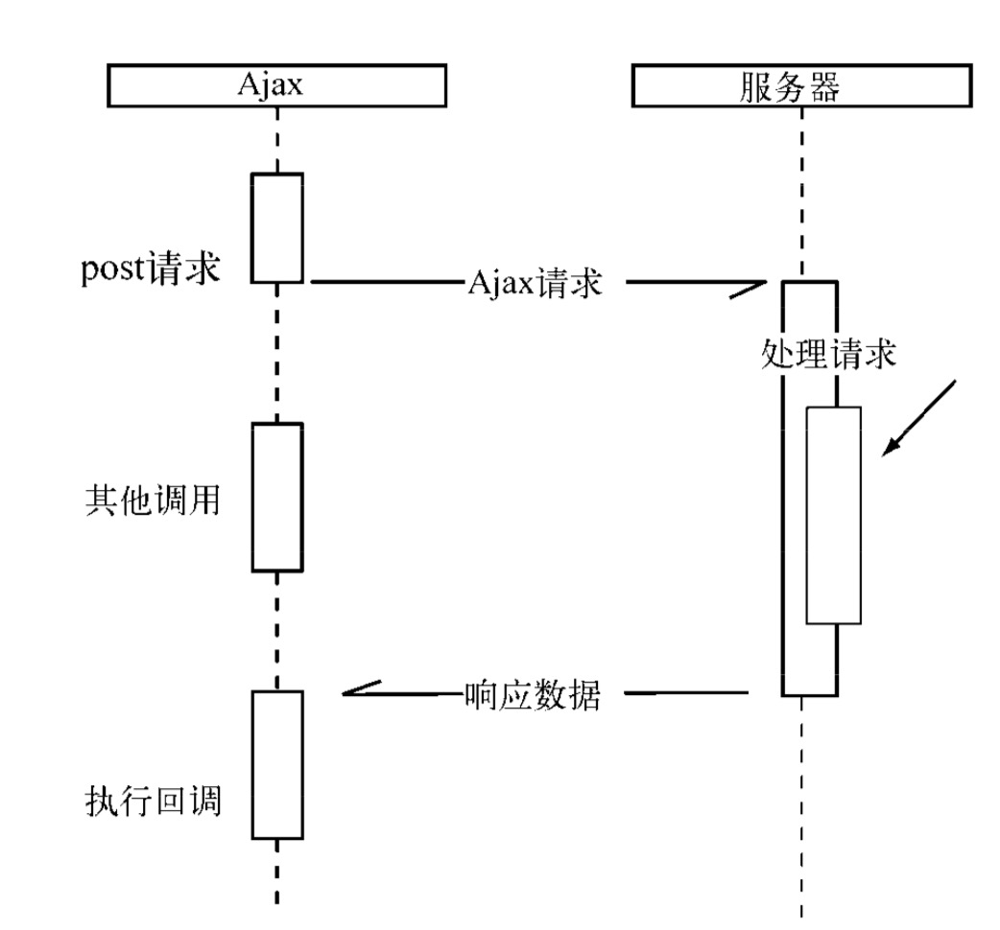
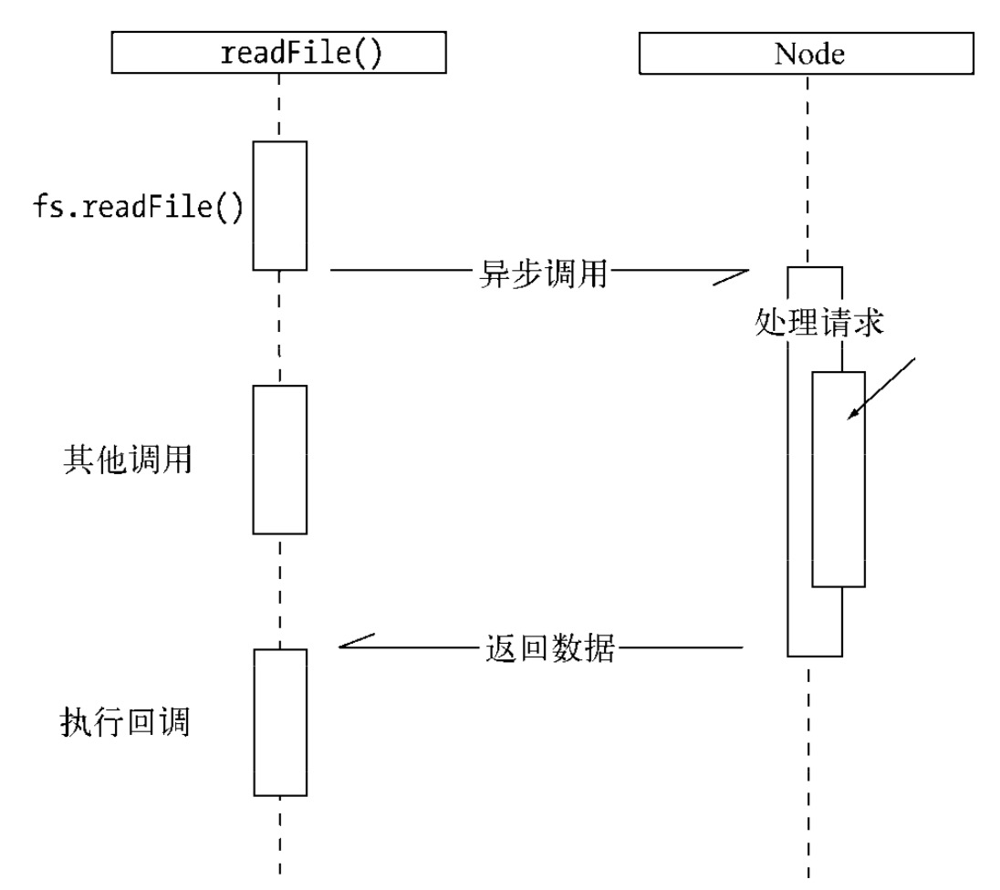

- [Node的特点](#node的特点)
    - [异步I/O](#异步i/o)
    - [事件与回调函数](#事件与回调函数)
    - [单线程](#单线程)

作为后端`Javascript`的运行平台，`Node`保留了前端浏览器`Javascript`中那些熟悉的接口，没有改写语言本身的任何特性，依旧基于作用域和原型链，区别在于它将前端中广泛运用的思想迁移到了服务器端。

### Node的特点
#### 异步I/O
```js
$.post('/url', {title: '􏹄入􏹅出Node.js'}, function (data) { 
    console.log('收􏹆响应');
}); 
console.log('发􏹇Ajax结􏹈');
```
熟悉异步的用户必然知道，“收到响应”是在“发送`ajax`结束”之后输出的。在调用`$.post()`后，后续代码是被立即执行的，而“收到响应”的执行时间是不被预期的。我们只知道它将在这个异步请求结束后执行，但并不知道具体的时间点。异步调用中对于结果值得捕获是符合“don‘t call me，I will call you”的原则的，这也是注重结果，不关心过程的一种表现。


在`Node`中，异步I/O也很常见。以读取文件为例，我们可以看到它与前端`ajax`调用的方式是极其类似的。
```js
var fs = require('fs');
fs.readFile('/path', function (err, file) { 
    console.log('读取文件完成');
}); 
console.log('发起读取文件');
```
这里的“发起读取文件”是在“读取文件完成”之前输出的。同样，“读取文件完成”的执行也取决于读取文件的异步调用何时结束。


在`node`中绝大多数的操作都是以异步的方式进行调用。

下面两个文件读取任务的耗时取决于最慢的那个文件读取的耗时：
```js
fs.readFile('/path1', function (err, file) { 
    console.log('读取文件1完成');
});
fs.readFile('/path2', function (err, file) {
    console.log('读取文件2完成'); 
});
```
而对于同步I/O而言，他们的耗时是两个任务的耗时之和。

#### 事件与回调函数
`node`将前端浏览器中应用广泛且成熟的事件引入后端，配合异步I/O，将事件点暴露给业务逻辑。

下面的例子展示的是`ajax`异步提交的服务器端处理过程。`node`创建一个web服务器，并侦听8080端口。对于服务器，我们为其绑定了`request`事件，对于请求对象，我们为其绑定了`data`事件和`end`事件：
```js
var http = require('http');
var querystring = require('querystring');
//侦听服务器的request事件
http.createServer(function(req, res) {
    var postData = '';
    req.setEncoding('utf8');
    //侦听请求的data事件
    req.on('data', function(trunk) {
        postData += trunk;
    });
    //侦听请求的end事件
    req.on('end', function() {
        res.end(postData);
    });
}).listen(8080);
console.log('服务器启动完成');
```
相应的前端为`ajax`请求绑定了`success`事件
```js
$.ajax({
    'url': '/url',
    'method': 'POST',
    'data': {},
    'success': function (data) {
        // success事件 
    }
});
```
在多个异步任务的场景下，事件与事件之间各自独立。

#### 单线程
`node`保持了`javascript`在浏览器中单线程的特点。而且在`node`中， `Javascript`与其余线程是无法共享任何状态的。单线程的最大好处是不用像多线程那样处处在意状态的同步问题，这里没有死锁的存在，也没有线程上下文交换所带来的性能上的开销。当然，单线程也存在弱点。
1. 无法利用多核CPU；
2. 错误会引起整个应用退出，应用的健壮性值得考验；
3. 大量计算占用CPU导致无法继续调用异步I/O；