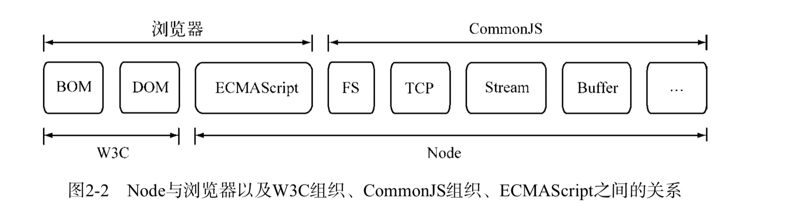
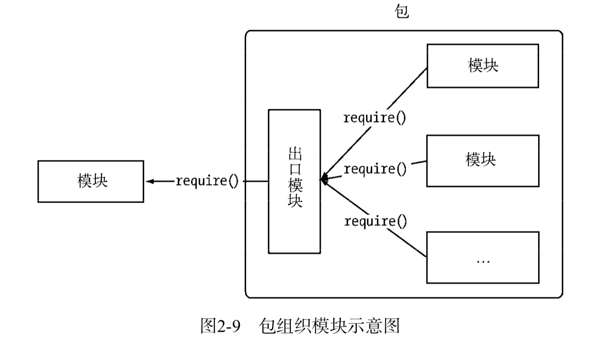

- [CommonJs](#commonjs)
- [Node的模块实现](#node的模块实现)
    - [优先从缓存加载](#优先从缓存加载)
    - [路径分析和文件定位](#路径分析和文件定位)
        - [模块标识符分析](#模块标识符分析)
        - [模块路径](#模块路径)
    - [文件定位](#文件定位)
        - [文件扩展名分析](#文件扩展名分析)
        - [目录分析和包](#目录分析和包)
    - [模块编译](#模块编译)
        - [Javascript模块的编译](#javascript模块的编译)
        - [C/C++模块的编译](#ccc)
        - [json文件的编译](#json文件的编译)
- [核心模块](#核心模块)
    - [Javascript核心模块的编译过程](#javascript核心模块的编译过程)
    - [C/C++核心模块的编译过程](#C/C++核心模块的编译过程)
- [包与NPM](#包与npm)
    - [包结构](#包结构)
    - [包描述文件与npm](#包描述文件与npm)
- [前后端公用模块](#前后端公用模块)
    - [AMD规范](#amd规范)
    - [CMD规范](#cmd规范)
    - [兼容多种模块规范](#兼容多种模块规范)

### CommonJs
`CommonJs`在不断的被规范中，这些规范涵盖了模块、二进制、`Buffer`、字符集编码、I/O流、进程环境、文件系统、套接字、单元测试、web服务器网关接口、包管理等。


`node`借鉴`CommonJs`的`Modules`规范实现了一套非常易用的模块系统，`npm`对`Packages`规范的完好支持使得`node`应用在开发过程中事半功倍。

#### CommonJs的模块规范
`CommonJs`对模块的定义十分简单，主要分为模块引用、模块定义和模块标识3个部分。
1. 模块引用
```js
var math = require('math');
```
2. 模块定义
对应引入的功能，上下文提供了`exports`对象用于导出当前模块的方法或者变量，并且它是唯一导出的出口。在模块中，还存在一个`module`对象，它代表模块自身，而`exports`是`modules`的属性。在`node`中，一个文件就是一个模块，将方法挂载在`exports`对象上作为属性即可定义导出的方式：
```js
// math.js  定义导出
exports.add = function () {
    varsum=0, i=0,
    args = arguments,
    l = args.length; while(i<l){
        sum += args[i++]; 
    }
    return sum; 
};
```
```js
// program.js     引入
var math = require('math');
exports.increment = function (val) {
    return math.add(val, 1); 
};
```
3. 模块的标识
模块的标识其实就是传递给`require()`方法的参数，它必须是符合小驼峰命名的字符串，或者以`.`、`..`开头的相对路径，或者绝对路径。它可以没有文件名后缀`.js`。

每个模块具有独立的空间，他们互不干扰。

### Node的模块实现
`node`在实现中并非完全按照规范实现，而是对模块规范进行了一定的取舍，同时增加了少许自身需要的特性。尽管规范中`exports`、`require`和`module`听起来十分简单，但是`node`在实现他们的过程中经历了3个步骤
1. 路径分析
2. 文件定位
3. 编译执行

在`node`中，模块分为两类：一类是`node`提供的模块，称为核心模块；另一类是用户编写的模块，称为文件模块。
- 核心模块部分在`node`源代码的编译过程中，编译进了二进制执行文件。在`node`进程启动时，部分核心模块就被直接加载进内存中，所以这部分核心模块引入时，文件定位和编译执行这两个步骤可以省略掉，并且在路径分析中优先判断，所以它的加载速度是最快的。
- 文件模块则是在运行时动态加载，需要完成的路径分析、文件定位、编译执行过程，速度比核心模块慢。

#### 优先从缓存加载
与前端浏览器会缓存静态脚本文件以提高性能一样，`node`对引入过的模块都会进行缓存，以减少二次引入时的开销。不同的是浏览器仅仅缓存文件，而`node`缓存的是编译和执行之后的对象。

不论是核心模块还是文件模块，`require()`方法对相同模块的二次加载都一律采用缓存优先的方式，这是第一优先级的。不同之处在于核心模块的缓存检查先于文件模块的缓存检查。

#### 路径分析和文件定位
##### 模块标识符分析
前面说过`require()`接受一个标识作为参数。在`node`中正是基于这样一个标识符进行模块查找的。模块标识符在`node`中主要分为以下几类。
1. 核心模块，如`http`、`fs`、`path`等。
2. `.`或`..`开始的相对路径文件模块。
3. 以/开始的绝对路径文件模块。
4. 非路径形式的文件模块，如自定义的`connect`模块。

- 核心模块
优先级仅次于缓存加载，它在`node`的源代码编译过程中已经编译为二进制代码，其加载过程最快。
如果试图加载一个与核心模块标识符相同的自定义模块，那是不会成功的，必须选择一个不同的标识符方式。

- 路径形式的文件模块
以`.`、`..`和`/`开始的标识符，这里都是被当做文件模块来处理。`require`方法会将路径转为真实路径，并以真实路径作为索引，将编译执行后的结果存放在缓存中，以使二次加载时更快。因为路径明确指出，加载速度慢于核心模块。

- 自定义模块
自定义模块指的是非核心模块，也不是路径形式的标识符。可能是一个文件或者包的形式。这种模块查找最慢。

##### 模块路径
模块路径是`node`在定位文件模块的具体文件时制定的查找策略，具体表现为一个路径组成的数组。
```js
//module_path.js
console.log(module.paths);

//执行module_path.js文件， 会输出一个数组
//在linux下
[
    '/home/jackson/research/node_modules', 
    '/home/jackson/node_modules', 
    '/home/node_modules',
    '/node_modules'
]
//在windows下
[ 'c:\\nodejs\\node_modules', 'c:\\node_modules' ]
```
模块路径的生成规则如下所示。
- 当前文件目录下的`node_modules`目录。
- 父目录下的`node_modules`目录。
- 父目录的父目录下的`node_modules`目录。
- 沿路径向上逐级递归，直到根目录下的`node_modules`目录。

#### 文件定位
从缓存加载的优化策略使得二次引入时不需要路径分析、文件定位和编译执行过程，大大提高了加载模块时的效率。
##### 文件扩展名分析
`require()`在分析标识符的过程中，会出现标识符中不包含文件扩展名的情况。`CommonJs`模块规范也允许在标识符中不包含文件扩展名，这种情况下，`node`会按`.js`、`.json`、`.node`的次序补足扩展名，依次尝试。如果是`.node`和`.json`文件，建议在传递给`require()`的标识符中带上扩展名，这样会加快一点速度。
##### 目录分析和包
在分析标识符的过程中，`require()`通过分析文件扩展名之后，可能没有查找到对应文件，但却得到一个目录，这在引入自定义模块和逐个模块路径进行查找时经常会出现，此时`node`会将目录当做一个包来处理。

 在这个过程中，首先，`node`在当前目录下查找`package.json`（`CommonJs`包规范定义的包描述文件），通过`JSON.parse()`解析出包描述对象，从中取出`main`属性指定的文件名进行定位。如果文件名缺少扩展名，将会进入扩展名分析的步骤。

而如果`main`属性指定的文件名错误，或者压根没有`package.json`文件，`node`会将`index`当做默认文件名，然后依次查找`index.js`、`index.json`、`index.node`。

如果在目录分析的过程中没有定位成功任何文件(这里是加载核心模块或者第三方模块，并不是文件模块这种有路径写好的)，则自定义模块进入下一个模块路径进行查找。如果模块路径数组都被遍历完毕，依然没有查找到目录文件，则会抛出查找失败的异常。

#### 模块编译
在`node`中，每个文件模块都是一个对象，它的定义如下：
```js
function Module(id, parent) { 
    this.id = id;
    this.exports = {}; 
    this.parent = parent;
    if (parent && parent.children) {
        parent.children.push(this);
    }
    this.filename = null; 
    this.loaded = false; 
    this.children = [];
}
```
定位到具体的文件后，`noee`会新建一个模块对象，然后根据路径载入并编译。对于不同的文件扩展名，其载入方法也有所不同。
- `.js`文件。通过`fs`模块同步读取文件后编译执行。
- `.node`文件。这是用`C/C++`编写的扩展文件，通过`dlopen()`方法加载最后编译生成的文件。
- `.json`文件。通过`fs`模块同步读取文件后，用`JSON.parse()`解析返回结果。
- 其余扩展名文件。它们都被当做`.js`文件载入。

##### Javascript模块的编译
回到`CommonJs`模块规范，我们知道每个模块文件中存在着`require`、`exports`、`module`这3个变量，但是它们在模块文件中并没有定义，那么从何而来呢？其实在`node`的api文档中，我们知道每个模块还有`__filename`、`__dirname`这两个变量的存在，它们又是从何而来的呢？

事实上，在编译的过程中，`node`对获取的`Javascript`文件内容进行了头尾包装。在头部添加了`(function(exports,require,module,__filename,__dirname){···})`;
```js
(function (exports, require, module, __filename, __dirname) { 
    var math = require('math');
    exports.area = function (radius) {
        return Math.PI * radius * radius; 
    };
 });
```
这样每个模块文件之间都进行了作用域隔离。包装之后的代码会通过`vm`原生模块的`runInThisContext()`方法执行，返回一个具体的`function`对象。最后，将当前模块对象的`exports`属性、`require()`方法、`module`模块对象自身，以及在文件定位中得到的完整文件路径和文件目录作为参数传递给这个`function()`执行。

这就是这些变量并没有定义在每个模块文件中却存在的原因。在执行之后，模块的`exports`属性被返回给了调用方。`exports`属性上的任何方法和属性都可以被外部调用到，但是模块中的其余变量或属性则不可直接被调用。

##### <span id="ccc">C/C++模块的编译<span>
···

##### json文件的编译
`.json`文件的编译是3中编译方式中最简单的。`node`利用`fs`模块同步读取`json`文件的内容之后，调用`JSON.parse()`方法得到对象，然后将它赋给模块对象的`exports`,以供外部调用。

`JSON`文件在用作项目的配置文件时比较有用。如果你定义了一个`JSON`文件作为配置，那就不必调用`fs`模块去异步读取和解析，直接调用`require()`引入即可。此外，你还可以享受到模块缓存的便利，并且二次引入时也没有性能影响。

### 核心模块
前面提到，`node`的核心模块在编译成可执行文件的过程中被编译进了二进制文件。核心模块其实分为`C/C++`编写的和`Javasript`编写的两个部分，其中`C/C++`文件存放在`Node`项目的`src`目录下，`Javascript`文件存放在`lib`目录下。

#### Javascript核心模块的编译过程
···

#### C/C++核心模块的编译过程
···

### 包与NPM


`CommonJs`的包规范的定义由包结构和包描述文件两个部分组成，前者用于组织包中的各种文件，后者则用于描述包的相关信息，以供外部读取分析。

#### 包结构
完全符合`CommonJs`规范的包目录应该包含如下这些文件。
- `package.json`：包描述文件
- `bin`：用于存放可执行二进制文件的目录。
- `lib`: 用于存放`Javascript`代码的目录。
- `doc`：用于存放文档的目录。
- `test`：用于存放单元测试用例的代码。

#### 包描述文件与npm
包描述文件用于表达非代码相关的信息，它是一个`JSON`格式的文件----`package.json`，位于包的根目录下，是包的重要组成部分。而`npm`的所有行为都与包描述文件的字段息息相关。
- `name`。报名。规范定义它需要有小写的字母和数字组成。
- `description`。包简介。
- `version`。版本号。该版本号十分重要，常常用于控制一些版本控制的场合。
- `keywords`。关键词数组，`npm`中主要用来做分类搜索。
- `maintainers`。包维护者列表。每个维护者由`name`、`email`和`web`这3个属性组成。`maintainers: [{}]`
- `contributors`。贡献者列表。
- `bugs`。一个可以反馈`bug`的网页地址或邮件地址。
- `licenses`。当前包所使用的许可证列表，表示这个包可以在哪些许可证下使用。
- `repositories`。托管源代码的位置列表，标明可以通过哪些方式和地址访问包的源代码。
- `dependencies`。使用当前包所需要依赖的包列表(生成环境)
- `homepage`。当前包的网站地址。

···查看官网

- `script`。脚本说明对象。它主要被包管理器用来安装、编译、测试和卸载包。
```js
"script": {
    "install": "install.js",
    "uninstall": "uninstall.js",
    "build": "build.js",
    "doc": "make-doc.js",
    "test": "test.js"
}
```
在包描述文件的规范中，`npm`实际需要的字段主要有`name`、`version`、`description`、`keywords`、`repositories`、`author`、`bin`、`main`、`script`、`engines`、`dependencies`、`devDependencies`。

与包规范的区别在于多了`author`、`bin`、`main`和`devDependencies`这4个字段。
- `author`。包作者。
- `bin`。一些包作者希望包可以作为命令行工具使用。
- `mian`。模块引入方法`require()`在引入包时，会优先检查这个字段，并将其作为包中其余模块的入口。如果不存在这个字段，`require()`方法会查找包目录下的`index.js`、`index.node`、`index.json`文件作为默认入口。
- `deDependencies`。一些模块只在开发时需要依赖。

### 前后端公用模块
鉴于网络的原因，`CommonJs`为后端`Javascript`制定的规范并不完全适合前端的应用场景。经过一段争执之后，`AMD`规范最终在前端应用场景中胜出。即为“异步模块定义”，除此之外，还有玉伯定义的`CMD`规范。

#### AMD规范
`AMD`规范是`CommonJs`模块规范的一个延伸，它的模块定义如下：

`define(id?, dependencies?, factory)`;

它的模块`id`和依赖是可选的，与`Node`模块相似的地方在于`factory`的内容就是实际代码的内容。
```js
define(function() {
    var exports = {}; exports.sayHello = function() {
        alert('Hello from module: ' + module.id); 
    };
    return exports; 
});
```
不同之处在于`AMD`模块需要用`define`来明确定义一个模块，而在`node`实现中是隐式包装的，它们的目的是进行作用域隔离，仅在需要的时候被引入，避免掉过去那种通过全局变量或者全局命名空间的方式，以免变量污染和不小心被修改。另一个区别则是内容需要通过返回的方式实现导出。

#### CMD规范
`CMD`规范由国内的玉伯提出，与`AMD`规范的主要区别在于定义模块和依赖引入的部分。`AMD`需要在声明模块的时候指定所有的依赖，通过形参传递依赖到模块内容中：
```js
define(['dep1', 'dep2'], function (dep1, dep2) { 
    return function () {};
});
```
与`AMD`模块规范相比，`CMD`模块更接近于`node`对`CommonJs`规范的定义：

`define(factory)`；

在依赖部分，`CMD`支持动态引入，示例如下：
```js
define(function(require, exports, module) {
    //the module code goes here
 });
```
`require`、`exports`和`module`通过形参传递给模块，在需要依赖模块时，随时调用`require()`引入。

#### 兼容多种模块规范
 为了要使同一个模块可以运行在前后端，在写作的过程中需要考虑兼容前端也实现模块规范的环境。

 代码封装，使其能够兼容`node`、`amd`、`cmd`以及常见浏览器环境。