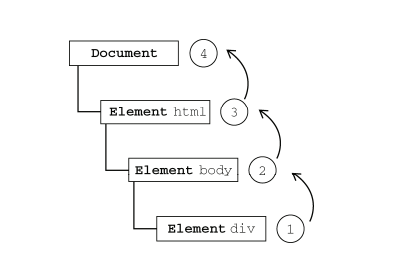
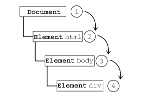
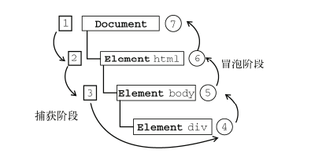
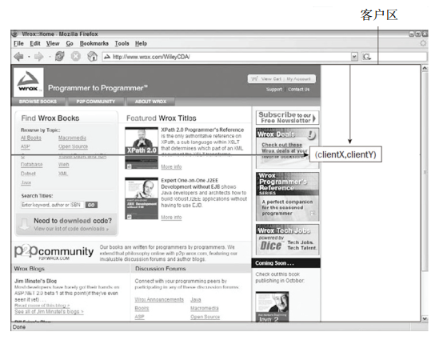
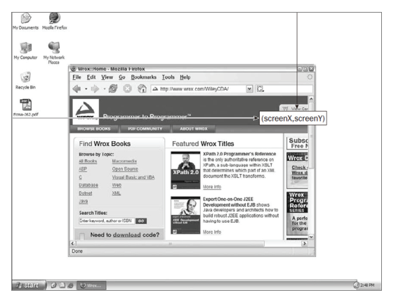
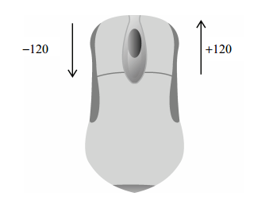

## 事件

### 事件流

#### 事件冒泡

IE的事件流叫做事件冒泡，即事件开始时由最具体的元素(文档中嵌套层次最深的那个节点)接收，然后逐级向上传播到较为不具体的节点(文档)。

例子：

```html
<!DOCTYPE html>
<html>
    <head>
    	<title>Event Bubbling Example</title>
    </head>
<body>
	<div id="myDiv">Click Me</div>
</body>
</html>
```

如果你单击了页面中的`div`元素，那么这个`click`事件会按照如下顺序传播：

1. `<div>`
2. `<body>`
3. `<html>`
4. `document`



IE9、 Firefox、 Chrome 和 Safari 则将事件一直冒泡到 `window` 对象。 

#### 事件捕获

事件捕获的思想是不太具体的节点应该更早接收到事件，而最具体的节点应该最后接收到事件。

例子：还是上面的例子，单击`<div>`元素就会以下列顺序触发`click`事件。

1. `document`
2. `<html>`
3. `<body>`
4. `<div>`

事件捕获过程中，`document`对象首先接收到`click`事件，然后事件沿DOM树依次向下，一直传播到事件的实际目标。



但 IE9、 Safari、 Chrome、 Opera和 Firefox 目前也都支持这种事件流模型，这些浏览器都是从 window 对象开始捕获事件的 。 

#### DOM事件流

“DOM2级事件”规定的事件流包括三个阶段：事件捕获阶段、处于目标阶段和事件冒泡阶段。

首先发生的是事件捕获，为截获事件提供了机会。然后是实际的目标接收到事件（尽管“处于目标”发生在冒泡阶段）。最后一个阶段是冒泡阶
段，可以在这个阶段对事件做出响应。 以前面简单的 HTML 页面为例，单击`<div>`元素会按照图所
示顺序触发事件。



在 DOM 事件流中，实际的目标（`<div>`元素）在捕获阶段不会接收到事件。这意味着在捕获阶段，事件从 `document `到`<html>`再到`<body>`后就停止了。下一个阶段是“处于目标”阶段，于是事件在`<div>`上发生，**并在事件处理中被看成冒泡阶段的一部分**。然后，冒泡阶段发生，事件又传播回文档。 

> 即使DOM2事件规范明确要求捕获阶段不会涉及事件目标， 但是大部分浏览器还是可以在捕获阶段触发事件对象上的事件。结果，就是有两个机会在目标对象上面操作事件。


### 事件处理程序

#### HTML事件处理程序

```html
<input type="button" value="Click Me" onclick="alert(&quot;Clicked&quot;)" />
```

在html标签绑定的事件函数中有一个局部变量`event`，也就是事件对象。通过`event`变量，可以直接访问事件对象，在这个函数内部，`this`值等于事件的目标元素。

例如：

```html
<input type="button" value="Click Me" onclick="alert(event.type)">

<input type="button" value="Click Me" onclick="alert(this.value)">
```

如果当前元素是一个表单输入元素，则作用域中还会包含访问表单元素（父元素）的入口，如下所示： 

```js
function(){
	with(document){
		with(this.form){	//this.form
			with(this){
			//元素属性值
			}
		}
	}
}
```

#### DOM0级事件处理程序

```js
element.onclick = functon() {
    //do something
    console.log(this)
}
element.onclick = null;   //删除事件处理程序
```

#### DOM2级事件处理程序

DOM2级事件定义了两个方法，所有DOM节点中都包含这两个方法，并且接受3个参数：要处理的事件名、事件处理程序、一个布尔值。最后这个布尔值参数如果为`true`，表示在捕获阶段调用事件处理程序；如果为`false`，表示在冒泡阶段调用事件处理程序。

- `addEventListener()`
- `removeEventListener()`：**参数必须要和addEventListenr一样才会被移除， 记住第二个参数函数不能为匿名函数**

```js
var btn = document.getElementById("myBtn");
btn.addEventListener("click", function(event){
	alert(this.id);		//this就是当前dom
}, false);				//false 冒泡阶段
```

使用DOM2级方法添加事件处理程序的主要好处是可以添加多个事件处理程序。

```js
//DOM2级事件可以绑定多个事件，不会覆盖， DOM0就会覆盖掉
//所以下面 会按顺序执行
var btn = document.getElementById("myBtn");
btn.addEventListener("click", function(){
	alert(this.id);
}, false);
btn.addEventListener("click", function(){
	alert("Hello world!");
}, false);
```

移除添加的事件程序，参数要一样，并且参数中函数不要是匿名函数。

```js
var btn = document.getElementById("myBtn");
btn.addEventListener("click", function(){
	alert(this.id);
}, false);
btn.removeEventListener("click", function(){ //没有用！
	alert(this.id);		
}, false);

//改为有名函数
var btn = document.getElementById("myBtn");
var handler = function(){
	alert(this.id);
};
btn.addEventListener("click", handler, false);
btn.removeEventListener("click", handler, false); //有效！
```

大多数情况下，都是将事件处理程序添加到事件流的冒泡阶段。IE9、 Firefox、 Safari、 Chrome 和 Opera 支持 DOM2 级事件处理程序 。

#### IE事件处理程序

IE也实现了两个类似的方法，这两个方法接收两个参数：事件处理程序名称和事件处理程序函数。IE8之前只支持事件冒泡，所以通过`attachEvent()`添加的事件处理程序只会被添加到冒泡阶段。

- `attachEvent()`
- `detachEvent()`

> 注意：使用attachEvent()方法的情况下，事件处理程序会在全局作用域中运行，因此this等于window。

```js
var btn = document.getElementById("myBtn");
btn.attachEvent("onclick", function(){		
	alert(this === window); //true			
});
```

和上面的一样，`attachEvent()`也可以添加多个事件处理程序，但是顺序确实从下往上执行。

`detachEvent()`移除也和上面一样，必须提供相同的参数，也不能使用匿名函数。


### 事件对象

#### DOM中的事件对象

- 标准浏览器下在触发DOM上的某个事件时，会产生一个事件对象`event`。
- 在IE下时则是以window对象的event属性显示`window.event`。

无论是DOM0或DOM2级都会传入`event`对象。

```js
//兼容写法
function aa(event) {
    var event = event || window.event;
}
```

以下为几个比较常用的：

| 属性/方法           | 类型     | 读写 | 说明                                                         |
| :------------------ | -------- | ---- | ------------------------------------------------------------ |
| `currentTarget`     | Element  | 只读 | 其事件处理程序当前正在处理事件的那个元素**(即绑定事件的那个元素)** |
| `eventPhase`        | Integer  | 只读 | 调用事件处理程序的阶段： 1表示捕获阶段， 2表示“处于目标”， 3表示冒泡阶段 |
| `preventDefault()`  | Function | 只读 | 取 消 事 件 的 默 认 行 为 。 如 果 `cancelable`是true，则可以使用这个方法 |
| `stopPropagation()` | Function | 只读 | 取消事件的进一步捕获或冒泡。如果`bubbles`为true，则可以使用这个方法 |
| `target`            | Element  | 只读 | 事件的目标**（触发事件的元素）**                             |
| `type`              | String   | 只读 | 被触发的事件的类型                                           |

其中在事件处理程序内部，对象`this`始终等于`currentTarget`的值，而`target`则只包含事件的实际目标。

```js
//因为事件冒泡的原因 点击button按钮 冒泡 到body上面触发
document.body.onclick = function(event){
    alert(event.currentTarget === document.body); //true
    alert(this === document.body); //true
    alert(event.target === document.getElementById("myBtn")); //true
};
```

使用`preventDefault()`方法阻止默认事件。

```js
var link = document.getElementById("myLink");
link.onclick = function(event){
    //在原生中 也可以直接使用  return false 也可以阻止默认事件
    //包括ie 兼容的写法：window.event ? window.event.returnValue=false : event.preventDefault();
	event.preventDefault();
};
```

使用`stopPropagation()`来阻止事件冒泡或者捕获。

```js
btn.onclick = function(event){
    //包括ie 兼容写法：window.event.window.event.cancelBubble=true : event.stopPropagation()
	event.stopPropagation();
};
```

#### IE中的事件对象

1. 通过HTML来访问，可以在函数中传入一个`event`参数。

```html
<input type="button" value="Click Me" onclick="alert(event)">
```

2. 在DOM0中用`window.event`来访问。

```js
var btn = document.getElementById("myBtn");
btn.onclick = function(){
	var event = window.event;
};
```

3. 在DOM2中可以在事件处理程序中传入一个`event`参数，也可以使用`window.event`。

```js
var btn = document.getElementById("myBtn");
btn.attachEvent("onclick", function(event){
	alert(event.type); //"click"
});
```

IE 的 event 对象同样也包含与创建它的事件相关的属性和方法。 

| 属性/方法      | 类型    | 读/写 | 说明                                                         |
| -------------- | ------- | ----- | ------------------------------------------------------------ |
| `cancelBubble` | Boolean | 读/写 | 默认值为`false`，但将其设置为`true`就可以取消事件冒泡（与DOM中的`stopPropagation()`方法的作用相同） |
| `returnValue`  | Boolean | 读/写 | 默认值为`true`，但将其设置为`false`就可以取消事件的默认行为（与DOM中的`preventDefault()`方法的作用相同） |
| `srcElement`   | Element | 只读  | 事件的目标（与DOM中的`target`属性相同）                      |
| `type`         | String  | 只读  | 被触发的事件的类型                                           |

```js
//兼容写法
//阻止事件冒泡
window.event ? window.event.cancelBubble = true : event.stopPropagation();
//阻止默认事件
window.event ? window.event.returnValue = false : event.preventDefault();
```

在IE的DOM2级事件中，因为监听的事件处理函数内部的`this`是指向`window`的，所以最好内部不要使用`this`，可以使用`event.srcElement`

```js
var btn = document.getElementById("myBtn");
btn.onclick = function(){
	alert(window.event.srcElement === this); //true
};	
btn.attachEvent("onclick", function(event){		//IE的DOM2的事件处理函数中this指向window
	alert(event.srcElement === this); //false
});
```


### 事件类型

DOM3级事件，规定了以下几类事件：

- UI（User Interface，用户界面）事件，当用户与页面上的元素交互时触发； 
- 焦点事件，当元素获得或失去焦点时触发； 
- 鼠标事件，当用户通过鼠标在页面上执行操作时触发； 
- 滚轮事件，当使用鼠标滚轮（或类似设备）时触发； 
- 文本事件，当在文档中输入文本时触发； 
- 键盘事件，当用户通过键盘在页面上执行操作时触发； 
- 合成事件，当为 IME（Input Method Editor，输入法编辑器）输入字符时触发； 
- 变动（mutation）事件，当底层 DOM 结构发生变化时触发 

#### UI事件

以下为常用或兼容性还不错的事件

- `load` 
- `unload` 
- `abort` 
- `error` ： 当发生 JavaScript 错误时在 window 上面触发，当无法加载图像时在``元素上面触
  发，当无法加载嵌入内容时在`<object>`元素上面触发，或者当有一或多个框架无法加载时在框
  架集上面触发。 
- select : 当用户选择文本框（`<input>`或`<texterea>`）中的一或多个字符时触发。 

- `resize` 
- `scroll`

##### load事件

当页面完全加载后（包括所有图像、 JavaScript 文件、CSS 文件等外部资源），就会触发 window 上面的 load 事件。有两种定义 onload 事件处理程序的方式。 

```
//第一种
window.onload = function() {}

//第二种
<body onload="alert('load')">
```

也可以用于img，图像的加载。

```js
img.onload = function() {}
//或

```

**这里有一点需要格外注意；新图像元素不一定要从添加到文档后才开始下载，只要设置了`src`属性就会开始下载。同样的功能也可以通过使用DOM0级的`Image`对象实现。在DOM出现之前，开发人员经常使用`Image`对象在客户端预先加载图像。可以像使用``元素一样使用`Image`对象，只不过无法将其添加到DOM树中。**

图像预加载， 可先在`window.onload`之前加载。

```js
window.onload = function() {
    var image = new Image();
    image.onload = function() {
        //do something
    }
    image.src = './xx'
}
```

##### scroll事件

```js
window.onscroll = function() {
    alert(document.documentElement.scrollTop || document.body.scrollTop)
}

element.onscroll = function(){}
```

#### 焦点事件

焦点事件会在页面元素获得或失去焦点时触发。利用这些事件并与 `document.hasFocus()`【是否有焦点】方法及`document.activeElement` 【获得焦点的元素】属性配合，可以知晓用户在页面上的行踪。 

只指出常用的兼容较好的事件：

- blur： 元素失去焦点时触发。这个事件不会冒泡；所有浏览器都支持它。
- focus： 在元素获得焦点时触发。这个事件不会冒泡；所有浏览器都支持它。

#### 鼠标与滚轮事件

只指出了兼容性较好的事件：

- `click`：用户单击主鼠标按钮或按下回车键时触发。
- `dbclick`
- `mousedown`
- `mouseup` 
- `mousemove`：当鼠标指针在元素内部移动时重复地触发。不能通过键盘触发这个事件。 
- `mouseout` ：在鼠标指针位于一个元素上方，然后用户将其移入另一个元素时触发。又移入的另
  一个元素可能位于前一个元素的外部，也可能是这个元素的子元素。不能通过键盘触发这个事件。 

- `mouseover`: 在鼠标指针位于一个元素外部，然后用户将其首次移入另一个元素边界之内时触
  发。不能通过键盘触发这个事件。 

页面上的所有元素都支持鼠标事件。除了 `mouseenter` 和 `mouseleave`，所有鼠标事件都会冒泡。

##### 客户区坐标位置

获取到的是鼠标触发点相对于浏览器可视区域到左、上的距离，不随页面滚动而改变。

- `event.clientX`
- `event.clientY`



##### 页面坐标位置

相对于文档区域，会随页面滚动而改变。换句话表示鼠标光标在页面中的位置，因此坐标是从页面本身而非视口的左边和顶端计算的。

- `event.pageX`
- `event.pageY`

在页面没有滚动的情况下，`pageX`和`pageY`的值与`clientX`和`clientY`的值相等。

```js
//IE8早期不支持pageX/Y属性，可以使用以下方式计算
var {pageX, pageY} = event
if (pageX === undefined){
	pageX = event.clientX + (document.body.scrollLeft ||
	document.documentElement.scrollLeft);
}
if (pageY === undefined){
	pageY = event.clientY + (document.body.scrollTop ||
	document.documentElement.scrollTop);
}
```

##### 屏幕坐标位置

鼠标事件发生时，不仅会有相对于浏览器窗口的位置，还有一个相对于整个电脑屏幕的位置。

- `event.screenX`
- `event.screenY`



##### 修改键

提供了修改键就是 Shift、 Ctrl、 Alt 和 Meta（在 Windows 键盘中是 Windows 键，在苹果机中是 Cmd 键） ，DOM 为此规定了 4 个属性，表示这些修改键的状态： `event.shiftKey`、 `ctrlKey`、 `altKey` 和 `metaKey`。这些属性中包含的都是布尔值，如果相应的键被按下了，则值为 `true`，否则值为 `false`。 

> IE9、 Firefox、 Safari、 Chrome 和 Opera 都支持这 4 个键。 IE8 及之前版本不支持metaKey 属性。 

##### 相关元素

在`mouseover`和`mouseout`事件中存在一个相关元素和主目标的概念。

比如从a元素`mouseout`，然后`mouseover`进入b元素。

1. 那么当从a元素`mouseout`移出时，a为主目标，b为相关元素。
2. 如果`mouseover`移入b元素时，b为主目标，a为相关元素。

DOM通过`event`对象的`relatedTarget`提供了相关元素信息。这个属性只对于`mouseover`和`mouseout`事件才包含值，对于其他事件值为`null`。

##### 鼠标按钮

`event.button`: 0表示主鼠标按钮(即左键)，1表示中间的鼠标按钮(鼠标滚轮按钮)，2表示次鼠标按钮(即右键)。

##### 鼠标滚轮事件

- `mousewheel`

这个事件可以在任何元素上面触发，最终会冒泡到 document（IE8）或 window（IE9、 Opera、Chrome 及 Safari）对象。 

与 mousewheel 事件对应的 event 对象除包含鼠标事件的所有标准信息外，
还包含一个特殊的 wheelDelta 属性。当用户向前滚动鼠标滚轮时， wheelDelta 是 120 的倍数；当用
户向后滚动鼠标滚轮时， wheelDelta 是120 的倍数。 



##### 触摸设备

iOS和Android设备的实现非常特别，因为没有鼠标，在面向iPhone和iPod中的Safari开发时，要记住一下几点：

- 不支持dbclick事件。 双击只会放大。
- 轻击可单击的元素(如链接，button，指定了onclick的元素等)会触发`mousemove`事件。如果此操作会导致内容变化，将不再有其他事件发生；如果屏幕没有因此变化，那么会依次发生 `mousedown`、 `mouseup` 和 `click` 事件。轻击不可单击的元素不会触发任何事件。 
- `mousemove` 事件也会触发 `mouseover` 和 `mouseout` 事件。 
- 两个手指放在屏幕上且页面随手指移动而滚动时会触发 `mousewheel` 和 `scroll` 事件。 

#### 键盘与文本事件

- `keydown`：当用户按下键盘上的任意键时触发，而且如果按住不放的话，会重复触发此事件。 
- `keypress`：当用户按下键盘上的字符键时触发，而且如果按住不放的话，会重复触发此事件。 
- `keyup`：当用户释放键盘上的键时触发。 

在发生 `keydown` 和 `keyup` 事件时， `event` 对象的 `keyCode` 属性中会包含一个代码，与键盘上一个特定的键对应。 

还有`event.charCode`可以获得那个键所代表字符的ASCLL编码，这个属性只有在发生`keypress`事件时才包含值。

#### DOM变动事件

- `DOMSubtreeModified`  
- `DOMNodeInserted` 
- `DOMNodeRemoved `
- `DOMNodeInsertedIntoDocument `
- `DOMNodeRemovedFromDocument `
- `DOMAttrModified `
- `DOMCharacterDataModified `

#### HTML5事件

