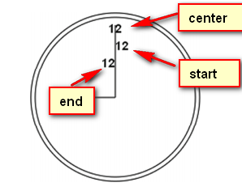

 ### 基本用法

1. 要使用`<canvas>`元素，必须先设置其`width`和`height`属性，指定可以绘图的区域大小。如果不支持`<canvas>`会出现标签内的文本信息。

```html
<canvas id="drawing" width=" 200" height="200">A drawing of something.</canvas>
```

2. 要在这块画布（canvas）上绘图，需要取得绘图上下文。需要使用`getContext()`方法并传入上下文的名字。传入`2d`，就可以取得 2D 上下文对象。 

```js
var drawing = document.getElementById("drawing");
//确定浏览器支持<canvas>元素
if (drawing.getContext){
    var context = drawing.getContext("2d");
	//更多代码
}
```

3. 使用`toDataURl()`方法，可以导出在`<canvas>`元素上绘制的图像。这个方法接受一个参数，即图像的`MIME`类型格式，而且适用于创建图像的任何上下文。比如，要取得画布中的一幅PNG格式的图像：

   ```js
   var drawing = document.getElementById("drawing");
   
   //确定浏览器支持<canvas>元素
   if (drawing.getContext){
   	//取得图像的数据 URI
   	var imgURI = drawing.toDataURL("image/png");
   	//显示图像
   	var image = document.createElement("img");
   	image.src = imgURI;
   	document.body.appendChild(image);
   }
   ```

   默认情况下，浏览器会将图像编码为 PNG 格式（除非另行指定）。 

   > 注意：如果绘制到画布上的图像源自不同的域， toDataURL()方法会抛出错误。 


### 2D上下文

使用2D绘图上下文提供的方法，可以简单的绘制2D图形。2D上下文的坐标开始于`<canvas>`元素的左上角，远点坐标是(0,0)。所有的坐标值都是基于这个原点计算，x值越大越右，y越大越下。默认情况，`width`和`height`表示水平和垂直两个方向上可用的像素数目。

#### 填充和描边

- `fillStyle`：填充
- `strokeStyle`：描边

这两个属性的值可以是字符串、渐变对象或模式对象。颜色

```js
var drawing = document.getElementById("drawing");
//确定浏览器支持<canvas>元素
if (drawing.getContext){
	var context = drawing.getContext("2d");
	context.strokeStyle = "red";
	context.fillStyle = "#0000ff";
}
```

因为在前面定义了，所有涉及描边和填充的操作都将使用这两个样式，直至重新设置这两个值。

#### 绘制矩形

与绘制矩形有关的方法包括：

- `fillRect()`
- `strokeRect()`
- `clearRect()`

这三个方法都接收4个参数：矩形的x坐标、矩形的y坐标、矩形宽度和矩形高度。这些参数的单位都是像素。

`fillRect()`方法在画布上绘制的矩形会填充指定的颜色。填充的颜色通过`fillStyle`属性指定：

```js
var drawing = document.getElementById("drawing");
//确定浏览器支持<canvas>元素
if (drawing.getContext){
    var context = drawing.getContext("2d");
    //绘制红色矩形
    context.fillStyle = "#ff0000";
    context.fillRect(10, 10, 50, 50);
    //绘制半透明的蓝色矩形
    context.fillStyle = "rgba(0,0,255,0.5)";
    context.fillRect(30, 30, 50, 50);
}
```

`strokeRect()`方法在画布上绘制的矩形会使用指定的颜色描边。描边颜色通过`strokeStyle`属性指定。

> 描边线条的宽度由 `lineWidth` 属性控制，该属性的值可以是任意整数。另外，通过`lineCap` 属性可以控制线条末端的形状是平头、圆头还是方头（"butt"、"round"或"square"），通过`lineJoin`属性可以控制线条相交的方式是圆交、斜交还是斜接（"round"、"bevel"或"miter"）。 

`clearRect()`方法用于清除画布上的矩形区域。本质上，这个方法可以把绘制上下文中的某
一矩形区域变透明。 

#### 绘制路径

要绘制路径首先要调用`beginPath()`方法，表示要开始绘制新路径。

- `arc(x, y, radius, startAngle, endAngle, counterclockwise)`：表示以(x, y)为圆心绘制一条弧线，弧线半径为`radius`，起始和结束角度(用弧度表示)分别为`startAngle`和`endAngle`。最后一个参数表示是否按逆时针方向计算，值为`false`表示按顺时针方向计算。
- `arcTo(x1, y1, x2, y2, radius)`：从上一点开始绘制一条弧线，到(x2, y2)为止，并且以给定的半径radius穿过(x1, x2)。
- `bezierCurveTo(c1x, c1y, c2x, c2y, x, y)`：从上一点开始绘制一条曲线，到(x, y)为止，并且以(c1x, c1y)和(c2x, c2y)为控制点。(就是贝塞尔曲线)
- `lineTo(x, y)`：从上一点开始绘制一条直线，到(x, y)为止。
- `moveTo(x, y)`：将绘图游标移动到(x, y)， 不画线。如果不移动就直接绘制，那么绘图游标会和当前绘制开始点连起来，有一个闭合。
- `quadraticCurveTo(cx, cy, x, y)`：从上一点开始绘制一条二次曲线，到(x, y)为止，并且以(cx, cy)作为控制点。
- `rect(x, y, width, height)`：从点(x, y)开始绘制一个矩形，宽度和高度为width和height指定。这个方法绘制的是矩形路径，而不是`strokeRect()`和`fillRect()`所绘制的独立形状。

创建好路径后，接下来有几种可能的选择：

- 如果想绘制一条连接到起点的线条，可以使用`closePath()`来闭合。
- 如果路径已经完成，你想使用`fillstyle`填充它，可以使用`fill()`方法。
- 也可以使用`stroke()`方法对路径描边，描边使用的是`strokeStyle`。
- 最后还可以调用`clip()`，这个方法可以在路径上创建一个剪切区域。

存在一个isPointInPath()的方法。这个方法接收x和y坐标作为参数，用于在路径被关闭之前确定画布上的某一点是否位于路径上：

```js
if(context.isPointInPath(100, 100)) {
    alert(是在路径上)
}
```

#### 绘制文本

- `fillText()`
- `strokeText()`

这两个方法都可以接收4个参数：要绘制的文本字符串、x坐标、y坐标和可选的最大像素宽度。而且，这两个方法都以下列3个属性为基础。

1. `font`：表示文本样式、大小及字体，用css中指定字体的格式来指定。如：'10px Arial'。
2. `textAlign`：表示文本对齐方式。可能的值有start、end、left、right和center。
3. `textBaseline`：表示文本的基线。可能的值有top、hanging、middle、alphabetic、ideographic和bottom。

这几个属性都有默认值，因此没有必要每次使用它们都重新设置一遍值。

```js
context.font = "bold 14px Arial";
context.textAlign = "center";
context.textBaseline = "middle";
context.fillText("12", 100, 20);
```

因为这里把 `textAlign` 设置为"center"，把 `textBaseline` 设置为"middle"，所以坐标(100,20)表示的是文本水平和垂直中点的坐标。 `fillText()`方法使用`fillStyle` 属性绘制文本，而 `strokeText()`方法使用 `strokeStyle` 属性为文本描边。 



所以textBaseline也是类似的。

`measureText()`方法利用font、textAlign和textBaseline的当前值指定文本大小。

比如假设你想在一个140像素宽的矩形区域中绘制文本Hello world！，下面代码从100像素的字体开始递减，最终会找到合适的字体大小。 字体大小的像素不代表宽度。

```js
var fontSize = 100;
context.font = fontSize + "px Arial";
//自动会根据字体的属性来计算width
while(context.measureText("Hello world!").width > 140){
    fontSize--;
	context.font = fontSize + "px Arial";
}
context.fillText("Hello world!", 10, 10);
context.fillText("Font size is " + fontSize + "px", 10, 50);
```

#### 变换

- `rotate(angle)`：围绕原点旋转图像angle弧度。

- `scale(scaleX, scaleY)`：缩放图像，在x方向乘以scaleX，在y方向乘以scaleY。默认值都是1.0。

- `translate(x, y)`：将坐标原点移动到(x, y)。执行这个变换之后，设置的(x, y)点就成了当前的(0, 0)原点了，一切数学计算都基于这个(0, 0)点开始。

- `transform(m1_1, m1_2, m2_1, m2_2, dx, dy)`：直接修改变换矩阵，方式是乘以如下矩阵。

  m1_1	m1_2	dx

  m2_1	m2_2	dy

  0		0		1

- `setTransform(m1_1, m1_2, m2_1, m2_2, dx, dy)`：将变换矩阵重置为默认状态，然后再调用transform()

无论是执行的变换，还是 `fillStyle`、 `strokeStyle` 等属性，都会在当前上下文中一直有效，除非再对上下文进行什么修改。 

虽然没有什么办法把上下文中的一切都重置回默认值，但有两个方法可以跟踪上下文的状态变化。 

通过`save()`方法，可以将当前的所有设置保存到一个栈结构中。然后可以对上下文进行其他修改。等想要回到之前保存的设置时，可以调用`restore()`方法，在保存设置的栈结构中向前返回一级，恢复之前的状态。连续调用 `save()`可以把更多设置保存到栈结构中，之后再连续调用 `restore()`则可以一级一级返回。 

```js
context.fillStyle = "#ff0000";
context.save();
context.fillStyle = "#00ff00";
context.translate(100, 100);
context.save();
context.fillStyle = "#0000ff";
context.fillRect(0, 0, 100, 200); //从点(100,100)开始绘制蓝色矩形
context.restore();
context.fillRect(10, 10, 100, 200); //从点(110,110)开始绘制绿色矩形
context.restore();
context.fillRect(0, 0, 100, 200); //从点(0,0)开始绘制红色矩形
```

> 注意： save()方法保存的只是对绘图上下文的设置和变换，不会保存绘图上下文的内容。 (我测试比如对变换和fillStyle、strokeStyle这种有效)

#### 绘制图形

如果想把一幅图像绘制到画布上，可以使用`drawImage()`。

1. 传入一个HTML``元素，以及绘制该图像的起点的x和y坐标。

   ```js
   var image = document.images[0];
   context.drawImage(image, 10, 10);
   ```

2. 可以再多传入两个参数来表示绘制图像的大小。 通过这种方式来缩放图像并不影响上下文的变换矩阵。

   ```js
   context.drawImage(image, 10, 10, 100, 100);
   ```

3. 还可以选择把图像中的某个区域绘制到上下文中。需要传入9个参数：要绘制的图像、源图像的x坐标、源图像的y坐标、源图像的宽度、源图像的高度、目标图像的x坐标、目标图像的y坐标、目标图像的宽度、目标图像的高度。

   ```js
   context.drawImage(image, 0, 10, 50, 50, 0, 100, 40, 60);
   ```

除了给`drawImage()`方法传入HTML``元素外，还可以传入另一个`<canvas>`元素作为其第一个参数。

通过`toDataURL()`方法，我们可以获得图像路径。

> 注意：图像不能来自其他域，否则会报错。

#### 阴影

- `shadowColor`：用CSS颜色格式表示的阴影颜色，默认为黑色。
- `shadowOffsetX`：形状或路径x轴方向的阴影偏移量，默认为0。
- `shadowOffsetY`：形状或路径y轴方向的阴影偏移量，默认为0。
- `shadowBlur`：模糊的像素数，默认0，即不模糊。

#### 渐变

渐变由CanvasGradient实例表示。

- `createLinearGradient(起点的x坐标，起点的y坐标，终点的x坐标，终点的y坐标)`：线性渐变

创建了渐变对象后，下一步使用`addColorStop(色标位置， css颜色值)`方法来指定色标。色标位置是一个0(开始的颜色)到1(结束的颜色)之间的数据。例如：

```js
var gradient = context.createLinearGradient(30, 30, 70, 70);
gradient.addColorStop(0, "white");
gradient.addColorStop(1, "black");
//绘制渐变矩形
context.fillStyle = gradient;
context.fillRect(30, 30, 50, 50)；
```

- `createRadialGradient (起点圆的圆心x坐标，起点圆的圆心y坐标，起点圆半径，终点圆的圆心x坐标，终点圆的圆心y坐标，终点圆的半径)`

```js
var gradient = context.createRadialGradient(55, 55, 10, 55, 55, 30);
gradient.addColorStop(0, "white");
gradient.addColorStop(1, "black");
//绘制渐变矩形
context.fillStyle = gradient;
context.fillRect(30, 30, 50, 50)；
```

#### 模式

模式其实就是重复的图像，可以用来填充或描边图形。就好像css中`background-repeat`。调用`createPattern(一个HTML元素，一个表示重复图像的字符串）`，第二个参数包括`repeat`、`repeat-x`、`repeat-y`、`no-repeat`。

```js
var image = document.images[0],
pattern = context.createPattern(image, "repeat");
//绘制矩形
context.fillStyle = pattern;
context.fillRect(10, 10, 150, 150);
```

> 注意：模式与渐变一样，都是从画布的原点(0,0)开始的。所以填充的重复图是从(0, 0)开始算起

`createPattern()`方法的第一个参数也可以是一个`<video>`元素，或者另一个`<canvas>`元素。 

#### 使用图像数据

可以通过`getImageData()`取得原始图像数据。这个方法接收4个参数：要取得其数据的画面区域的x和y坐标以及该区域的像素宽度和高度。

```js
var imageData = context.getImageData(10, 5, 50, 50);
```

这里返回的对象是`ImageData`的实例。每个`ImageData`对象都有三个属性：`width`、`height`和`data`。其中`data`属性是一个数组，保存着图像中每个像素的数据。在data数组中，每一个像素用4个元素来保存，分别表示红、绿、蓝和透明度值。因此，第一个像素的数据就保存在数组的第0到第3个元素中。

```js
var data = imageData.data,
    red = data[0],
    green = data[1],
    blue = data[2],
    alpha = data[3];
```

数组中每个元素的值都介于 0 到 255 之间（包括 0 和 255）。 

- `context.createImageData(width, height)`或`context.createImageData(另一个 ImageData对象)`得到的是一个`ImageData`实例
- `context.getImageData(x,y,width,height)`得到的是一个`ImageData`实例

- `context.putImageData(imgData,x,y,dirtyX,dirtyY,dirtyWidth,dirtyHeight);`

#### 合成

- `globalAlpha`：是一个介于0和1之间的值(包括0和1)，用于指定所有绘制的透明度。默认为0

  ```js
  //绘制红色矩形
  context.fillStyle = "#ff0000";
  context.fillRect(10, 10, 50, 50);
  //修改全局透明度
  context.globalAlpha = 0.5;
  //绘制蓝色矩形
  context.fillStyle = "rgba(0,0,255,1)";
  context.fillRect(30, 30, 50, 50);
  //重置全局透明度
  context.globalAlpha = 0;
  ```

- `globalCompositionOperation`：表示后绘制的图形怎样与先绘制的图形结合。这个属性的值是字符串，具体值查看文档。

  ```js
  //设置合成操作
  context.globalCompositeOperation = "destination-over";
  ```


### WebGL