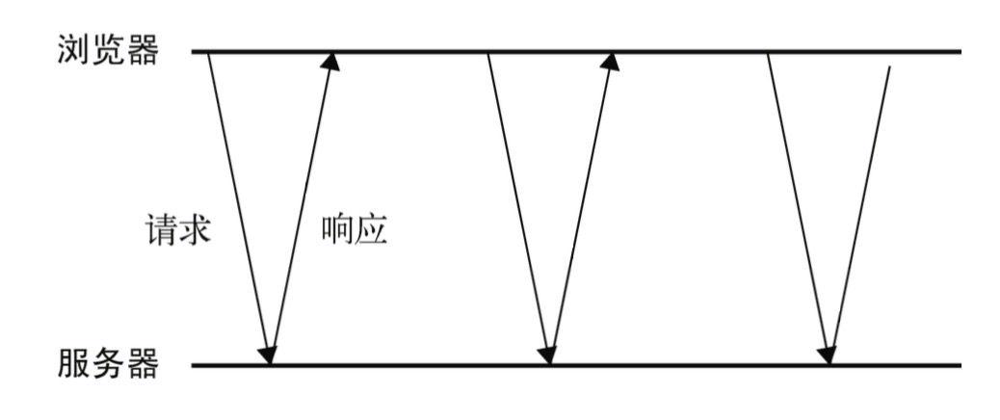
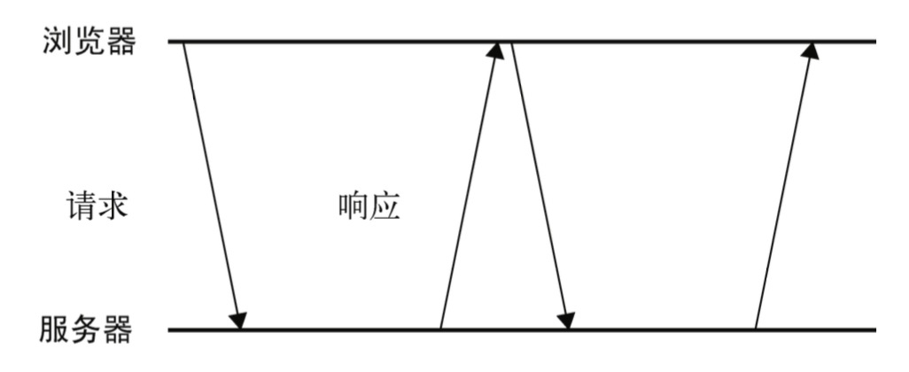

### XMLHttpRequest对象

```js
var xhr = new XMLHttpRequest();
```

#### XHR的用法

在使用XHR对象时，要调用的第一个方法是`open()`。接收3个参数：要发送的请求类型(get、post)等、请求的URL和表示是否异步发送请求的布尔值(true为异步，fasle为同步)。

```js
xhr.open('get', 'xxx.php', false);
```

调用 `open()`方法并不会真正发送请求，而只是启动一个请求以备发送。

要发送特定的请求，必须调用 `send()`方法，可以在`send()`方法中传递参数。

```js
xhr.open("get", "example.txt", false);  //同步
xhr.send(null);
```

`send()`方法接收一个参数，**即要作为请求主体发送的数据(即请求体中传参数，一般用于post请求，get请求一般是请求头传参数)**。如果不需要通过请求主体发送数据，则必须传入 `null`,因为这个参数对有些浏览器来说是必需的。调用 `send()`之后，请求就会被分派到服务器。

在收到响应后，响应的数据会自动填充 XHR 对象的属性，相关的属性简介如下：

- `responseText`：作为响应主体被返回的文本。
- `responseXML`：如果响应的内容类型是`text/xml`或`application/xml`，这个属性中将保存包含着响应数据的 XML DOM 文档。 
- `status`:响应的 HTTP 状态。
- `statusText`:HTTP 状态的说明。

在接收到响应后，第一步是检查 `status` 属性，以确定响应已经成功返回。一般来说，可以将 HTTP状态代码为 `200` 作为成功的标志。此外，状态代码为 `304` 表示请求的资源并没有被修改，可以直接使用浏览器中缓存的版本;当然，也意味着响应是有效的。

```js
if ((xhr.status >= 200 && xhr.status < 300) || xhr.status == 304){
      alert(xhr.responseText);
  } else {
      alert("Request was unsuccessful: " + xhr.status);
}
```

当我们发送的是异步请求的时候，此时我们可以检测XHR对象的`readyState`属性，该属性表示请求/响应过程的当前活动阶段。这个属性可取的值如下：

- 0：未初始化。尚未调用`open()`方法。
- 1：启动。已经调用`open()`方法，但尚未调用`send()`方法。
- 2：发送。已经调用`send()`方法，但尚未接收到响应。
- 3：接收。已经接收到部分响应数据。
- 4：完成。已经接收到全部响应数据，而且已经可以在客户端使用了。

只要 `readyState` 属性的值由一个值变成另一个值，都会触发一次 `readystatechange` 事件。可以利用这个事件来检测每次状态变化后 `readyState` 的值。通常，我们只对 `readyState` 值为 4 的阶段感兴趣，因为这时所有数据都已经就绪。不过，必须在调用 `open()`之前指定 `onreadystatechange`事件处理程序才能确保跨浏览器兼性。

```js
var xhr = createXHR();
    xhr.onreadystatechange = function(){
        if (xhr.readyState == 4){
            if ((xhr.status >= 200 && xhr.status < 300) || xhr.status == 304){
                  alert(xhr.responseText);
        } else {
             alert("Request was unsuccessful: " + xhr.status);
        }
} };
xhr.open("get", "example.txt", true);
xhr.send(null);
```

> 这个例子在 onreadystatechange 事件处理程序中使用了 xhr 对象，没有使用this 对象，原因是onreadystatechange 事件处理程序的作用域问题。如果使用this 对象，在有的浏览器中会导致函数执行失败，或者导致错误发生。因此，使用实际的 XHR 对象实例变量是较为可靠的一种方式。

另外，在接收到响应之前还可以调用 abort()方法来取消异步请求，如下所示:

```js
xhr.abort();
```

调用这个方法后，XHR 对象会停止触发事件，而且也不再允许访问任何与响应有关的对象属性。

#### HTTP头部信息

XHR 对象也提供了操作请求头部和响应头部信息的方法。

默认情况下，在发送 XHR 请求的同时，还会发送下列头部信息。

- Accept:浏览器能够处理的内容类型。 
- Accept-Charset:浏览器能够显示的字符集。 
- Accept-Encoding:浏览器能够处理的压缩编码。 
- Accept-Language:浏览器当前设置的语言。 
- Connection:浏览器与服务器之间连接的类型。 
- Cookie:当前页面设置的任何 Cookie。 
- Host:发出请求的页面所在的域 。 
- Referer:发出请求的页面的 URI。 
- User-Agent:浏览器的用户代理字符串。 

虽然不同浏览器实际发送的头部信息会有所不同，但以上列出的基本上是所有浏览器都会发送的。

**使用 `setRequestHeader()`方法可以设置自定义的请求头部信息。**这个方法接受两个参数:头部字段的名称和头部字段的值。这个方法必须在`xhr.open()`方法之后，`xhr.send()`方法之前。

```js
xhr.open("get", "example.php", true); 
xhr.setRequestHeader("MyHeader", "MyValue"); 
xhr.send(null);
```

服务器在接收到这种自定义的头部信息之后，可以执行相应的后续操作。我们建议读者使用自定义的头部字段名称，不要使用浏览器正常发送的字段名称，否则有可能会影响服务器的响应。有的浏览器允许开发人员重写默认的头部信息，但有的浏览器则不允许这样做。

**调用 XHR 对象的 `getResponseHeader()`方法并传入头部字段名称，可以取得相应的响应头部信息。而调用 `getAllResponseHeaders()`方法则可以取得一个包含所有头部信息的长字符串。**

```js
var myHeader = xhr.getResponseHeader("MyHeader");
var allHeaders = xhr.getAllResponseHeaders();
```

#### GET请求

GET请求类型一般可以将查询字符串参数追加到URL末尾，以便将信息发送给服务器。并且最好我们还要将查询字符串经过正确的编码。**请求参数是在请求头中。**

查询字符串中每个参数的名称和值都必须使用 `encodeURIComponent()`进行编码，然后才能放到 URL 的末尾;而且所有`名-值`对儿都必须由`和号(&)`分隔。

```js
xhr.open("get", "example.php?name1=value1&name2=value2", true);
//可以进行编码
encodeURIComponent(name)和encodeURIComponent(value);
```

#### POST请求

**POST请求的参数是被放在请求体中**。POST请求可以发送非常多的数据，并且格式不限。

发送 `POST` 请求的第二步就是向 `send()`方法中传入某些数据。这些数据将被放在请求体中发送。

如果要通过XHR来模仿表单的提交：首先将 `Content-Type` 头部信息设置为 `application/x-www-form-urlencoded`，也就是表单提交时的内容类型，其次是以适当的格式创建一个字符串。

```js
xhr.open("post", "postexample.php", true); 
xhr.setRequestHeader("Content-Type", "application/x-www-form-urlencoded")
var form = document.getElementById("user-info");
xhr.send(new FormData(form));  //或  xhr.send('a=1&b=2&c=3')    表单的提交方式
```

- GET请求速度会比POST请求快，所以效率更高，消耗的资源更少。

- POST请求的参数在请求体中不能被看到，GET请求的参数在URL上可以被看到，相对来说POST请求更安全。

- POST请求可以传送的数据更多，并且数据类型不限。GET可以发送的数据大小少。

- POST是一个持续的连接，在服务端需要一个持续的事件监听，每次拿到数据进行积累。而GET请求则是一次性的请求。


### XMLHttpRequest2级

#### FormData

现代 Web 应用中频繁使用的一项功能就是表单数据的序列化，XMLHttpRequest 2 级为此定义了`FormData` 类型。

`FormData`对象用以将数据编译成键值对，以便用`XMLHttpRequest`来发送数据。其主要用于发送表单数据，但亦可用于发送带键数据(keyed data)，而独立于表单使用。如果表单`enctype`属性设为`multipart/form-data` ，则会使用表单的[`submit()`](https://developer.mozilla.org/zh-CN/docs/Web/API/HTMLFormElement/submit)方法来发送数据，从而，发送数据具有同样形式。

```js
//键和值，分别对应表单字段的名字和字段中包含的值。
var data = new FormData();
data.append("name", "Nicholas");

//向 FormData 构造函数中直接传入表单元素
var data = new FormData(document.forms[0]);
```

创建了 `FormData` 的实例后，可以将它直接传给 XHR 的 `send()`方法。

```js
xhr.send(new FormData(form));
```

使用 `FormData` 的方便之处体现在不必明确地在 XHR 对象上设置请求头部。**XHR 对象能够识别传入的数据类型是 `FormData` 的实例，并配置适当的头部信息。**

支持 FormData 的浏览器有>=IE10、 Firefox 4+、Safari 5+、Chrome 和 Android 3+版 WebKit。

#### 超时设定

```js
//设置一个超时时间，表示请求在等待响应多少毫秒之后就终止。
xhr.timeout = 1000;
```

在给`timeout` 设置一个数值后，如果在规定的时间内浏览器还没有接收到响应，那么就会触发 `timeout` 事
件，进而会调用 `ontimeout` 事件处理程序。

```js
xhr.open("get", "timeout.php", true);
xhr.timeout = 1000; 	
xhr.ontimeout = function(){
    alert("Request did not return in a second.");
};
xhr.send(null);
```

`timeout`超时事件兼容IE10，其他支持。

#### overrideMimeType()方法

`overrideMimeType()`方法，用于重写 XHR 响应的 `MIME` 类型。因为返回响应的 `MIME` 类型决定了 XHR 对象如何处理它，所以提供一种方法能够重写服务器返回的 `MIME` 类型是很有用的。

比如，服务器返回的 `MIME` 类型是 `text/plain`，但数据中实际包含的是 `XML`。根据 `MIME` 类型，即使数据是`XML`，`responseXML` 属性中仍然是 `null`。通过调用 `overrideMimeType()`方法，可以保证把响应当作 `XML` 而非纯文本来处理。

```js
var xhr = createXHR(); 
xhr.open("get", "text.php", true); 
xhr.overrideMimeType("text/xml");
xhr.send(null);
```

这个例子强迫 XHR 对象将响应当作 `XML` 而非纯文本来处理。

调用 `overrideMimeType()`必须在`send()`方法之前，才能保证重写响应的 `MIME` 类型。

> 兼容：IE11、其他浏览器支持。


### 进度事件

- `loadstart`:在接收到响应数据的第一个字节时触发。
- `progress`:在接收响应期间持续不断地触发。
- `error`:在请求发生错误时触发。
- `abort`:在因为调用 `abort()`方法而终止连接时触发。
- `load`:在接收到完整的响应数据时触发。
- `loadend`:在通信完成或者触发 `error`、`abort` 或 `load` 事件后触发。

每个请求都从触发 `loadstart` 事件开始，接下来是一或多个 `progress` 事件，然后触发 `error`、 `abort` 或 `load` 事件中的一个，最后以触发 `loadend` 事件结束。

IE 8+只支持 load 事件。目前还没有浏览器支持 loadend 事件。 

#### load事件

`load`事件主要用以替代`readystatechange`事件。响应接收完毕后将触发`load`事件。相当于`xhr.readyState===4`状态时，因此也就没有必要去检查`readyState`属性了。并且`onload`事件接收一个`event`对象，其`target`属性指向XHR对象实例。

> 注意这个事件存在兼容性问题

#### progress事件

这个事件会在浏览器接收新数据期间周期性的触发。`onprogress`接收一个`event`对象，其`target`属性是XHR对象，但包含三个额外的属性：

- `lengthComputable`：表示进度信息是否可用的布尔值。
- `position`：表示已经接收的字节数。
- `totalSize`：表示根据`Content-Length`响应头部确定的预期字节数。

```js
xhr.onload = function(event) {
    if(xhr.status >= 200 && xhr.status < 300 || xhr.status === 304) {
        alert(xhr.responseText)
    }
}
xhr.onprogress = function(event) {
    if(event.lengthComputable) {
        document.body.innerHTML = event.position + event.totalSize
    }
}
```

为确定正常执行，必须在调用`open()`方法之前添加`onprogress`事件处理程序。


### 跨域源资源共享

CORS跨域源资源共享。CORS背后的基本思想，就是使用自定义HTTP头部让浏览器与服务器进行沟通，从而决定请求或响应是应该成功还是应该失败。

比如一个简单的GET或POST发送请求，需要给它附加一个额外的`Origin`头部，其中包含请求页面的源信息(协议、域名和端口)，以便服务器根据这个头部信息来决定是否给予响应。

```js
Origin：http://www.nczonline.net
```

**如果服务器认为这个请求可以接受，就在`Access-Control-Allow-Origin`头部中回发相同的源信息(如果是公共资源，可以回发`*`)**

```js
Access-Control-Allow-Origin: http://www.nczonline.net
```

如果没有这个头部，或者有这个头部但源信息不匹配，浏览器就会驳回请求。

**跨域 XHR 对象也有一些限制，但为了安全这些限制是必需的(跨域的时候需要注意)。以下就是这些限制:**

- 不能使用`setRequestHeader()`设置自定义头部。
- 不能发送和接收`cookie`
- 调用 `getAllResponseHeaders()`方法总会返回空字符串。

经过测试：确实同源的时候可以发送和接收`cookie`(当你设置了`cookie`，请求会自动带上)，可以使用`setRequestHeader()`设置请求头，可以直接调用`getAllResponseHeaders()`或`getResponseHeader()`得到响应头信息，不需要通过`Access-Control-Expose-Headers`来暴露响应头。

但是如果是跨域的话就不能使用`setRequestHeader()`设置自定义头部，不能发送和接收`cookie`，通过`getAllResponseHeaders()`方法因为跨域的限制，w3c规定只允许客户端得到只限于[simple response header](https://developer.mozilla.org/en-US/docs/Glossary/Simple_response_header)和[Access-Control-Expose-Headers](https://developer.mozilla.org/zh-CN/docs/Web/HTTP/Headers/Access-Control-Expose-Headers) 的头部信息。

如果在跨域的情况下想发送`cookie`，那么要设置如下：

```js
//前端
xhr.withCredentials = true;   //写上这个，即使跨域，也可以发送cookie了,当然后台要相应的配置

//后台设置响应头   允许credentials:
res.set({
    //不写这个 虽然浏览器上能看到响应结果，但我们不能得到响应的数据
    'Access-Control-Allow-Credentials': true,   //或'true'也可以， 设置了这个字段，那么下面的Access-Control-Allow-Origin不能使用*，一定要写正确的地址。
    'Access-Control-Allow-Origin': 'http://127.0.0.1:5500',  
})
```

对于本地资源，最好使用相对 URL，在访问远程资源时再使用绝对 URL。

#### Preflighted Reqeusts（预检请求）

跨域资源共享标准新增了一组 HTTP 首部字段，允许服务器声明哪些源站有权限访问哪些资源。规范要求，对那些可能对服务器数据产生副作用的 HTTP 请求方法（特别是 [`GET`](https://developer.mozilla.org/zh-CN/docs/Web/HTTP/Methods/GET) 以外的 HTTP 请求，或者搭配某些 MIME 类型的 [`POST`](https://developer.mozilla.org/zh-CN/docs/Web/HTTP/Methods/POST) 请求），浏览器必须首先使用 [`OPTIONS`](https://developer.mozilla.org/zh-CN/docs/Web/HTTP/Methods/OPTIONS) 方法发起一个预检请求（preflight request），从而获知服务端是否允许该跨域请求。服务器确认允许之后，才发起实际的 HTTP 请求。在预检请求的返回中，服务器端也可以通知客户端，是否需要携带身份凭证（包括 [Cookies ](https://developer.mozilla.org/zh-CN/docs/Web/HTTP/Cookies)和 HTTP 认证相关数据）。

预检请求使用OPTIONS方法。至于什么情况才发送预检请求，查看自己的另一篇[CROS跨域文章](https://github.com/touH/myself/blob/master/Web/Js/%E8%B7%A8%E5%9F%9F%E9%97%AE%E9%A2%98/CORS.md) 。

**请注意，这些首部字段无须手动设置。 当开发者使用 XMLHttpRequest 对象发起跨域请求时，它们已经被设置就绪**，发送下列头部：

- `Origin`:与简单的请求相同。
- `Access-Control-Request-Method`:请求自身使用的方法。
- `Access-Control-Request-Headers`:(可选)自定义的头部信息，多个头部以逗号分隔。

发送这个请求后，服务器可以决定是否允许这种类型的请求。服务器通过在响应中发送如下头部与浏览器进行沟通。

- `Access-Control-Allow-Origin`:与简单的请求相同。
- `Access-Control-Allow-Methods`:允许的方法，多个方法以逗号分隔。
- `Access-Control-Allow-Headers`:允许的头部，多个头部以逗号分隔。
- `Access-Control-Max-Age`:应该将这个 Preflight 请求缓存多长时间(以秒表示)。

Preflight 请求结束后，结果将按照响应中指定的时间缓存起来。而为此付出的代价只是第一次发送这种请求时会多一次 HTTP 请求。

支持 Preflight 请求的浏览器包括 Firefox 3.5+、Safari 4+和 Chrome。IE 10 及更早版本都不支持。

#### 带凭据的请求

**默认情况下，跨源请求不提供凭据(cookie、HTTP 认证及客户端 SSL 证明等)**。在发送请求时，请求头中没有cookie字段。想要发送cookie，客户端需要设置`xhr.withCredentials = true`，可以指定某个请求应该发送凭据。

如果服务器接受带凭据的请求，会用下面的 HTTP 头部来响应。

```js
 Access-Control-Allow-Credentials: true
```

另外，服务器也还可以在 Preflight（预检请求） 响应中发送这个 HTTP 头部，表示允许源发送带凭据的请求。

总设置：

```js
//跨域时不发送cookie，想要发送cookie如下设置

//前端
xhr.withCredentials = true

//后端 响应头设置
Access-Control-Allow-Credentials: true
```

> 支持 withCredentials 属性的浏览器有 Firefox 3.5+、Safari 4+和 Chrome、>=IE 10 。


即使浏览器对 CORS 的支持程度并不都一样，但所有浏览器都支持简单的(非 Preflight 和不带凭据
的)请求，因此有必要实现一个跨浏览器的方案。检测 XHR 是否支持 CORS 的最简单方式，就是检查
是否存在 `withCredentials` 属性。再结合检测 `XDomainRequest` 对象是否存在，就可以兼顾所有浏
览器了。


### 其他跨域技术

在 CORS 出现以前，要实现跨域 Ajax 通信颇费一些周折。开发人员想出了一些办法，利用 DOM 中能够执行跨域请求的功能，在不依赖 XHR 对象的情况下也能发送某种请求。

#### 图片Ping

动态创建图像经常用于图像 Ping。图像 Ping 是与服务器进行简单、单向的跨域通信的一种方式。

```js
var img = new Image();
img.onload = img.onerror = function(){
    alert("Done!");
};
img.src = "http://www.example.com/test?name=Nicholas";
```

图像 Ping 有两个主要的缺点，一是只能发送 GET 请求，二是无法访问服务器的响应文本。因此，图像 Ping 只能用于浏览器与服务器间的单向通信。

#### JSONP

`JSONP` 由两部分组成：回调函数和数据。

回调函数是当响应到来时应该在页面中调用的函数。回调函数的名字一般是在请求中指定的。而数据就是传入回调函数中的 `JSON` 数据。

```js
//客户端
function handleResponse(response) {
    alert(response)
}
let script = document.createElement('script');
script.src = 'http://127.0.0.1:3000/aaa?callback=handleResponse';
document.body.appendChild(script);

//服务端
app.use('/aaa', (req, res) => {
    let callback = `${req.query.callback}({a: 1, b: 2})`
    res.send(callback)   //甚至可以直接返回客户端函数的名字  res.send('handleResponse(123)')
})
```

通过查询字符串来指定 `JSONP` 服务的回调参数是很常见的，就像上面的 `URL` 所示，这里指定的回调函数的名字叫 `handleResponse()`。

`JSONP` 是通过动态`<script>`元素来使用的，使用时可以为`src` 属性指定一个跨域 `URL`。因为 `JSONP` 是有效的 JavaScript 代码，所以在请求完成后，即在 `JSONP` 响应加载到页面中以后，就会立即执行。

服务端返回的数据是一个执行函数字符串，到浏览器后该字符串执行函数直接变为执行函数执行了。

`JSONP`的优点： 与图像 Ping 相比，它的优点在于能够直接访问响应文本，支持在浏览器与服务器之间双向通信。

`JSONP`的缺点：

1. `JSONP` 是从其他域中加载代码执行。如果其他域不安全，很可能会在响应中夹带一些恶意代码。
2. 要确定 `JSONP` 请求是否失败并不容易。虽然 HTML5 给`<script>`元素新增了一个 `onerror`事件处理程序，但目前还没有得到任何浏览器支持。为此，开发人员不得不使用计时器检测指定时间内是否接收到了响应。
3. 只能实现`get`一种请求

#### Comet

指的是一种更高级的 Ajax 技术(经常也有人称为服务器推送)。

Ajax 是一种从页面向服务器请求数据的技术，而 Comet 则是一种服务器向页面推送数据的技术。

有两种实现 Comet 的方式:长轮询和流。

长轮询是传统轮询(也称为短轮询)的一个翻版，即浏览器定时向服务器发送请求，看有没有更新的数据。

下图是短轮询：



长轮询把短轮询颠倒了一下。页面发起一个到服务器的请求，然后服务器一直保持连接打开，直到有数据可发送。发送完数据之后，浏览器关闭连接，随即又发起一个到服务器的新请求。这一过程在页面打开期间一直持续不断。下图是长轮询：



无论是短轮询还是长轮询，浏览器都要在接收数据之前，先发起对服务器的连接。两者最大的区别在于服务器如何发送数据。短轮询是服务器立即发送响应，无论数据是否有效，而长轮询是等待发送响应。

轮询的优势是所有浏览器都支持，因为使用 `XHR` 对象和 `setTimeout()`就能实现。

第二种流行的 Comet 实现是 HTTP 流。

流不同于上述两种轮询，因为它在页面的整个生命周期内只使用一个 HTTP 连接。具体来说，就是浏览器向服务器发送一个请求，而服务器保持连接打开，然后周期性地向浏览器发送数据。

在 Firefox、Safari、Opera 和 Chrome 中，通过侦听 `readystatechange` 事件及检测 `readyState`的值是否为 3，就可以利用 XHR 对象实现 HTTP 流。在上述这些浏览器中，随着不断从服务器接收数据，`readyState` 的值会周期性地变为 3。当 `readyState` 值变为 3 时，`responseText` 属性中就会保存接收到的所有数据。

```js
function createStreamingClient(url, progress, finished){
        var xhr = new XMLHttpRequest(),
            received = 0;
        xhr.open("get", url, true);
        xhr.onreadystatechange = function(){
            var result;
            if (xhr.readyState == 3){
                //只取得最新数据并调整计数器
                result = xhr.responseText.substring(received);
                received += result.length; 21
 				//调用 progress 回调函数 progress(result);
        	} else if (xhr.readyState == 4){
            	finished(xhr.responseText);
			}
    };
    xhr.send(null);
        return xhr;
    }
var client = createStreamingClient(
    "streaming.php", 
    function(data){
        alert("Received: " + data);
    }, 
    function(data){
        alert("Done!");
    }
);
```

#### 服务器发送事件

SSE(Server-Sent Events，服务器发送事件)是围绕只读 Comet 交互推出的 API 或者模式。SSE API用于创建到服务器的单向连接，服务器通过这个连接可以发送任意数量的数据。服务器响应的 `MIME`类型必须是 `text/event-stream`，而且是浏览器中的 JavaScript API 能解析格式输出。SSE 支持短轮询、长轮询和 HTTP 流，而且能在断开连接时自动确定何时重新连接。

简单说，所谓SSE，就是浏览器向服务器发送一个HTTP请求，然后服务器不断单向地向浏览器推送“信息”（message）。这种信息在格式上很简单, 前缀`"data:"` + 信息 + `"\n\n"`结尾。 

要预订新的事件流，首先要创建一 个新的 `EventSource` 对象，并传进一个入口点: 

```js
var source = new EventSource("myevents.php");
```

注意，传入的 URL 必须与创建对象的页面同源(相同的 URL 模式、域及端口)。`EventSource` 的实例有一个 `readyState` 属性，值为 `0` 表示正连接到服务器，值为 `1` 表示打开了连接，值为 `2` 表示关闭了连接。

存在3个事件：

- `open`:在建立连接时触发。
- `message`:在从服务器接收到新事件时触发。
- `error`:在无法建立连接时触发。

服务器发回的数据以字符串形式保存在 `event.data` 中。

可以通过`source.close()`，强制立即断开连接并且不再重新连接。

```js
if (!!window.EventSource) {
    var evtSource = new EventSource('/sendMessage');
}

//收到服务器发生的事件时触发
evtSource.onmessage = function (e) {
    console.log(e.data);
}
//成功与服务器发生连接时触发
evtSource.onopen = function () {
    console.log("Server open")
} 
//出现错误时触发
evtSource.onerror = function () {
    console.log("Error")
} 

 //自定义事件
evtSource.addEventListener("myEvent", function (e) {
    console.log(e.data);
}, false)

//关闭连接
evtSource.close();
```

服务器端nodejs实现：

- 把报头 `Content-Type` 设置为 `text/event-stream`
- 字段：**每个事件之间通过空行来分隔**。

```js
var http = require('http');
var fs = require('fs');

http.createServer(function (req, res) {
    if(req.url === '/sendMessage') {
        res.writeHead(200, {
            "Content-Type": "text/event-stream", //设置头信息
            "Cache-Control": "no-cache",		//浏览器和缓存服务器都不应该缓存页面信息；
    		"Connection": "keep-alive"			//TCP连接在发送后将仍然保持打开状态，于是，浏览器可以继续通过相同的连接发送请求。	长连接
        });

        setInterval(function () {
            //输出内容，必须 "data:" 开头 "\n\n" 结尾（代表结束）
            res.write('data:' + Date.now() + '\n\n');
        }, 1000);
    } 
}).listen(3000);
```

> 支持 SSE 的浏览器有 Firefox 6+、Safari 5+、Opera 11+、Chrome 和 iOS 4+版 Safari。除了IE，其他主流浏览器都支持

#### Web Sockets

```js
var socket = new WebSocket("ws://www.example.com/server.php");
```

注意，必须给 WebSocket 构造函数传入绝对 URL。同源策略对 Web Sockets 不适用，因此可以通过它打开到任何站点的连接。至于是否会与某个域中的页面通信，则完全取决于服务器。(通过握手信息就可以知道请求来自何方。)

实例化了 WebSocket 对象后，浏览器就会马上尝试创建连接。与 XHR 类似，WebSocket 也有一个表示当前状态的 `readyState` 属性。

- `WebSocket.OPENING (0)`:正在建立连接。
- `WebSocket.OPEN (1)`:已经建立连接。
- `WebSocket.CLOSING (2)`:正在关闭连接。
- `WebSocket.CLOSE (3)`:已经关闭连接。

`readyState`的值永远从 0 开始。要关闭 Web Socket 连接，可以在任何时候调用 `close()`方法:

```js
socket.close();
```

##### 发送和接收数据

要向服务器发送数据，使用 `send()`方法并传入任意字符串，例如:

```js
var socket = new WebSocket("ws://www.example.com/server.php");
socket.send("Hello world!");
```

因为 Web Sockets 只能通过连接发送纯文本数据，所以对于复杂的数据结构，在通过连接发送之前，必须进行序列化，`JSON.stringify(message)`。

当服务器向客户端发来消息时，WebSocket 对象就会触发 `message` 事件。这个 `message` 事件与其他传递消息的协议类似，也是把返回的数据保存在 `event.data` 属性中。

```js
socket.onmessage = function(event){
    //event.data 中返回的数据也是字符串
    var data = event.data;
};
```

##### 其他事件

WebSocket 对象还有其他三个事件，在连接生命周期的不同阶段触发。

- `open`:在成功建立连接时触发。
- `error`:在发生错误时触发，连接不能持续。
- `close`:在连接关闭时触发。

WebSocket 对象不支持 DOM 2 级事件侦听器，因此必须使用 DOM 0 级语法分别定义每个事件处理程序。

在这三个事件中，只有 `close` 事件的 `event` 对象有额外的信息。这个事件的事件对象有三个额外的属性:`wasClean`、`code` 和 reason。其中，`wasClean` 是一个布尔值，表示连接是否已经明确地关闭;`code` 是服务器返回的数值状态码;而 `reason` 是一个字符串，包含服务器发回的消息。

> 关于Web Sockets可以使用Socket.io这个库

