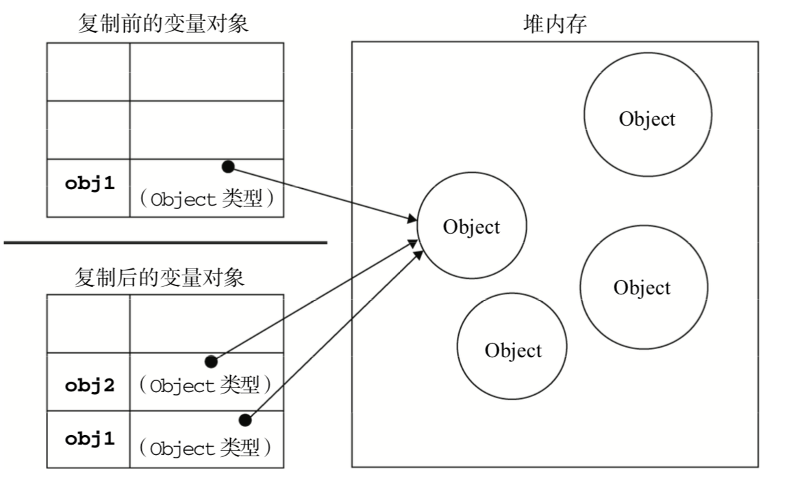

- [基本类型和引用类型](#基本类型和引用类型)
    - [动态属性](#动态属性)
    - [复制变量值](#复制变量值)
    - [传递参数](#传递参数)
    - [检测类型](#检测类型)
- [执行环境及作用域](#执行环境及作用域)
    - [延长作用域链](#延长作用域链)
    - [变量](#变量)
- [垃圾收集](#垃圾收集)
    - [内存管理](#内存管理)
- [小结](#小结)

### 基本类型和引用类型
基本数据类型: Undefined, Null, Boolean, Number, String, 这5中基本数据类型是按值访问的, 因此可以操作保存在变量中的实际的值。

引用类型: Object， 是保存在内存中的对象。 与其他语言不同，JavaScript不允许直接访问内存中的位置， 也就是说不能直接操作对象的内存空间。当复制保存着对象的某个变量时，操作的是对象的引用。但在为对象添加属性时，操作的是实际的对象

#### 动态属性
我们不能给基本类型的值添加属性， 尽管这样做不会导致任何错误。如
```js
var name = 'Nicholas';
name.age = 27;
alert(name.age);    //undefined
```
只能给引用类型值动态添加属性，基本类型无效。

#### 复制变量值
对于基本类型，如果从一个变量向另一个变量复制基本类型的值，会在变量对象上创建一个新值，然后把该值复制到为新变量分配的位置上。
```js
var num1 = 5;
var num2 = num1;  //基本变量复制，时完全独立的， num2时num1的一个副本，两个变量不会互相影响
```

当从一个变量向另一个变量复制引用类型的值时，同样也会将存储在变量对象中的值复制一份放到 为新变量分配的空间中。不同的是，这个值的副本实际上是一个指针，而这个指针指向存储在堆中的一个对象。复制操作结束后，两个变量实际上将引用同一个对象。因此，改变其中一个变量，就会影响另一个变量。
```js
var obj1 = new Object();
var obj2 = obj1;
obj1.name = "Nicholas";
alert(obj2.name);  //"Nicholas"
```


#### 传递参数
ECMAScript 中**所有函数的参数都是按值传递的**。也就是说，把函数外部的值复制给函数内部的参 数，就和把值从一个变量复制到另一个变量一样。基本类型值的传递如同基本类型变量的复制一样，而 引用类型值的传递，则如同引用类型变量的复制一样。

在向参数传递基本类型的值时，被传递的值会被复制给一个局部变量(即命名参数，或者用 ECMAScript 的概念来说，就是 arguments 对象中的一个元素)。

在向参数传递引用类型的值时，会把这个值在内存中的地址复制给一个局部变量，因此这个局部变量的变化会反映在函数的外部。

基本类型参数
```js
function addTen(num) {  
    num += 10;      //函数的num是个局部变量
    return num; 
}
var num = 20;
var result = addTen(num);   //num参数是全局变量
alert(num); //20，没有变化 
alert(result); //30
```
就好像值传递，参数赋给局部变量`num(局部)=num（全局）`， 值传递的特性，互不干扰的副本。

引用类型参数
```js
function setName(obj) {
    obj.name = "Nicholas";
}
var person = new Object();
setName(person);
alert(person.name);    //"Nicholas"
```
同理，局部变量`obj=person`，这是一个引用传值，所以obj和person都代表指针，指向堆内存中的同一个对象。 所以即使时局部变量，在函数中直接修改就是直接操作堆内存中的对象了。 当然如果在函数内部对局部参数重新定义，那么局部参数就改变了指针指向了，即使修改也不影响person指向的对象了。
```js
function setName(obj) { 
    obj.name = "Nicholas"; 
    obj = new Object();         //对局部变量重新定义，修改了。 函数结束立即销魂
    obj.name = "Greg";
}
var person = new Object();
setName(person);
alert(person.name);    //"Nicholas"

//引用类型的修改是直接修改堆内存中的对象， 而重新定义赋值则是重新在堆内存中开辟了一个新对象。 所以即使之前是相互的指针， 重新定义后也会没有关联
let o = {
    a: 1
}
let b = o;      //引用传值
b.b = 2;        //直接修改堆内存对象
console.log(a, b)  //{a: 1, b: 2}  {a: 1, b: 2}
b = {c: 3};     //重新定义
console.log(a, b)   //{a: 1, b: 2}  {c: 3}
```

#### 检测类型
要检测一个变量是不是基本类型,我们使用的是`typeof`， `typeof`是确定一个变量是字符串，数值，布尔值，还是`undefined`的最佳方法， 但是变量是一个对象或者null,则`typeof`返回的都是`Object`，函数返回`function`, 所以对于检测引用类型的值时，我们使用`instanceof`操作符。
```js
typeof(variable)      //检测基本类型

result = variable instanceof constructor    //返回一个布尔值
```
如果变量是给定引用类型的实例(包括原型链上)， 那么返回true。 

根据规定，所有引用类型的值都是`Object`的实例。

当然如果使用`instanceof`操作符检测基本类型的值， 则操作符返回`false`，因为基本类型不是对象。

### 执行环境及作用域
执行环境定义了变量或函数有权访问的其他数据，决定了他们各自的行为。每个执行环境都有一个与之关联的变量对象，环境中定义的所有变量和函数都保存在这个对象中。虽然我们编写的代码无法访问这个对象，但解析器在处理数据时会在后台使用它。

**全局环境**：全局执行环境是最外围的一个执行环境。在web浏览器中，全局执行环境被认为是window对象， 因此所有全局变量和函数都是作为window对象的属性和方法创建的。某个执行环境中的所有代码执行完毕后，该环境被销毁，保存在其中的所有变量和函数定义也随之销毁。

**函数环境**：每个函数都有自己的执行环境。当执行流进入一个函数时，函数的环境就会被推入一个环境栈中。 而在函数执行之后，栈将其环境弹出，把控制权返回给之前的执行环境。ECMAScript 程序中的执行流 正是由这个方便的机制控制着。

**作用域链**: 当代码在一个环境中执行时，会创建变量对象的一个作用域链。作用域链的用途，是保证对执行环境有权访问的所有变量和函数的有序访问。作用域链的前端，始终都是当前执行的代码所在环境的变量对象。如果这个环境是函数，则将其活动对象作为变量对象。活动对象在最开始时只包含一个变量，即`arguments`对象(这个对象在全局环境中是不存在的)。作用域链中的下一个变量对象来自包含(外部)环境，而再下一个变量对象则来自下一个包含环境。这样，一直延续到全局执行环境;全局执行环境的变量对象始终都是作用域链中的最后一个对象。

搜索过程始终从作用域链的前端开始， 然后逐级地向后回溯，直至找到标识符为止。

**内部环境可以通过作用域链访问所有的外部环境， 但外部环境不能访问内部环境中的任何变量和函数。这些环境之间的联系是线性的，有次序。每个环境都可以向上搜索作用域链，以查询变量和函数名。但任何环境不能通过向下搜索作用域链而进入另一个执行环境。**

现在自己的变量对象中搜索变量和函数名，如果搜索不到则再按照作用域链向上搜索。

> 函数参数也被当作变量来对待，而且是作为局部变量的形式， 因此其访问规则与执行环境中的其他变量相同。


#### 延长作用域链
当执行流进入下列任何一个语句时，作用域链就会得到加长，这两个语句都会在作用域链的前端添加一个变量对象(就是环境变量)：
- `try-catch`语句的`catch`块：
- `with`语句

对于with语句来说，会将指定的对象添加到作用域链中。 对于catch语句来说，会创建一个新的变量对象，其中包含的是被抛出的错误对象的声明。
例子：
```js
function buildUrl() {
    var qs = '?debug=true';
    with(location) {
        var url = href + qs
    }
    return url
}
```
在此，`with`语句接受了`location`对象， 因此其变量对象中就包含了`location`对象的所有属性和方法，而这个变量对象被添加到了作用域链的前端。当在`with`语句中引用变量`href`时(实际引用的是`location.href`)，可以在当前执行环境的变量对象中找到， 当引用qs时，在当前环境变量`location`上是找不到的，所以我们根据作用域链去上寻找。`with`语句还是算函数的一部分， 只是语句内部环境变量强制改变了一下而已。所以内部的`url`还是算`buildUrl`函数的局部变量。

#### 变量
- 如果初始化变量时没有使用`var`声明， 该变量会自动被添加到全局环境。
- 在作用域链的搜素过程中，如果存在一个局部的变量定义，则搜索会自动停止，不再进入另一个变量对象。换句话说，如果局部环境中存在着同名标识符，就不会使用位于父环境中的标识符，
- 如果你想在函数内部获取window环境变量中同名的变量，那么就要使用`window.变量名`这种方式， 父级也一样。

### 垃圾收集
#### 内存管理
确保占用最少的内存可以让页面获得更好的性能。而优化内存占用的最佳方式，就是为执行中的代码只保存必要的数据。一旦数据不再有用，最好通过将其值设置为`null`来释放其引用,这个做法叫做解除引用。这一做法适用于大多数全局变量和全局对象的属性。局部变量会在它们离开执行环境时自动被解除引用。
```js
function createPerson(name){
    var localPerson = new Object();
    localPerson.name = name;
 }
var globalPerson = createPerson("Nicholas");
 // 手工解除 globalPerson 的引用
globalPerson = null;
```
解除一个值的引用并不意味着自动回收该值所占用的内存。解除引用的真正作用是让值脱离执行环境，以便垃圾收集器下次运行时将其回收。

### 小结
JavaScript 变量可以用来保存两种类型的值:基本类型值和引用类型值。

基本类型： Undefined、Null、Boolean、Number 和 String。
引用类型： Object

基本类型值和引用类型值具 有以下特点：
- 基本类型值在内存中占据固定大小的空间，因此被保存在栈内存中;
- 从一个变量向另一个变量复制基本类型的值，会创建这个值的一个副本;
- 引用类型的值是对象，保存在堆内存中;
- 包含引用类型值的变量实际上包含的并不是对象本身，而是一个指向该对象的指针;
- 从一个变量向另一个变量复制引用类型的值，复制的其实是指针，因此两个变量最终都指向同一个对象;
- 确定一个值是哪种基本类型可以使用`typeof`操作符，而确定一个值是哪种引用类型可以使用`instanceof`操作符。


所有变量(包括基本类型和引用类型)都存在于一个执行环境(也称为作用域)当中，这个执 行环境决定了变量的生命周期，以及哪一部分代码可以访问其中的变量。以下是关于执行环境的几 点总结:
- 执行环境有全局执行环境(也称为全局环境)和函数执行环境之分;
- 每次进入一个新执行环境，都会创建一个用于搜索变量和函数的作用域链;
- 函数的局部环境不仅有权访问函数作用域中的变量，而且有权访问其包含(父)环境，乃至全局环境;
- 全局环境只能访问在全局环境中定义的变量和函数，而不能直接访问局部环境中的任何数据;
- 变量的执行环境有助于确定应该何时释放内存。

`JavaScript`是一门具有自动垃圾收集机制的编程语言，开发人员不必关心内存分配和回收问题。可 以对`JavaScript`的垃圾收集例程作如下总结。
- 离开作用域的值将被自动标记为可以回收，因此将在垃圾收集期间被删除。
- “标记清除”是目前主流的垃圾收集算法，这种算法的思想是给当前不使用的值加上标记，然后再回收其内存。
- 另一种垃圾收集算法是“引用计数”，这种算法的思想是跟踪记录所有值被引用的次数。JavaScript引擎目前都不再使用这种算法;但在IE中访问非原生JavaScript对象(如DOM元素)时，这种算法仍然可能会导致问题。
- 当代码中存在循环引用现象时，“引用计数”算法就会导致问题。
- 解除变量的引用不仅有助于消除循环引用现象，而且对垃圾收集也有好处。为了确保有效地回收内存，应该及时解除不再使用的全局对象、全局对象属性以及循环引用变量的引用。

