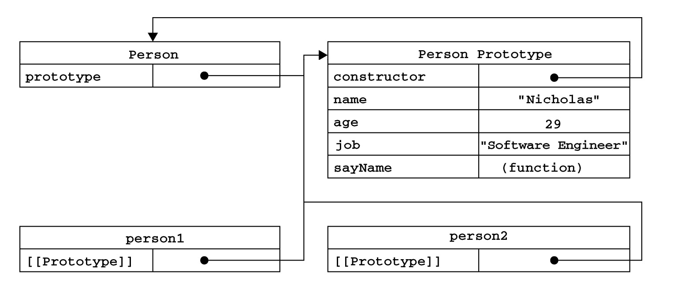
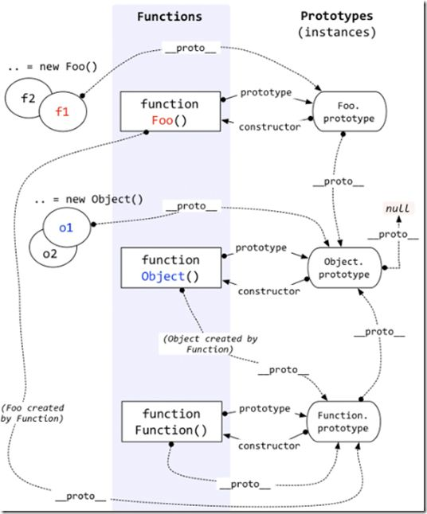
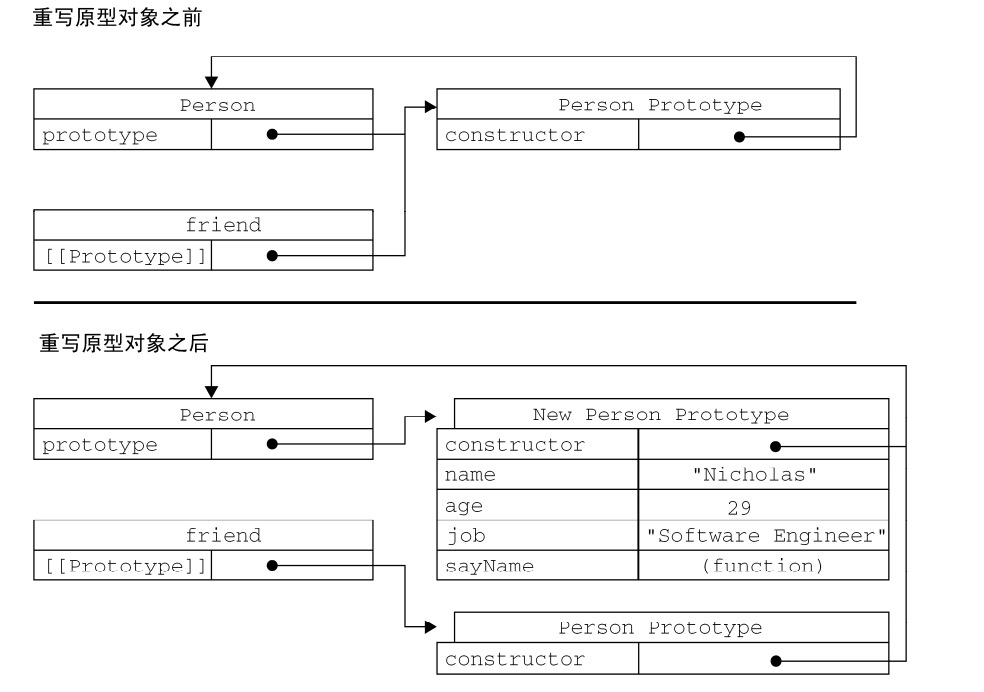

- [理解对象](#理解对象)
    - [属性类型](#属性类型)
        - [数据属性](#数据属性)
        - [访问器属性](#访问器属性)
    - [扩展Get Set](#get和set)
    - [定义多个属性](#定义多个属性)
    - [读取属性的特性](#读取属性的特性)
- [创建对象](#创建对象)
    - [工厂模式](#工厂模式)
    - [构造函数模式](#构造函数模式)
        - [将构造函数当成函数](#将构造函数当成函数)
        - [构造函数的问题](#构造函数的问题)
     - [原型模式](#原型模式)
        - [理解原型对象](#理解原型对象)
        - [原型与in操作符](#原型与in操作符)
        - [跟简单的原型语法](#跟简单的原型语法)
        - [原型的动态性](#原型的动态性)
        - [原生对象的原型](#原生对象的原型)
        - [原型对象的问题](#原型对象的问题)
    - [组合使用构造函数模式和原型模式](#组合使用构造函数模式和原型模式)
    - [动态原型模式](#动态原型模式)
    - [寄生构造函数模式](#寄生构造函数模式)
    - [稳妥构造函数模式](#稳妥构造函数模式)


### 理解对象
创建对象
```js
var person = new Object();
person.name = 'zhangsan';
person.show = function() {

}
//或者
var person = {
    name: 'zhangsan',
    show() {
        //do
    }
}
```

#### 属性类型
每个属性都存在各种特性。这些特性能够影响属性的表示。

`ECMAScript` 中有两种属性：数据属性和访问器属性

##### 数据属性
```js
let o = {
    name: 'zhangsan',
    age: 24
}
```
数据属性包含一个数据值的位置。在这个位置可以读取和写入值。数据属性有 4 个描述其行为的特性。
- `configurable`: 表示能否通过 `delete` 删除属性从而重新定义属性，能否修改属性的特性，或者能否把属性修改为访问器属性。像前面例子中那样直接在对象上定义的属性，它们的这个特性默认值为 true;
- `enumerable`: 表示能否通过 `for-in` 循环返回属性。像前面例子中那样直接在对象上定义的属性，它们的这个特性默认值为 `true`;
- `writable`: 表示能否修改属性的值。像前面例子中那样直接在对象上定义的属性，它们的这个特性默认值为 `true`。
- `value`: 包含这个属性的数据值。读取属性值的时候，从这个位置读；写入属性值的时候，把新值保存在这个位置。这个特性的默认值为 `undefined`。

对于像前面例子中那样直接在对象上定义的属性，它们的`[[Configurable]]`、 `[[Enumerable]]`和`[[Writable]]`特性都被设置为 `true`，而`[[Value]]`特性被设置为指定的值。

```js
var person = {
    name: 'Nicholas'
}
```
这里创建了一个名为 `name` 的属性，为它指定的值是`"Nicholas"`。也就是说， `[[Value]]`特性将被设置为`"Nicholas"`，而对这个值的任何修改都将反映在这个位置。

要修改属性默认的特性，必须使用 `ECMAScript 5` 的 `Object.defineProperty()`方法。这个方法接受三个参数：属性所在的对象、属性的名字和一个描述符对象(即该对象的属性必须是: configurable、enumerable、writable、value中的一个或者多个)。

**注意：**
在调用`Object.defineProperty()`方法创建一个新的属性时,如果不指定`configurable`、`enumerable`和`writable`特性的默认值，那么就都是`false`, `value`为`undefined`。但是如果不是用在调用`Object.defineProperty()`创建新属性，属性一开始就被定义存在，那么就根据最开始的规则来，`configurable`、`enumerable`、`writable`默认为`true`,`value`为初始化的值，没有则为`undefined`。或者是很久前就被调用`Object.defineProperty()`初始化过的特性。

记住当将`configurable`设置为false后，表示不能从对象中删除属性。而且一旦把属性定义为不可配置，就不能再把它变回可配置了。此时，再调用`Object.defineProperty()`方法修改`configurable`、`enumerable`会报错，而`writable`为`true`时修改成`false`不会报错，但是`false`改成`true`会报错,`value`的值如果是直接修改，则是根据`writable`来判定是否可写，如果是通过`Object.defineProperty()`方法来创建或者修改属性值，那么`value`不管`writable`是什么都能被修改。

例子1
直接修改对象属性
```js
var person = {};
Object.defineProperty(person, "name", {
    writable: false,
    value: "Nicholas"
});
alert(person.name);     //"Nicholas"
person.name = "Greg";           //因为name属性的writable特性为不可写，所以不能被直接修改 报错
alert(person.name);     //"Nicholas"
```

例子2
```js
var person = {};
//一开始是空对象， 通过Object.defineProperty创建了一个新属性，所以configurable和enumerable默认为false
Object.defineProperty(person, "name", {
    writable: false,
    value: "Nicholas"
});
Object.defineProperty(person, "name", {
    writable: true,             //报错， 因为用Object.defineProperty新建的时候没有指定configurable，所以默认为false， 所以不能修改writable特性
    value: "adf"
});
```

例子3
通过`Object.defineProperty`来修改对象属性
```js
var person = {};
Object.defineProperty(person, "name", {
    configurable: true,
    writable: false,
    value: "Nicholas"
});
//person.name = 'abc';      写这句会报错， 因为writable为false
Object.defineProperty(person, "name", {
    //writable: true,
    value: "abc"        //可以直接调用Object.defineProperty方法来修改value特性
});
console.log(person.name);       //bac
```
直接调用`Object.defineProperty`方法来修改`value`特性，即使`writable`是`false`，却还是能修改。为什么？ 因为其实当我们在调用该方法时，他内部默认是先将`writable`特性改为了`true`,等我们修改好后又将其特性改为`false`, 所以只要我们使用`Object.defineProperty`方法修改属性的值，不管`writable`的特性是什么，都能被修改成功， 但是直接修改属性的值就要看`wriable`的特性了。

例子4
```js
var person = {};
Object.defineProperty(person, "name", {
    configurable: false,            //不可配置
    writable: false,
    value: "Nicholas"
});

Object.defineProperty(person, "name", {
    value: "abc"            //报错
});
```
当我们在下面项修改value值时，`Object.defineProperty`方法会默认先去将`writable`特性改为`true`， 然后在变为`false`。但因为我们将`configurable`特性设置为了`false`,而当`configurable`为`false`的时候，`writable`特性是如果是`true`可以改为`false`, 但是从`false`改为`true`则会报错。

例子5
```js
var person = {};
Object.defineProperty(person, "name", {
    configurable: false,
    writable: true,     
    value: "Nicholas"
});
Object.defineProperty(person, "name", {
    writable: false,        
    value: "abc"
});
console.log(person.name)        //abc
console.log(Object.getOwnPropertyDescriptor(person, 'name'));
```
虽然`configurable`是`false`， 但是`writable`为`true`是可以被`Object.defineProperty`方法改为`false`的，但又因为调用`Object.defineProperty`修改`value`的时候，会默认现将`writable`先变为`true`，最后在改回到`false`，所以这里虽然看到`writable`为`false`但是`value`还是修改成功了。

##### 访问器属性
在读取访问器属性时，会调用`getter`函数，这个函数负责返回有效值；在写入访问器属性时，会调用`setter`函数并传入新值，这个函数负责决定如何处理数据。访问器属性有如下4个特性。
- `configurable`表示能否通过 delete 删除属性从而重新定义属性，能否修改属性的特性，或者能否把属性修改为数据属性。对于直接在对象上定义的属性，这个特性的默认值为true。
- `enumerable`: 表示能否通过`for-in`循环返回属性。对于直接在对象上定义的属性，这个特性的默认值为true。
- `get`: 在读取属性时调用的函数。默认值为`undefined`。
- `set`: 在写入属性时调用的函数。默认值为`undefined`。

访问器属性不能直接定义，必须使用`Object.defineProperty()`来定义。请看下面例子。
```js
var book = {
    _year: 2004,
    edition: 1
};
Object.defineProperty(book, 'year', {
    get() {
        return this._year;
    },
    set(newValue) {
        if(newValue > 2004) {
            this._year = newValue;
            this.edition += newValue - 2004
        }
    }
})
Object.defineProperty(book, 'aa', {
    value: 111
})
book.year = 2005;
console.log(book.edition);    //2
console.log(book)       //{_year:2005, year: 2005, edition: 2, aa: 111}
```
以上代码创建了`book`对象，并定义了两个默认属性。`_year`前面的下划线是一种常用的记号，用于表示只能通过对象方法访问属性。而访问器属性`year`则包含一个`geeter`函数和一个`setter`函数。

不一定非要同事指定`getter`和`setter`。只指定`getter`意味着属性是不能写，尝试写入属性会被忽略。类似地，只指定`setter`函数的属性表示不能读，只能写。

#### get和set
get和set我个人理解本身只是一个语法糖，它定义的属性相当于“存储器属性”。本质并不是属性，而是属性的特性。在读取访问器属性时，会调用 getter 函数，这个函数负责返回有效的值；在写入访问器属性时，会调用setter 函数并传入新值，这个函数负责决定如何处理数据。

实现有2种，一种是直接使用get和set语法糖。 另一种是在Object.defineproperty或者defineProperties中修改属性特性。

其中我们在前面加上‘_’符号来表示对象内部的私有属性。
例子:
```js
var person = {
    _name: "chen",  //私有     //这里的_name和get/set方法name()不能重名就行
    age: 21,
    get name() {
        return this._name;
    },
    set name(name) {
        this._name = name;
    }
}
console.log(person.name);       //chen
person.name = "lunc";
console.log(person.name);       //lunc
```
或者
```js
 var p = {
    name:"chen",
    work:function() {
        console.log("wording...");
    },
    _age:18,
    get age(){
        return this._age;
    },
    set age(val) {
        if (val<0 || val> 100) {//如果年龄大于100就抛出错误
            throw new Error("invalid value")
        }else{
            this._age = val;
        }
    }
};
console.log(p.name);//输出chen

p.age
"18"
p.age=23
"23"
p.age=200
Uncaught Error: invalid value
```
<br/>

##### 对于类和构造函数
es5写法
```js
function Number(num) {
  this._num = num           
}

//get/set方法使用同一个命名，增加可读性
Number.prototype = {
  get num() {
    return this._num;
  },
  
  set num(num) {
    this._num = num;
  }
}

var test = new Number(8);
console.log(test.num);
test.num = 88;
console.log(test.num);
```
es6写法
```js
class Num {
  constructor(num) {
        this._num = num;
  }
  
  get num() {
    return this._num;
  }
  
  set num(num) {
    this._num = num;
  }
}

var test = new Num(9);
console.log(test.num);
test.num = 99;
console.log(test.num);
```

#### 定义多个属性
`Object.defineProperties()`方法可以通过描述符一次定义多个属性。这个方法接受两个对象参数：第一个为被改动的对象，第二个是该对象要被修改或者添加的属性。例如下面对象创建了两个数据属性和一个访问器属性。
```js
var book = {};
Object.defineProperties(book, {
    _year: {
        value: 204
    },
    edition: {
        value: 1
    },
    year: {
        get() {
            return this._year;
        },
        set(newValue) {
            if(newValue > 2004) {
                this._year = newValue;
                this.edition += newValue - 2004
            }
        }
    }
})
```

#### 读取属性的特性
```js
let book = Object.getOwnPropertyDescriptor(对象, 要读取的属性名);
console.log(book.configurable)
console.log(typeof book.get)    //function  get是一个指向getter函数的指针
···
```

### 创建对象
虽然 `Object` 构造函数或对象字面量都可以用来创建单个对象，但这些方式有个明显的缺点：使用同一个接口创建很多对象，会产生大量的重复代码。为解决这个问题， 开始使用工厂模式的一种变体。

#### 工厂模式
```js
function createPerson(name, age, job) {
    var o = new Object();
    o.name = name;
    o.age = age;
    o.job = job;
    o.sayName = function() {
        alert(this.name);
    };
    return o;
}
var person1 = createPerson("Nicholas", 29, "Software Engineer");
var person2 = createPerson("Greg", 27, "Doctor");
```
工厂模式虽然解决了创建多个相似对象的问题，但却没有解决对象识别的问题（即怎样知道一个对象的类型）。

#### 构造函数模式
像`Object`和`Array`这样的原生构造函数，在运行时会自动出现在执行环境中。自定义构造函数也是一样的。
```js
function Person(name, age, job) {
    this.name = name;
    this.age = age;
    this.job = job;
    this.sayName = function() {
        alert(this.name);
    }
}
var person1 = new Person("Nicholas", 29, "Software Engineer");
var person2 = new Person("Greg", 27, "Doctor");
```
通过构造函数创建的实例对象，每个都是不同的，独一的。即使`person1`和`person2`传的参数相同，但`person1 != person2`。

实例对象存在一个`constructor`属性，指向创建当前实例的构造函数。
```js
alert(person1.constructor == Person); //true
alert(person2.constructor == Person); //true
```
检测对象类型还是使用`instanceof`操作符更好点。
```js
alert(person1.constructor == Person); //true
alert(person2.constructor == Person); //true
``` 

##### 将构造函数当成函数
任何函数，只要通过 `new` 操作符来调用，那它就可以作为构造函数；而任何函数，如果不通过 `new` 操作符来调用，那它跟普通函数也不会有什么两样。
```js
// 当作构造函数使用
var person = new Person("Nicholas", 29, "Software Engineer");
person.sayName(); //"Nicholas"
// 作为普通函数调用
Person("Greg", 27, "Doctor"); // 添加到 window
window.sayName(); //"Greg"
// 在另一个对象的作用域中调用
var o = new Object();
Person.call(o, "Kristen", 25, "Nurse");
o.sayName(); //"Kristen
```
##### 构造函数的问题
构造函数模式虽然好用，但也并非没有缺点。使用构造函数的主要问题，就是每个相同的方法都要在每个实例上重新创建一遍。而且这个方法因为创建在实例上，所以还是不同的， 即相同的行为(方法)却同时定义多次。但是其实这是没有必要的。
```js
person1.sayName == person2.sayName    //false
```
可以改成将函数定义在构造函数外部。
```js
function Person(name, age, job){
    this.name = name;
    this.age = age;
    this.job = job;
    this.sayName = sayName;
}
function sayName(){
    alert(this.name);
}
var person1 = new Person("Nicholas", 29, "Software Engineer");
var person2 = new Person("Greg", 27, "Doctor");
```
但是在全局作用域中定义的函数实际上只能被某个对象调用，这让全局作用域有点名不副实。而更让人无法接受的是：如果对象需要定义很多方法，那么就要定义很多个全局函数，于是我们这个自定义的引用类型就丝毫没有封装性可言了。好在，这些问题可以通过使用原型模式来解决。

#### 原型模式
我们创建的每个函数都有一个 `prototype`（原型）属性，这个属性是一个指针，指向一个对象，而这个对象的用途是包含可以由特定类型的所有实例共享的属性和方法。如果按照字面意思来理解，那么 `prototype` 就是通过调用构造函数而创建的那个对象实例的原型对象。使用原型对象的好处是可以让所有对象实例共享它所包含的属性和方法。
```js
function Person() {
}
Person.prototype.name = 'Nicholas';
Person.prototype.age = 29;
Person.prototype.job = 'Software Engineer';
Person.prototype.sayName = function() {
    alert(this.name)
}
var person1 = new Person();
person1.sayName()       //Nicholas
var person2 = new Person();
person2.sayName();      //Nicholas
alert(person1.sayName == person2.sayName);  //true
```
都是同一个原型对象上的。

##### 理解原型对象
只要创建一个函数，就会为该函数创建一个`prototype`属性，这个属性指向函数的原型对象。在默认情况下，所有原型对象都会自动获得一个`constructor`（构造函数）属性，这个属性包含一个指`prototype`属性所在函数的指针。就拿前面的例子来说，`Person.prototype.constructor`指向`Person`。

创建了自定义的构造函数之后，其原型对象默认只会取得`constructor`属性；至于其他方法，则都是从`Object`继承而来的。当调用构造函数创建一个新实例后，该实例的内部将包含一个指针(内部属性)，指向构造函数的原型对象。在Firefox、Safari和Chrome这个指针的属性名叫`__proto__`；而在其他实现中，这个属性对脚本则是完全不可见的。


可以通过`isPrototypeOf()`方法来确定实例对象与原型对象之间是否存关系。实例对象内部存在一个指针指向他们的原型对象。
```js
alert(Person.prototype.isPrototypeOf(person1)); //true
```
ES5增加了一个新方法`Object.getPrototypeOf()`来返回原型对象。
```js
alert(Object.getPrototypeOf(person1) == Person.prototype);  //true
```

每当代码读取某个对象的某个属性时，都会执行一次搜索，目标是具有给定名字的属性。搜索首先从对象实例本身开始。如果在实例中找到了具有给定名字的属性，则返回该属性的值；如果没有找到，则继续搜索指针指向的原型对象，在原型对象中查找具有给定名字的属性。如果在原型对象中找到了这个属性，则返回该属性的值。如果没有找到，继续对原型对象的指针指向的原型对象查找。直到最顶层的，没有返回`null`。


其中`constructor`是原型对象的属性，实例只是继承之原型对象。

使用`hasOwnProperty()`方法可以检测一个属性是存在于实例中，还是存在于原型中。这个方法(是从`Object`继承来的)只在给定属性存在于对象实例中时，才返回`true`。请看例子：
```js
function Person() {};
Person.prototype.name = 'Nicholoas';
let person = new Person();

alert(person.hasOwnProperty('name'));   //false
person.name = '张三';       //实例中国添加了name属性
alert(person.hasOwnProperty('name'));   //true
delete person.name;         //删除实例中的name属性， 原型中的还在
alert(person.hasOwnProperty('name'));   //false
```

##### 原型与in操作符
有两种方式使用`in`操作符：
1. 单独使用
2. `for in`循环中

在单独使用时，`in`操作符会在通过对象能够访问给定属性时返回true，无论该属性存在于实例中还是原型中, 在实例中没有则会去原型对象中寻找。

在使用 `for-in` 循环时，返回的是所有能够通过对象访问的、可枚举的`（enumerated）`属性，其中既包括存在于实例中的属性，也包括存在于原型中的属性。当然对于对象中不可枚举的属性(enumerable：false)存在兼容问题。
要取得对象上所有可枚举的**实例属性**，可以使用ES5`Object.keys()`方法，返回一个包含所有可枚举属性的字符串数组。
如果你想得到所有实例属性，无论它是否可枚举，都可以使用`Object.getOwnPropertyNames()`方法。

##### 跟简单的原型语法
前面例子中每添加一个属性和方法就要敲一遍`Person.prototype`。为减少不必要的输入，也为了从视觉上更好地封装原型的功能，更常见的做法是用一个包含所有属性和方法的对象字面量来重写整个原型对象。
```js
function Person() {
}
Person.prototype = {
    name: 'Nicholas',
    age: 29,
    job: 'Software Engineer',
    sayName() {
        alert(this.name);
    }
}
```
在上面的代码中，我们将 `Person.prototype `设置为等于一个以对象字面量形式创建的新对象。最终结果相同，但一个例外：`constructor`属性不再指向`Person`了。前面曾经介绍过，每创建一个函数，就会同时创建它的 `prototype` 对象，这个对象也会自动获得 `constructor` 属性。而我们在这里使用的语法，本质上完全重写了默认的 `prototype` 对象，因此 `constructor` 属性也就变成了新对象的 `constructor` 属性 （指向 `Object` 构造函数），不再指向 `Person` 函数。此时，尽管 `instanceof`操作符还能返回正确的结果，但通过 `constructor` 已经无法确定对象的类型了，如下所示。
```js
var friend = new Person();
alert(friend instanceof Object); //true
alert(friend instanceof Person); //true
alert(friend.constructor == Person); //false
alert(friend.constructor == Object); //true
```
如果 `constructor` 的值真的很重要，可以像下面这样特意将它设置回适当的值。
```js
function Person(){
}
Person.prototype = {
    constructor : Person,       //这里
    name : "Nicholas",
    age : 29,
    job: "Software Engineer",
    sayName : function () {
        alert(this.name);
    }
};
```
注意，以这种方式重设 constructor 属性会导致它的`[[Enumerable]]`特性被设置为 true。默认情况下，原生的 `constructor` 属性是不可枚举的，因此如果你使用兼容`ECMAScript 5` 的`JavaScript` 引擎，可以试一试`Object.defineProperty()`。

##### 原型的动态性
由于在原型中查找值的过程是一次搜索，因此我们对原型对象所做的任何修改都能够立即从实例上反映出来---即使是先创建了实例后修改原型也照样如此。
```js
var friend = new Person();
Person.prototype.sayHi = function() {
    alert('hi');
}
friend.sayHi()      //hi
```
以上代码先创建了 Person 的一个实例，并将其保存在 `person` 中。然后，下一条语句在 `Person.prototype` 中添加了一个方法 `sayHi()`。即使 `person` 实例是在添加新方法之前创建的，但它仍然可以访问这个新方法。其原因可以归结为实例与原型之间的松散连接关系。当我们调用 `person.sayHi()`时，首先会在实例中搜索名为 `sayHi` 的属性，在没找到的情况下，会继续搜索原型。因为实例与原型之间的连接只不过是一个指针，而非一个副本，因此就可以在原型中找到新的 `sayHi` 属性并返回保存在那里的函数。

尽管可以随时为原型添加属性和方法，并且修改能够立即在所有对象实例中反映出来，但如果是重写整个原型对象，那么情况就不一样了。我们知道，调用构造函数时会为实例添加一个指向最初原型的`[[Prototype]]`指针，而把原型修改为另外一个对象就等于切断了构造函数与最初原型之间的联系。
请记住：实例中的指针仅指向原型，而不指向构造函数。看下面的例子。
```js
function Person(){
}
var friend = new Person();
Person.prototype = {
    constructor: Person,
    name : "Nicholas",
    age : 29,
    job : "Software Engineer",
    sayName : function () {
        alert(this.name);
    }
};
friend.sayName(); //error
```
如果将`Person.prototype`的重新赋值卸载初始化实例之前就不会报错了。



##### 原生对象的原型
所有原生引用类型(Object、Array、tring，等等)都在其构造函数的原型上定义方法。通过原生对象的原型，不仅可以取得所有默认方法的引用，而且也可以定义新方法，并且能在全局使用。
```js
String.prototype.startwith = function(text) {
    return xxx
}
var msg = 'Hello';      //后台会调用String基本包装函数创建这个字符串
msg.startwith('Hello');     
```

##### 原型对象的问题
```js
function Person(){
}
Person.prototype = {
    constructor: Person,
    name : "Nicholas",
    age : 29,
    job : "Software Engineer",
    friends : ["Shelby", "Court"],
    sayName : function () {
        alert(this.name);
} };
var person1 = new Person();
var person2 = new Person();
person1.friends.push("Van");
alert(person1.friends);    //"Shelby,Court,Van"
alert(person2.friends);    //"Shelby,Court,Van"
alert(person1.friends === person2.friends);  //true
```
最好把公共的属性和方法放在原型对象上，特有的属性放在实例本身上(即构造函数定义时内部初始化)。

#### 组合使用构造函数模式和原型模式
创建自定义类型的最常见方式，就是组合使用构造函数模式与原型模式。构造函数模式用于定义实 例属性，而原型模式用于定义方法和共享的属性。
```js
function Person(name, age, job) {
    this.name = name;
    this.age = age;
    this.job = job;
    this.friends = ['Shelby', 'Court'];
}
Person.prototype = {
    constructor: Person,
    sayName() {
        alert(this.name);
    }
}
var person1 = new Person('Nicholas', 29, 'Software Engineer');
var person2 = new Person("Greg", 27, "Doctor");

person1.friends.push("Van");
alert(person1.friends);    //"Shelby,Count,Van"
alert(person2.friends);    //"Shelby,Count"
alert(person1.friends === person2.friends); //false
alert(person1.sayName === person2.sayName); //true
```

#### 动态原型模式
动态函数模式则是将所有的信息都封装在了构造函数中，而通过在构造函数中初始化原型(仅在必要情况下)，又保持了同时使用构造函数和原型的优点。换句话说，可以通过检查某个应该存在的方法是否有效，来决定是否需要初始化原型。
```js
function Person(name, age, job) {
    //属性
    this.name = name;
    this.age = age;
    this.job = job;
    //方法
    if(typeof this.sayName != 'function') {
        Person.prototype.sayName = function() {
            alert(this.name)
        }
    }
}
var friend = new Person('Nicholas', 29, 'Software Engineer');
friend.sayName(;)
```
不过要记住，这里对原型所做的修改，能够立即在所有实例中得到反映。对于采用这种模式创建的对象，还可以使 用 instanceof 操作符确定它的类型。
#### 寄生构造函数模式
通常，在前述的几种模式都不适用的情况下，可以使用寄生(parasitic)构造函数模式。这种模式的基本思想是创建一个函数，该函数的作用仅仅是封装创建对象的代码，然后再返回新创建的对象;
```js
function Person(name, age, job){
    var o = new Object();
    o.name = name;
    o.age = age;
    o.job = job;
    o.sayName = function(){
        alert(this.name);
    };
    return o; 
}
var friend = new Person("Nicholas", 29, "Software Engineer");
friend.sayName();  //"Nicholas"
```
构造函数在不返回值的情况下，默认会返回新对象实例。而通过在构造函数的末尾添加一个 `return` 语句，可以重写调用构造函数时返回的值。

这个模式可以在特殊的情况下用来为对象创建构造函数。假设我们想创建一个具有额外方法的特殊数组。由于不能直接修改 `Array` 构造函数，因此可以使用这个模式来模拟一个类似的副本。
```js
function SpecialArray() {
    //创建数组
    var values = new Array();

    //添加值
    values.push.apply(values, arguments);

    //添加方法
    values.toPipedString = function() {
        return this.join('|');
    }

    //返回数组
    return values;
}
var colors = new SpecialArray('red', 'blue', 'green');
alert(colors.toPipedString())   //'red|blue|green'
```
关于寄生构造函数模式，有一点需要说明:首先，返回的对象与构造函数或者与构造函数的原型属 性之间没有关系;也就是说，构造函数返回的对象与在构造函数外部创建的对象没有什么不同。为此， 不能依赖 `instanceof` 操作符来确定对象类型。由于存在上述问题，我们建议在可以使用其他模式的情 况下，不要使用这种模式。

#### 稳妥构造函数模式
