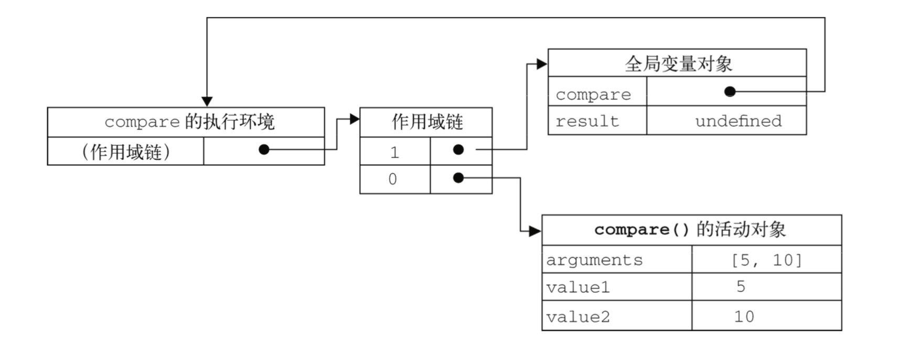

- [函数表达式](#函数表达式)
    - [递归](#递归)
    - [闭包](#闭包)
        - [闭包与变量](#闭包与变量)
    - [关于this对象](#关于this对象)
    - [内存泄露](#内存泄露)


### 函数表达式
定义函数的方式有两种：
- 函数声明
- 函数表达式

访问函数名字使用`name`属性，例如：`functionName.name`；

函数声明存在函数声明提升， 但是函数表达式却没有，只有变量提升。

```js
//函数声明
if(false) {
    function fn(){  //还是会函数声明提升的， 除非在函数，类等别的作用域中
        //do 
    }
}
//函数表达式
let fn; 
if(false) {
    fn = function() {       //函数表达式是可以的
        //do
    }
}
```
```js
//这样可是函数表达式
+function(value){
    alert(value)
}(11)
```

#### 递归
```js
function factorial(num) {
    if(num <= 1) {
        return 1;
    }
    else {
        return num * factorial(num - 1);
    }
}
```
虽然上面这样写没有错，但是下面操作可能导致错误：
```js
var anotherFactorial = factorial;
factorial = null;   
alert(anotherFactorial(4))      //因为此时factorial已经是null了，但是我们在函数里面递归还是在调用这个指向
```
所以在递归中我们可以使用`arguments.callee`，这是一个指向当前执行函数的指针。这样的话外面随便改变名字也没关系了
```js
function factorial(num) {
    if(num <= 1) {
        return 1;
    }
    else {
        return num * arguments.callee(num-1);
    }
}
```
不过在严格模式下`arguments。callee`会报错， 所以我们可以使用函数表达式的形式来递归，这种方法在严格模式和非严格模式下都可以；
```js
var factorial = (function f(num) {
    if(num<=1) {
        return 1;
    }
    else {
        return num * f(num - 1);
    }
})
```

#### 闭包
闭包是指有权访问另一个函数作用域中变量的函数。创建闭包的常见方式，就是在一个函数内部创建另一个函数。

记住函数的作用域链。当某个函数被调用时，会创建一个执行环境及相应的作用域链。然后，使用`arguments`和其他命名参数的值来初始化函数的活动对象。但在作用域链中，外部函数的活动对象始终处于第二位，外部函数的外部函数的活动对象处于第三位，···直到作为作用域链终点的全局执行环境。
```js
var result;
function compare(value1, value2) {
    if(value1 < value2) {
        return -1;
    }
    else if (value1 > value2) {
        return 1;
    }
    else {
        return 0;
    }
}
var result = compare(5, 10);
```
当调用`compare()`时，会创建一个包含`arguments`、`value1`和`value2`的活动对象。全局执行环境的变量对象处在`compare()`执行环境的作用域链中则处于第二位。


无论什么时候在函数中访问一个变量时，就会从作用域链中搜索具有相应名字的变量，一般来讲，当函数执行完毕后，局部活动变量就会销毁，内存中仅保存全局作用域，但是我们可以使用闭包来延迟局部变量的声明周期。
```js
function fnA() {
    let a = 111;
    return function() {
        return a;
    }
}
let a = fnA();
let b = a();
console.log(b);     //  局部变量中的a竟然在全部环境下还能得到
```
函数在执行完毕后，其活动对象也不会被销毁，因为返回的匿名函数的作用域链仍然在引用这个活动对象。
就是说返回的匿名函数的作用域链中存在三个活动对象，本身、`fnA`函数、`window`全局对象。而本身的活动对象中用到了其本身的`arguments`变量和`fn`函数中的`a`这个变量。所以当`fnA`函数执行完毕后，其活动对象也不会被销毁，因为匿名函数的作用域链仍然在引用这个活动对象。当然`fnA`函数的执行环境的作用域链会被销毁，其活动对象仍然会留在内存中，匿名函数的作用域链要直到匿名函数被销毁后才没有，所以`fnA`的活动对象也要到那时才会被销毁。

由于闭包会携带包含它的函数的作用域，因此会比其他函数占用更多的内存，过多使用闭包可能会导致内存占用过多，我们建议只在绝对必要时再考虑使用闭包。

##### 闭包与变量
闭包的几个有趣例子：
```js
function createFunctions() {
    var result = new Array();
    for(var i=0; i<10; i++) {
        result[i] = function() {
            return i;
        }
    }
    return result;  //每个函数中对于变量i的值都是10，都引用着保存变量i的同一个变量对象
}
```
我们可以通过创建另一个匿名函数强制让闭包的行为符合预期。
```js
function createFunctions() {
    var result = new Array();
    for(var i=0; i<10; i++) {
        result[i] = function(num) {
            return function() {
                return num
            }
        }(i)
    }
    return result;
}
/*
(function(num){})(i)    一样
*/
```

#### 关于this对象
函数的执行环境是当函数被调用的时候就被生成了。`this`永远指向一个对象。

**`this`对象是在运行时基于函数的执行环境绑定的；在全局函数中，`this`等于`window`，而当函数被作为某个对象的方法调用时，`this`等于那个对象**。不过匿名函数的执行环境具有全局性，因此其`this`对象通常指向`window`，但有时候由于编写闭包的方法不同，这一点可能不会那么明显。

例子1：

```js
var name = 'The Window';
var o = {
    name: 'My Object',
    getNameFunc() {
        return function() {
            return this.name;
        }
    }
}
alert(o.getNameFunc()());       //全局  'The Window
```
其实我们可以看成`o.getNameFunc()`执行`this`是指向`o`的， 后面的调用就是`window.function(){}()`此时函数的执行环境是`window`环境。

前面提到过，每个函数在被调用时都会自动取得两个特殊变量：`this`和`arguments`。内部函数在搜索这两个变量时，只会搜索到其活动对象为止(即自己这个函数作用域)，因此永远不可能直接访问外部函数中的这两个变量，但是对于别的变量通过函数作用域链搜索我们是能够得到的。

所以可以用下面方法解决：

1. 将`this`保存到一个变量中，通过作用域量来访问。`arguments`也是一样的道理。
```js
var name = 'The Window';
var o = {
    name: 'My Object',
    getNameFunc() {
        var _this = this;
        return function() {
            return _this.name;
        }
    }
}
alert(o.getNameFunc()());       //'my Object'
```
2. 使用`call`、`apply`或者`bind`方法来改变this的指向。
3. 使用es6的箭头函数来指向上下文。

例子2：

`this`指向一个对象， 函数被作为某个对象调用时，`this`指向该对象，很明显是`o.bb`对象。
```js
let o = {
    name: '张三',
    aa() {
        console.log(this.name);
    },
    bb: {
        name: '李四',
        jj() {
            console.log(this.name);
        }
    }
}
o.bb.jj()       //'李四'
```

例子3：

```js
var name = 'lisi';
var o = {
    name: 'zhangsan',
    getName() {
        return this.name;
    }
};
o.getName()     //zhangsan
(o.getName)()   //zhangsan
(o.getName = o.getName)()   //lisi   在非严格模式下

//如果是
o.getName = o.getName
o.getName()     //这样因为又是o在调用，所以会为zhangsan
```
因为第三行代码先执行了一条赋值语句，然后再直接调用赋值后的结果。因为这个赋值表达式的值是函数本身，所以`this`的值不能得到维持，结果返回了全局`name`。
我们也可以直接将左边的`o.getName`看成是右边这个函数， 所以`window.函数`值为lisi。

#### 内存泄露
```js
//这也是一个闭包，事件会一直被绑定在内存中，直到销毁
function assignHandler() {
    var element = document.getElementById('someElement');
    element.onclick = function() {
        alert(element.id)
    }
}
```
解决办法
```js
function assignHandler() {
    var element = document.getElementById('someElement');
    var id = element.id;
    element.onclick = function() {
        alert(id)
    }
    element = null;
}
```
当然这么做只是能够解除对DOM对象的引用，其实事件点击还是会有效果，顺利的减少其引用数，确保正常回收其占用的内存。如果想解除事件应该使用`element.onclick = null`