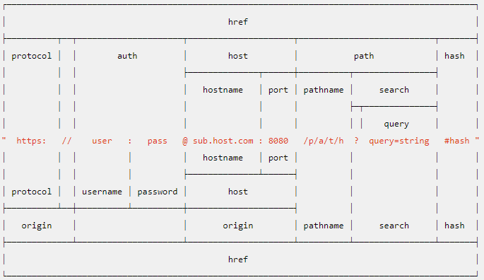

本章内容

- 理解window对象—BOM的核心
- 控制窗口、框架和弹出窗口
- 利用location对象中的页面信息
- 使用navigation对象了解浏览器


- [window对象](#window对象)
  - [全局作用域](#全局作用域)
  - [窗口关系及框架(frame)](#窗口关系及框架(frame))
  - [窗口位置](#窗口位置)
  - [窗口大小](#窗口大小)
  - [导航和打开窗口](#导航和打开窗口)
    - [window.open()](window.open())
    - [window.close()](#window.close())
    - [弹出窗口屏蔽程序](#弹出窗口屏蔽程序)
  - [间歇调用和超时调用](#间歇调用和超时调用)
  - [系统对话框](#系统对话框)


- [location对象](#location对象)
  - [编码解码](#编码解码)
  - [位置操作](#位置操作)
- [navigator对象](#navigator对象)
- [screen对象](#screen对象)
- [history](#history对象)
- [小结](#小结)


## BOM


### window对象

**BOM**的核心对象是`window`，它表示浏览器的一个实例。在浏览器中，`window`对象有双重角色，它既是通过JavaScript访问浏览器窗口的一个接口，又是ECMAScript规定的`Global`对象。这意味在网页中定义的任何一个对象、变量和函数，都以`window`作为其`Global`对象，因此有权访问`parseInt()`等方法。

#### 全局作用域

1. 由于window对象同时扮演着ECMAScript中的Global对象的角色，因此所有在全局作用域中声明的变量、函数都会变成window对象的属性和方法。

>  注意：ES6 为了改变这一点，一方面规定，为了保持兼容性，`var`命令和`function`命令声明的全局变量，依旧是顶层对象的属性；另一方面规定，`let`命令、`const`命令、`class`命令声明的全局变量，不属于顶层对象的属性。也就是说，从 ES6 开始，全局变量将逐步与顶层对象的属性脱钩。

```js
//window环境
var a = 1;
window.a // 1
	//let const 声明的是局部变量，所以window对象下寻找不到
let b = 1;
window.b // undefined

// 如果在 Node 的 REPL 环境，可以写成 global.a
// 或者采用通用方法，写成 this.a
a = 1;
global.a	//1

var a = 1;
global.a	//undefined		
```

2. 抛开全局变量会成为`window`对象的属性不谈，定义全局变量与在`window`对象上直接定义属性还是有一点差别：全局变量不能通过`delete`删除，而直接在`window`对象上的定义的属性是可以的。

```js
var age = 29;
window.color = 'red';

//在IE<9时抛出错误，在其他所有浏览器中都返回false
delete window.age;

//在IE<9时抛出错误，在其他所有浏览器中都是返回true
delete window.color	//return true

alert(window.age);		//29
alert(window.color);	//undefined
```

刚才使用`var`语句添加`window`属性有一个名为`[[Configurable]]`的特性，这个特性的值被设置为`false`，因此这样定义的属性不可以通过`delete`删除。

> 注意：尝试访问未声明的变量会抛出错误，但是通过查询window对象，可以知道某个可能未声明的变量是都存在。

```js
//为什么的a，调用
a   //报错
window.a    //undefined

```

#### 窗口关系及框架(frame)

1. 如果页面中包含框架，则每个框架都拥有自己的`window`对象，并且保存在`frames`集合中。在`frames`集合中，可以通过数值索引(从0开始，从左到右，从上到右)或框架名称来访问相应的`window`对象。每个`window`对象都有一个`name`属性，其中包含框架的名称。

```html
<frame src="xx" name="abc">
```

2. `top`对象始终指向最高(最外)层的框架，也就是浏览器窗口。还有一个`parent`对象，`parent`(父)对象始终指向当前框架的直接上层框架。

```js
window.frames[0]	//建议使用top
top.frames[0]		//top永远是顶层    
parent.frames[0]	//当前frames的上层框架
```

3. 注意，除非最高层窗口是通过`window.open()`打开的，否则其`window`对象的`name`属性不会包含任何值。
4. 与框架有关的最后一个对象是`self`，它始终指向当前`window`

#### 窗口位置

1. IE、Safari、Opera和Chrome提供了`screenLeft`和`screenTop`属性，分别用于表示窗口相对于屏幕左边和上边的位置。Firefox则为`screenX`和`screenY`。

兼容写法：

```js
var leftPos = (typeof window.screenLeft == 'number') ? window.screenLeft : window.screenX;
var topPos = (typeof window.screenTop == "number") ? window.screenTop : window.screenY;
```

2. 移动窗口

`moveTo()`接收的是新位置的 x 和 y 坐标值，而 `moveBy()`接收的是在水平和垂直方向上移动的像素数。

```js
//将窗口移动到屏幕左上角 
window.moveTo(0,0);
//将窗向下移动 100 像素 
window.moveBy(0,100);
//将窗口移动到(200,300) 
window.moveTo(200,300);
//将窗口向左移动 50 像素 
window.moveBy(-50,0);
```

#### 窗口大小

1. 在IE9+、Firefox、Safari、Opera和Chrome提供了4个属性：`innerWidth`、`innerHeight`、`outerWidth`和`outerHeight`。

   这里存在兼容性问题，在IE9+、Firefox、Safari中`outerWidth`和`outerHeight`返回浏览器窗口本身的尺寸。在Opera中这两个属性表示视图区。而`innerWidth`和`innerHeight`则表示页面视图区的大小。在Chrome中这四个属性返回相同的值，都是视口(viewport)大小而非浏览器窗口大小。

   在IE8及更早版本没有提供取得当前浏览器窗口尺寸的属性，不过，它通过DOM提供了页面可见区域的相关信息。在 IE、Firefox、Safari、Opera 和 Chrome 中，`document.documentElement.clientWidth`和`document.documentElement.clientHeight`中保存了页面视口的信息。IE6中使用`document.body.clientWidth`。 

兼容写法：

```js
var pageWidth = window.innerWidth,
    pageHeight = window.innerHeight;
if (typeof pageWidth != "number"){
    if (document.compatMode == "CSS1Compat"){
        pageWidth = document.documentElement.clientWidth;
        pageHeight = document.documentElement.clientHeight;
    } else {
        pageWidth = document.body.clientWidth;
        pageHeight = document.body.clientHeight;
    }
}
```

2. 对于**移动设备**，`window.innerWidth` 和 `window.innerHeight` 保存着可见视口，也就是屏幕上可
   见页面区域的大小。移动 IE 浏览器不支持这些属性，但通过 `document.documentElement.client-`
   `Width` 和 `document.documentElement.clientHeihgt` 提供了相同的信息。随着页面的缩放，这些值
   也会相应变化。
3. `resizeTo()`和 `resizeBy()`方法可以调整浏览器窗口的大小。这两个方法都接收两个
   参数，其中 `resizeTo()`接收浏览器窗口的新宽度和新高度，而 `resizeBy()`接收新窗口与原窗口的宽
   度和高度之差。

```js
//调整到 100×100 
window.resizeTo(100, 100);
//调整到 200×150 
window.resizeBy(100, 50);
//调整到 300×300 
window.resizeTo(300, 300);
```

需要注意的是，这两个方法与移动窗口位置的方法类似，也有可能被浏览器禁用; 而且，在 Opera和 IE7(及更高版本)中默认就是禁用的。另外，这两个方法同样不适用于框架，而只能对最外层的window 对象使用。

#### 导航和打开窗口

##### window.open()

`var w = window.open()`得到的值就是当前`window`对象。

使用`window.open()`方法既可以导航到一个特定的URL，也可以打开一个新的浏览器窗口。存在4个参数，一般只需要传第一个参数，最后一个参数只在不打开新窗口的情况下使用。

```js
window.open(要加载的url, 窗口目标, 一个特性字符串, 一个表示新页面是否取代浏览器历史记录的布尔值)
```

其中第三个参数是一个逗号分隔的设置字符串，表示在新窗口中都显示哪些特性。

例子：

```js
window.open('http://www.cxxx.x', 'topFrame');
```

如同单击了`href`为`http://www.cxxx.x`， `target`属性为topFrame的链接， 如果有一个名为topFrame的窗口或框架，就会在该窗口或框架加载这个URL，否则就会创建一个新窗口并命名为topFrame。此外，第二个参数可以是：`_self`, `_parent`, `_top`, `_blank`。

例子：改变窗口大小并移动窗口位置

```js
var wroxWin = window.open("http://www.wrox.com/","wroxWindow",
"height=400,width=400,top=10,left=10,resizable=yes");
//调整大小
wroxWin.resizeTo(500,500);
//移动位置
wroxWin.moveTo(100,100);
```

##### window.close()

`window.close()`这个方法仅适用于通过`window.open()`打开的弹出窗口，对于浏览器的的主窗口，如果没有得到用户的允许是不能关闭的。不过弹出窗口倒是可以调用`top.close()`在不经用户允许的情况下关闭自己。

##### 弹出窗口屏蔽程序

如果是浏览器内置的屏蔽程序阻止的弹出窗口，那么window.open()很可能会返回null， 如果是浏览器扩充或其他程序阻止弹出窗口，一般会抛出一个错误。

```js
var blocked = false;
try {
    var wroxWin = window.open("http://www.wrox.com", "_blank");
    if (wroxWin == null){
        blocked = true;
    }
} catch (ex){
	blocked = true;
}
if (blocked){
	alert("The popup was blocked!");
}
```

在任何情况下，以上代码都可以检测出调用window.open()打开的弹出窗口是不是被屏蔽了。

#### 间歇调用和超时调用

```js
var timeoutId = window.setTimeout(function(){
   	//do something
}, 3000)

var intervaloutId = setInterval(function() {
   // do something 
}, 3000)

//清除定时器
if(ok) {
    clearTimeout(timeoutId)
    clearInterval(intervaloutId)
}
```

> 注意: 定时器的代码都是在全局作用域中执行的， 在window对象上，因此函数中的this在非严格模式下指向window，在严格模式下指向undefined

#### 系统对话框

```js
alert('xxxx')			//弹出框

if(confirm('are you sure?')) {	//确认框
    alert(yes)
} else {
    alert(false)
}

var p = prompt(要显示给用户的文本提示， 文本输入域的默认值)   //ok的话 返回输入的值， 取消的话返回null
```


### location对象

`location`提供了与当前窗口中加载的文档有关的信息，还提供了一些导航功能。他即使`window`对象的属性，也是`document`对象的属性。

| 属性名   | 例子                  | 说明                                                         |
| -------- | --------------------- | ------------------------------------------------------------ |
| hash     | '#contents'           | 返回URL中的hash(#号后跟零或多个字符串)，如果URL中不包含散列，则返回空字符串 |
| host     | 'www.wrox.com: 80'    | 返回服务器名称和端口号(如果有)                               |
| hostname | 'www.wrox.com'        | 返回不带端口号的服务器名称                                   |
| href     | 'http://www.wrox.com' | 返回当前加载页面的完整URL。而location对象的toString()方法也返回这个值 |
| pathname | 'WileyCDA'            | 返回服务器名称和端口号后面的URL目录或文件名                  |
| port     | '8080'                | 返回端口号，如果没有则为空                                   |
| protocol | 'http:'               | 返回页面使用的协议。通常为http: 或https:                     |
| search   | '?q=javascript'       | 返回URl的查询字符串。这个字符串以问号开头                    |



#### 编码解码

```js
编码 encodeURIComponent(xx)
解码 decodeURIComponent(xx)

let name = xxx
？a=encodeURIComponent(name)
```

#### 位置操作

1. 跳转，增加历史记录

```js
//下面3者是一样的
location.assign('http://www.xx')
window.location = 'http://www.xx'
location.href = 'http://www.xx'
```

```js
//修改hash
location.hash = "#section1";
//修改search
location.search = "?q=javascript";
//修改hostname
location.hostname = "www.yahoo.com";
//修改athname
location.pathname = "mydir";
//修改port
location.port = 8080;
```

通过上述任何一种方式修改 URL 之后，浏览器的历史记录中就会生成一条新记录，因此用户通
过单击“后退”按钮都会导航到前一个页面。

- **每次修改 `location` 的属性（hash 除外），页面都会以新 URL 重新加载**。 

- 在 IE8、 Firefox 1、 Safari 2+、 Opera 9+和 Chrome 中，修改 `hash` 的值会在浏览
  器的历史记录中生成一条新记录。 

2. 使用`location.replace('http://xxx')` 会将当前的历史记录给替换掉。

```js
//替换当前历史记录
location.replace('xxx')
```

3. `location.reload()`， 作用是重新加载当前显示的页面。如果调用`reload()`不传参数，页面则有可能直接从浏览器缓存中重新加载。如果`location.reload(true)`带上`true`参数，测强制从服务器重新加载。


### navigator对象

`navigator`对象是识别客户端浏览器的事实标准。


### screen对象

用处不大


### history对象

`history`对象保存着用户上网的历史记录，从窗口被打开的那一刻算起。处于安全方面考虑，开发人员无法得知用户浏览过的URL。不过，借由用户访问过的页面列表，同样可以在不知道实际URL的情况下实现后退和前进。

```js
//使用go()方法跳转
history.go(-1); 	//后退一页
history.go(1);		//前进一页
history.go(2);		//前进两页	
history.go('wrox.com')	//跳转到最近的wrox.com页面

history.back()		//后退一页
history.forward()	//前进一页

history.length		//历史记录的数量
```


### 小结

浏览器对象模型（BOM）以 `window` 对象为依托，表示浏览器窗口以及页面可见区域。同时，`window`
对象还是 ECMAScript 中的 `Global` 对象，因而所有全局变量和函数都是它的属性，且所有原生的构造
函数及其他函数也都存在于它的命名空间下。本章讨论了下列 BOM 的组成部分。

- 在使用框架时，每个框架都有自己的 `window` 对象以及所有原生构造函数及其他函数的副本。
  每个框架都保存在 `frames` 集合中，可以通过位置或通过名称来访问。

- 有一些窗口指针，可以用来引用其他框架，包括父框架。

- `top` 对象始终指向最外围的框架，也就是整个浏览器窗口。

- `parent` 对象表示包含当前框架的框架，而 `self` 对象则回指 `window`。

- 使用 `location` 对象可以通过编程方式来访问浏览器的导航系统。设置相应的属性，可以逐段
  或整体性地修改浏览器的 URL。

- 调用 `replace()`方法可以导航到一个新 URL，同时该 URL 会替换浏览器历史记录中当前显示
  的页面。

- `navigator` 对象提供了与浏览器有关的信息。到底提供哪些信息，很大程度上取决于用户的浏
  览器；不过，也有一些公共的属性（如 `userAgent`）存在于所有浏览器中。

`BOM` 中还有两个对象： `screen` 和 `history`，但它们的功能有限。 `screen` 对象中保存着与客户端
显示器有关的信息，这些信息一般只用于站点分析。 history 对象为访问浏览器的历史记录开了一个
小缝隙，开发人员可以据此判断历史记录的数量，也可以在历史记录中向后或向前导航到任意页面。 