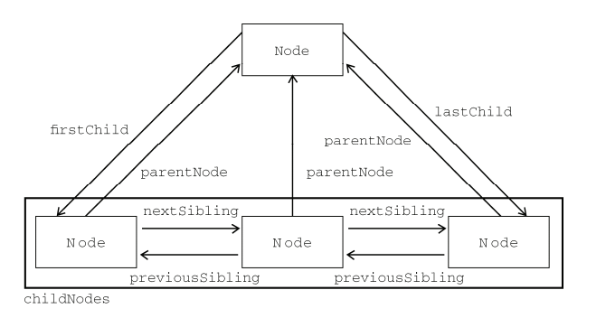

## DOM

### 节点层次

#### 节点关系

`节点.nodeName`为标签名字。

1. 每个节点都有一个`childNodes`属性，其中保存着一个`NodeList`对象，`NodeList`是一种类数组对象，用于保存一组有序的节点，可以使用方括号语法来访问`NodeList`，而且这个对象也有`length`属性，但它并不是`Array`实例。其中`childNodes`对象的集合是**包括节点内部的空白节点等所有节点**。

```html
<div id="root">
    <p>111</p> 
	<div>222</div>
</div>
<script>
    let r = document.getElementById('root');
	console.log(r.childNodes)  //NodeList(5) [text, p, text, div, text]
</script>
```

```js
var arrayOfNodes = Array.prototype.slice.call(someNode.childNodes,0);  //类数组转数组
```

2. `节点.children`不包括换行空白等文本节点。
3. 每个节点都有一个`parentNode`属性，该属性指向文档树中的父节点。
4. 每个节点的`previousSibling`和`nextSibling`属性，表示前一个节点和后一个节点， 包括空白节点、文本节点等。
5. 父节点的`firstChild`和`lastChild`属性，分别指向其`childNodes`列表中的第一个和最后一个节点。即包括空白文本节点。
6. `节点.hasChildNodes()`, 这个方法在节点包含一或多个子节点的情况下返回`true`，包括文本节点。



#### 操作节点

```js
//如果newNode已经是文档的一部分了，那么就是将该节点从原来的位置转移到新位置
var addNode = 某个节点中.appendChild(newNode)  

//insertNode为插入的节点， 和上面一下，如果是文档中的一部分，则转移
var insertNode = 某个节点中.insertBefore(要插入的节点， 作为参照的节点);

//替换节点, replaceNode为被替换的节点
var replaceNode = 某个节点中.replaceChild(要插入的节点， 要替换的节点);

//移除节点
var removeNode = 某个节点中.removeChild(要移除的节点);

//克隆节点，参数为true则深克隆(整个节点树)，false则只克隆节点本身。这个方法不会复制添加到DOM节点中的JavaScript属性，比如事件等， 只复制特性、子节点
节点.cloneNode(true | false)

```

#### Document类型

##### 文档的子节点

```js
var html = document.documentElement;	//取得<html>的引用
alert(html === document.childNodes[0]);	//true
alert(html === document.firstChild);	//true

var body = document.body;		//取得对<body>的引用
```

##### 文档信息

```js
document.title;				//取得文档标题
document.title = '设置文档标题';
//所有这些信息都存在于请求的HTTP头部
var url = document.URL;		//取得完整的URL
var domain = document.domain;	//取得域名
var referrer = document.referrer;	//取得来源页面的URL
```

上面的文档信息中只有`document.title`和`document.domain`可以被设置。由于安全方面的限制，也并非可以给`domain`设置任何值，如果URL中包含一个子域名，例如`p2p.wrox.com`，那么就只能将domain设置为`wrox.com`，因为`p2p.wrox.com`是`wrox.com`的子域，现在设置的`wrox.com`为主域。

```js
//假设页面来自 p2p.wrox.com 域
document.domain = "wrox.com"; // 成功
document.domain = "nczonline.net"; // 出错！
```

当页面中包含来自其他子域的框架或内嵌框架时，因为域名不同时存在跨域问题，来自不同子域的页面无法通过JavaScript通信。而通过将每个页面的`document.domain`设置为相同的域，这些页面就可以互相访问对方的JavaScript对象了。

例如：假设有一个页面加载自 `www.wrox.com`，其中包含一个内嵌框架，框架内的页面加载自 `p2p.wrox.com`。
由于 `document.domain` 字符串不一样，内外两个页面之间无法相互访问对方的 JavaScript 对象。但如
果将这两个页面的 `document.domain` 值都设置为`wrox.com`，它们之间就可以通信了。 （可以查看跨域通信那节）。

当对document.domain设置过之后，就不能再将其设置回去了。

##### 查找元素

```js
document.getElementById();	
document.getElementsByTagName();
document.getElementsByTagName('*');
document.querySelector(css选择器);		//只取第一个  静态的
document.querySelectorAll(css选择器);	//类数组 	静态的

//对于有name属性的元素
元素.nameItem(name名);
元素[name名];

document.getElementsByName()	//返回带有给定name特性的所有元素

//一些特殊集合
document.anchors;	//包含文档中所有带 name 特性的<a>元素；
document.forms;		//包含文档中所有的<form>元素，与document.getElementsByTagName("form")得到的结果相同；
document.images;	//包含文档中所有的元素，与 document.getElementsByTagName("img")得到的结果相同；
document.links;		//包含文档中所有带 href 特性的<a>元素。
```

表单中的`name`和`id`在ie7中存在一个bug，不能同名。

##### 文档写入

```js
document.write()
document.writeln()		//会在字符串末尾加上一个换行符(\n)
```

注意

```html
<body>
	<div id="one">111</div> 
<script>
    //如果直接这么写则是页面在呈现的过程中输出了内容，所以不会被覆盖。<div>111</div>也有
    document.write('aaaaaaaaa');
    
    /*
    这种情况就是页面都加载完的情况下写入，会覆盖掉
    window.onload = function() {
        document.write('Hello world!')
    }
    */
</script>
</body>
```


